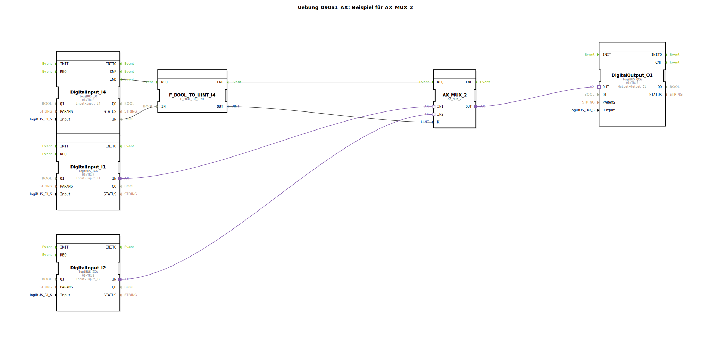

# Uebung_090a1_AX: Beispiel für AX_MUX_2

Dieser Artikel beschreibt die logiBUS®-Übung `Uebung_090a1_AX`.

----

## Ziel der Übung

Auswahl eines Signals aus mehreren Quellen (Umschalter).

-----

## Beschreibung und Komponenten

[cite_start]Die Subapplikation `Uebung_090a1_AX.SUB` verwendet einen `AX_MUX_2` Baustein[cite: 1].

### Funktionsbausteine (FBs)

  * **`I1` & `I2`**: Die beiden Signalquellen.
  * **`I4`**: Der Wahlschalter (Selector).
  * **`F_MUX_2`**: Der Multiplexer.
  * **`F_BOOL_TO_UINT`**: Hilfsbaustein zur Konvertierung.

-----

## Funktionsweise

Der Multiplexer erwartet am Eingang `K` eine Ganzzahl (UINT), um zu entscheiden, welchen Eingang er durchschaltet.
Da `I4` ein boolesches Signal liefert, wird dieses konvertiert:
*   `I4 = FALSE` -> `K = 0` -> `MUX` schaltet `IN1` (`I1`) auf den Ausgang.
*   `I4 = TRUE` -> `K = 1` -> `MUX` schaltet `IN2` (`I2`) auf den Ausgang.

Der Ausgang `Q1` folgt also entweder `I1` oder `I2`, abhängig von der Stellung von `I4`.

-----

## Anwendungsbeispiel

**Hand/Automatik-Umschaltung**:
*   `I1`: Signal aus der Automatik-Steuerung.
*   `I2`: Signal vom Hand-Taster.
*   `I4`: Schlüsselschalter "Hand/Auto".
Der Ausgang (`Q1`) wird je nach Betriebsart von der Automatik oder manuell gesteuert.