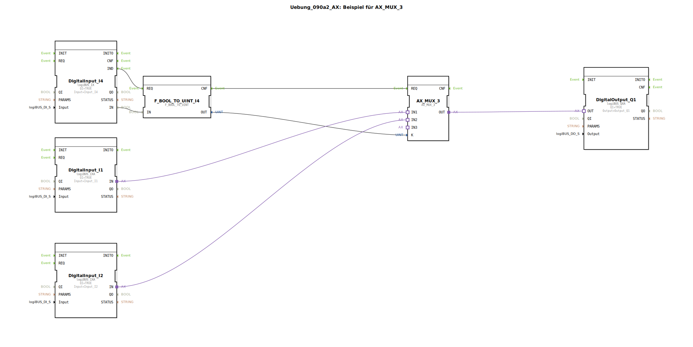

# Uebung_090a2_AX: Beispiel für AX_MUX_3

Dieser Artikel beschreibt die logiBUS®-Übung `Uebung_090a2_AX`.

----

## Ziel der Übung

Erweiterung des Multiplexers.

-----

## Beschreibung

[cite_start]Strukturell identisch zu `Uebung_090a1_AX`, jedoch mit einem `AX_MUX_3`[cite: 1].

-----

## Funktionsweise

Da als Selektor weiterhin nur ein boolescher Eingang (`I4`) verwendet wird, können nur die ersten beiden Eingänge (`IN1` bei K=0, `IN2` bei K=1) ausgewählt werden. Der dritte Eingang (`IN3`, Index 2) ist in dieser Konstellation nicht erreichbar. Um alle drei zu nutzen, bräuchte man einen Integer-Eingang oder zwei Bit-Eingänge.

