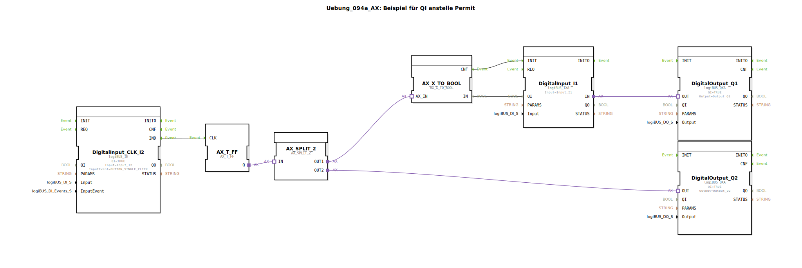

# Uebung_094a_AX: Beispiel für QI anstelle Permit

Dieser Artikel beschreibt die logiBUS®-Übung `Uebung_094a_AX`.

----

## Ziel der Übung

Nutzung des `QI` (Qualifier Input) Parameters zur Laufzeit-Steuerung von Funktionsbausteinen.

-----

## Beschreibung und Komponenten

[cite_start]Die Subapplikation `Uebung_094a_AX.SUB` schaltet einen Eingangspfad aktiv oder inaktiv[cite: 1].

### Funktionsbausteine (FBs)

  * **`DigitalInput_CLK_I2`**: Toggelt über ein Flip-Flop den Zustand "Aktiv/Inaktiv".
  * **`DigitalInput_I1`**: Der eigentliche Signaleingang. Sein `QI` Parameter ist variabel beschaltet.
  * **`DigitalOutput_Q1`**: Hängt an `I1`.
  * **`DigitalOutput_Q2`**: Zeigt den Status "Ist Aktiv" an.

-----

## Funktionsweise

1.  Drückt man `I2`, schaltet `Q2` ein (System aktiviert).
2.  Gleichzeitig wird `QI` von `DigitalInput_I1` auf TRUE gesetzt.
3.  Jetzt funktioniert `I1`: Wenn man `I1` drückt, schaltet `Q1`.
4.  Drückt man `I2` erneut, schaltet `Q2` aus (System deaktiviert).
5.  `QI` von `I1` wird FALSE.
6.  Der Baustein `I1` stellt seine Arbeit ein. Änderungen am physischen Eingang `I1` werden nicht mehr an `Q1` weitergeleitet.

-----

## Anwendungsbeispiel

**Wartungsmodus**: Teile der Sensorik werden softwareseitig "abgeklemmt", damit bei Arbeiten an der Maschine keine Fehlalarme ausgelöst werden.