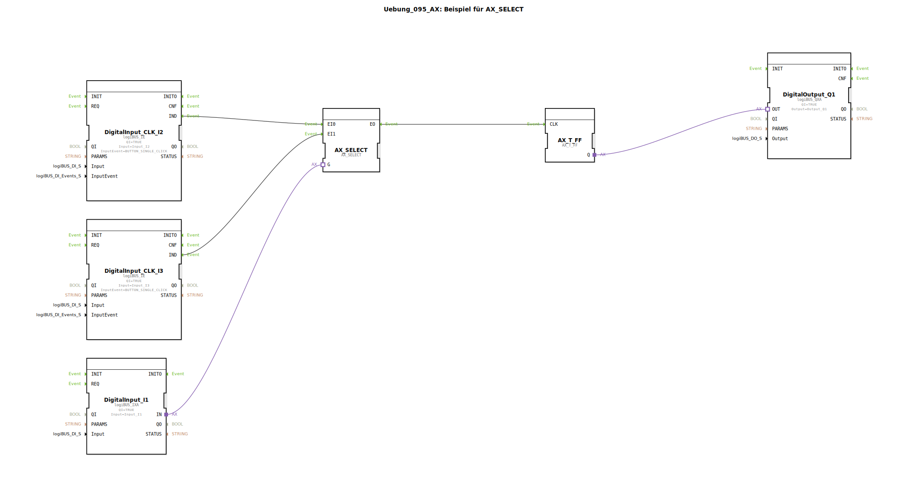

# Uebung_095_AX: Beispiel für AX_SELECT

Dieser Artikel beschreibt die logiBUS®-Übung `Uebung_095_AX`.

----

## Ziel der Übung

Auswahl einer Event-Quelle (Gegenteil von `E_SPLIT` oder `E_SWITCH`).

-----

## Beschreibung und Komponenten

[cite_start]Die Subapplikation `Uebung_095_AX.SUB` nutzt einen `AX_SELECT` Baustein[cite: 1].

### Funktionsbausteine (FBs)

  * **`I1`**: Wahlschalter (Gate `G`).
  * **`I2`**: Event-Quelle A.
  * **`I3`**: Event-Quelle B.
  * **`E_SELECT`**: Leitet entweder A oder B an den Ausgang weiter.

-----

## Funktionsweise

*   Ist `I1` aus (`G=FALSE`), werden Events von `I2` (`EI0`) zum Ausgang durchgelassen. Events von `I3` werden ignoriert.
*   Ist `I1` an (`G=TRUE`), werden Events von `I3` (`EI1`) zum Ausgang durchgelassen. Events von `I2` werden ignoriert.

Der Ausgang triggert ein Flip-Flop (`Q1`). Man kann also wählen, *welcher* Taster das Licht schalten darf.

-----

## Anwendungsbeispiel

**Bedienplatz-Umschaltung**: Ein Schlüsselschalter entscheidet, ob die Maschine vom Hauptpult (`I2`) oder vom Wartungspult (`I3`) gesteuert wird.