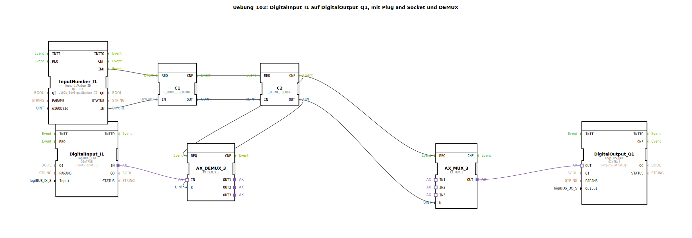

# Uebung_103: DigitalInput_I1 auf DigitalOutput_Q1, mit Plug and Socket und DEMUX

Dieser Artikel beschreibt die logiBUS®-Übung `Uebung_103`. Dies ist ein komplexes Beispiel, das zeigt, wie man den Signalpfad eines Tasters zur Laufzeit umschalten kann.

----

## Ziel der Übung

Dynamische Auswahl zwischen verschiedenen Verarbeitungslogiken (Tastend, Rastend, Verzögert) für denselben physikalischen Ein- und Ausgang.

-----

## Beschreibung und Komponenten

[cite_start]Die Subapplikation `Uebung_103.SUB` nutzt ein ISOBUS-Zahlenfeld, um zwischen drei Logik-Zweigen zu wählen[cite: 1].

### Funktionsbausteine (FBs)

  * **`InputNumber_I1`**: Ein Eingabefeld auf dem ISOBUS-Terminal. Der Nutzer gibt hier 1, 2 oder 3 ein.
  * **`AX_DEMUX_3`**: Verteilt das Signal vom Taster `I1` auf einen von drei Ausgängen.
  * **`AX_MUX_3`**: Sammelt das Ergebnis der drei Zweige wieder ein und gibt es an `Q1` weiter.
  * **Die drei Zweige**:
    1.  `tastend`: Direkte Weiterleitung (1:1).
    2.  `rastend`: Wandelt den Taster in einen Schalter (Toggle) um.
    3.  `tastend_TON_5s`: Leitet das Signal mit einer Einschaltverzögerung von 5s weiter.

-----

## Funktionsweise

1.  Der Nutzer gibt am Terminal den gewünschten Modus ein (z.B. "2" für Rastend).
2.  Die Zahl wird konvertiert und an die Selektoren (`K`) von MUX und DEMUX gesendet.
3.  Betätigt der Nutzer nun den physischen Taster `I1`, wird das Signal durch den `DEMUX` in den Zweig `rastend` geleitet.
4.  Dort wird es verarbeitet und vom `MUX` wieder auf den Ausgang `Q1` geführt.

Ändert der Nutzer die Zahl auf "1", verhält sich derselbe Taster plötzlich rein tastend.

-----

## Anwendungsbeispiel

**Multifunktions-Bedienelement**: Ein Joystick-Taster kann je nach gewählter Geräteeinstellung (Modus) eine andere Funktion haben oder ein anderes Zeitverhalten aufweisen.