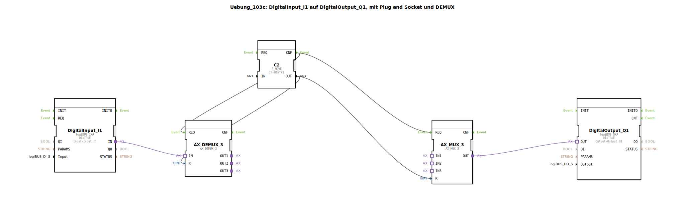

# Uebung_103c: DigitalInput_I1 auf DigitalOutput_Q1, mit Plug and Socket und DEMUX

Dieser Artikel beschreibt die logiBUS®-Übung `Uebung_103c`.

----

## Ziel der Übung

Testen eines spezifischen Pfads der MUX/DEMUX Struktur.

-----

## Beschreibung

[cite_start]Im Vergleich zu `Uebung_103` wurde das Eingabefeld entfernt[cite: 1]. Der Selektionswert wird stattdessen über einen `F_MOVE` Baustein fest auf den Wert `UINT#1` (Index 1 -> Zweig 2 "rastend") gesetzt.

-----

## Funktionsweise

Der Taster `I1` steuert den Ausgang `Q1` nun permanent im "rastenden" Modus (Toggle), obwohl die Struktur für andere Modi noch vorhanden ist. Dies dient oft zum Debugging oder zum schnellen Einfrieren einer Konfiguration.

