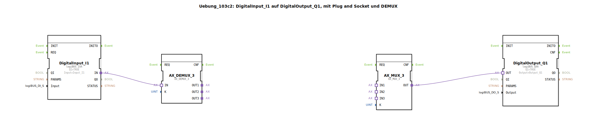

# Uebung_103c2: DigitalInput_I1 auf DigitalOutput_Q1, mit Plug and Socket und DEMUX

Dieser Artikel beschreibt die logiBUS®-Übung `Uebung_103c2`.

----

## Ziel der Übung

Variation der Modus-Selektion.

-----

## Beschreibung

[cite_start]Eine weitere Variante der MUX/DEMUX Übung[cite: 1]. Hier wird die interne Verschaltung der Pfade (z.B. `tastend2`) leicht variiert, um unterschiedliche Kombinationen zu testen.

