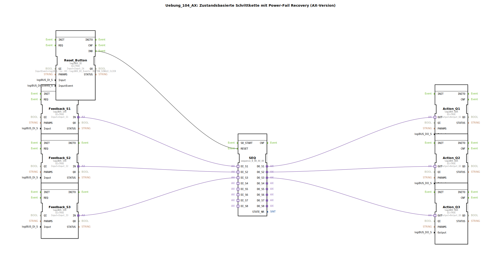

# Uebung_104_AX: Zustandsbasierte Schrittkette mit Power-Fail Recovery (AX-Version)

* * * * * * * * * *
## Einleitung

Diese Übung realisiert eine **zustandsbasierte Schrittkette mit Power-Fail Recovery** für die AX-Variante (Adapter-basiert).  
Das System kann nach einem Spannungsausfall oder Neustart selbstständig in den Zustand zurückkehren, dessen zugehöriger Eingangssensor gerade ein TRUE-Signal liefert.  
Der verwendete Sequenzbaustein `sequence_B_08_AX_AX` bildet das Kernstück und wird über Adapter mit den Ein‑ und Ausgangsbausteinen verbunden.

## Verwendete Funktionsbausteine (FBs)

### Sub-Baustein: SEQ
- **Typ**: `logiBUS::utils::sequence::boolean::sequence_B_08_AX_AX`  
- **Parameter**: Keine expliziten Parameter gesetzt.  
- **Ereigniseingänge**:  
  - `RESET` – verbunden mit dem Reset-Taster (Reset_Button.IND)  
- **Adaptereingänge**:  
  - `DI_S1`, `DI_S2`, `DI_S3` – jeweils verbunden mit den Feedback-Adaptern  
- **Adapterausgänge**:  
  - `DO_S1`, `DO_S2`, `DO_S3` – jeweils verbunden mit den Aktions-Adaptern  
- **Funktionsweise**:  
  Eine Sequenzsteuerung für bis zu acht Schritte, die auf booleschen Adapterwerten basiert.  
  Beim Einschalten oder nach einem Reset springt die Sequenz direkt in den Schritt, dessen zugehöriger Eingangsadapter TRUE liefert (Power‑Fail Recovery).  
  Während des normalen Betriebs durchläuft sie eine festgelegte Schrittfolge.

### Sub-Baustein: Feedback_S1
- **Typ**: `logiBUS::io::DI::logiBUS_IXA`  
- **Parameter**:  
  - `QI` = `TRUE`  
  - `Input` = `Input_I1`  
- **Adapterausgang**: `IN` – verbunden mit `SEQ.DI_S1`  
- **Funktionsweise**:  
  Digitaler Eingangsadapter, der den physikalischen Sensor `Input_I1` in einen logischen Adapter umwandelt.  
  Bei `QI=TRUE` ist der Adapter aktiv.

### Sub-Baustein: Feedback_S2
- **Typ**: `logiBUS::io::DI::logiBUS_IXA`  
- **Parameter**:  
  - `QI` = `TRUE`  
  - `Input` = `Input_I2`  
- **Adapterausgang**: `IN` – verbunden mit `SEQ.DI_S2`  
- **Funktionsweise**:  
  Analog zu Feedback_S1 für Sensor `Input_I2`.

### Sub-Baustein: Feedback_S3
- **Typ**: `logiBUS::io::DI::logiBUS_IXA`  
- **Parameter**:  
  - `QI` = `TRUE`  
  - `Input` = `Input_I3`  
- **Adapterausgang**: `IN` – verbunden mit `SEQ.DI_S3`  
- **Funktionsweise**:  
  Analog zu Feedback_S1 für Sensor `Input_I3`.

### Sub-Baustein: Reset_Button
- **Typ**: `logiBUS::io::DI::logiBUS_IE`  
- **Parameter**:  
  - `QI` = `TRUE`  
  - `Input` = `Input_I4`  
  - `InputEvent` = `logiBUS::io::DI::logiBUS_DI_Events::BUTTON_SINGLE_CLICK`  
- **Ereignisausgang**: `IND` – verbunden mit `SEQ.RESET`  
- **Funktionsweise**:  
  Erkennt einen einzelnen Tastendruck (Single‑Click) auf den physischen Eingang `Input_I4` und erzeugt ein Ereignis am Ausgang `IND`, das die Sequenz zurücksetzt.

### Sub-Baustein: Action_Q1
- **Typ**: `logiBUS::io::DQ::logiBUS_QXA`  
- **Parameter**:  
  - `QI` = `TRUE`  
  - `Output` = `Output_Q1`  
- **Adaptereingang**: `OUT` – verbunden mit `SEQ.DO_S1`  
- **Funktionsweise**:  
  Digitaler Ausgangsadapter, der den logischen Adapterwert auf den physikalischen Ausgang `Output_Q1` ausgibt.

### Sub-Baustein: Action_Q2
- **Typ**: `logiBUS::io::DQ::logiBUS_QXA`  
- **Parameter**:  
  - `QI` = `TRUE`  
  - `Output` = `Output_Q2`  
- **Adaptereingang**: `OUT` – verbunden mit `SEQ.DO_S2`  
- **Funktionsweise**:  
  Analog zu Action_Q1 für Ausgang `Output_Q2`.

### Sub-Baustein: Action_Q3
- **Typ**: `logiBUS::io::DQ::logiBUS_QXA`  
- **Parameter**:  
  - `QI` = `TRUE`  
  - `Output` = `Output_Q3`  
- **Adaptereingang**: `OUT` – verbunden mit `SEQ.DO_S3`  
- **Funktionsweise**:  
  Analog zu Action_Q1 für Ausgang `Output_Q3`.

## Programmablauf und Verbindungen

Die **Schrittkette** (SEQ) verfügt über drei Eingangsadapter (`DI_S1` … `DI_S3`) und drei Ausgangsadapter (`DO_S1` … `DO_S3`).  
Die Eingänge sind über die Feedback‑Bausteine mit den physikalischen Sensoren `Input_I1` … `Input_I3` verbunden.  
Die Ausgänge steuern über die Action‑Bausteine die Aktoren `Output_Q1` … `Output_Q3` an.

**Reset-Verhalten:**  
Drücken des Tasters an `Input_I4` erzeugt ein Ereignis (`IND`), das den RESET‑Eingang der Sequenz triggert.  
Daraufhin springt die Sequenz in den Zustand, dessen zugehöriger Eingangsadapter TRUE führt (z. B. wenn Sensor 2 aktiv ist, wird Schritt 2 gestartet).  
Dieses Verhalten stellt das **Power‑Fail Recovery** dar: Nach einem Stromausfall oder Neustart kehrt die Steuerung automatisch in einen definierten Zustand zurück.

**Normalbetrieb:**  
Im normalen Ablauf durchläuft die Sequenz eine vordefinierte Schrittfolge (nicht im XML dargestellt, da die Schritte im FB `sequence_B_08_AX_AX` konfiguriert werden).

### Lernziele
- Verständnis von zustandsbasierten Steuerungen mit Recovery‑Mechanismus  
- Umgang mit IEC 61499‑Adaptern in der 4diac‑IDE  
- Einsatz von logiBUS I/O‑Bausteinen (Eingangs‑/Ausgangsadapter)  
- Analyse und Fehlerbehandlung bei Spannungsausfällen  

### Schwierigkeitsgrad
Mittel – Grundkenntnisse in 4diac und Schrittketten sind erforderlich.

### Vorkenntnisse
- Grundlagen der IEC 61499  
- Bedienung der 4diac‑IDE  
- Vertrautheit mit logiBUS‑I/O (Sensoren, Aktoren)  

### Starten der Übung
1. Öffnen Sie die Übung `Uebung_104_AX` in der 4diac‑IDE.  
2. Verbinden Sie die physikalischen Ein‑/Ausgänge:  
   - `Input_I1`, `I2`, `I3` – z. B. Endlagenschalter oder Sensoren  
   - `Input_I4` – Taster für Reset  
   - `Output_Q1`, `Q2`, `Q3` – z. B. Ventile oder Motoren  
3. Laden Sie die Applikation auf die Zielhardware (z. B. logiBUS‑Steuerung).  
4. Testen Sie das Power‑Fail Recovery: Unterbrechen und Wiederherstellen der Spannungsversorgung – die Maschine sollte in den durch die Sensoren vorgegebenen Zustand zurückkehren.

## Zusammenfassung

Die Übung **Uebung_104_AX** demonstriert eine **zustandsbasierte Schrittkette mit Power‑Fail Recovery** mithilfe des Sequenzbausteins `sequence_B_08_AX_AX` in Verbindung mit logiBUS I/O‑Adaptern.  
Durch die adapterbasierte Verbindung werden Sensoren und Aktoren modular eingebunden.  
Das Recovery‑Verhalten sorgt dafür, dass die Steuerung nach einem Spannungsausfall automatisch den zum aktuellen Sensorzustand passenden Schritt einnimmt – eine wichtige Eigenschaft für sicherheitskritische oder unterbrechungsempfindliche Anwendungen.