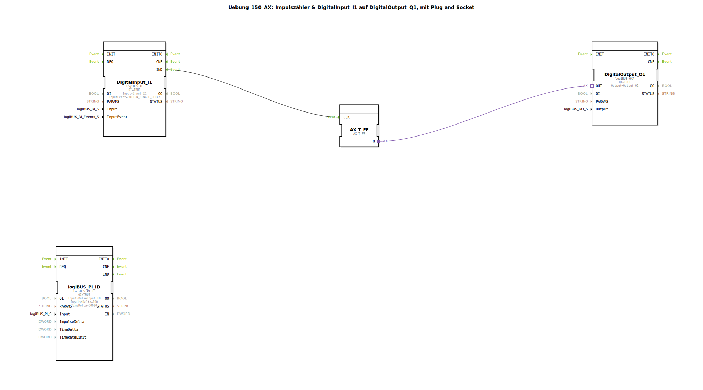

# Uebung_150_AX: Impulszähler &amp; DigitalInput_I1 auf DigitalOutput_Q1, mit Plug and Socket

Dieser Artikel beschreibt die logiBUS®-Übung `Uebung_150_AX`. Hier nutzen wir den schnellen Zählereingang der Steuerung.

----

## Ziel der Übung

Erfassung von schnellen Impulsen (z.B. Drehzahl, Durchfluss).

-----

## Beschreibung und Komponenten

[cite_start]Die Subapplikation `Uebung_150_AX.SUB` kombiniert eine Standard-Beleuchtungslogik mit einem Impulszähler-Baustein[cite: 1].

### Funktionsbausteine (FBs)

  * **`logiBUS_PI_ID`**: Typ `PulseInput_ID`. Erfasst Impulse am Hardware-Eingang `I8`.
  * **`DigitalInput_I1`**: Taster für die Lampe.
  * **`AX_T_FF`**: Toggle für die Lampe.

-----

## Funktionsweise

Der Baustein `logiBUS_PI_ID` arbeitet im Hintergrund. Er zählt die Impulse am Eingang `I8`.
*   `ImpulseDelta = 100`: Der Baustein meldet sich (sendet ein Event), wenn 100 neue Impulse gezählt wurden.
*   `TimeDelta = 50000` (µs): Oder wenn 50ms vergangen sind.

Dies ermöglicht die Erfassung von Hochgeschwindigkeitssignalen, die für normale digitale Eingänge zu schnell wären. Die restliche Schaltung (`I1` auf `Q1`) läuft völlig unabhängig davon weiter.

-----

## Anwendungsbeispiel

**Radarsensor / Geschwindigkeitsmessung**: Ein Sensor am Rad liefert Impulse. Die Steuerung zählt diese, um die Fahrgeschwindigkeit des Traktors zu berechnen.