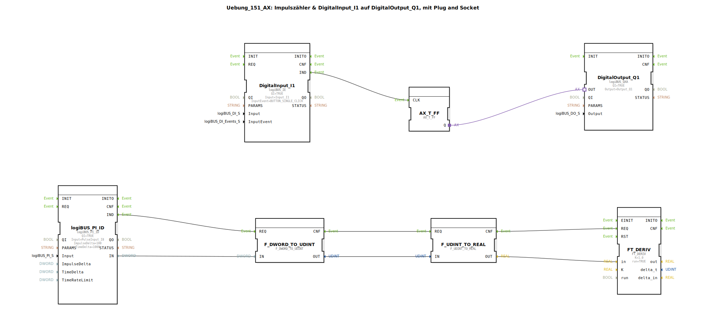

# Uebung_151_AX: Impulszähler &amp; DigitalInput_I1 auf DigitalOutput_Q1, mit Plug and Socket

Dieser Artikel beschreibt die logiBUS®-Übung `Uebung_151_AX`.

----

## Ziel der Übung

Berechnung einer zeitlichen Änderung (Differenzialquotient) aus Impulswerten.

-----

## Beschreibung und Komponenten

[cite_start]Die Subapplikation `Uebung_151_AX.SUB` erweitert den Impulszähler um mathematische Funktionen[cite: 1].

### Funktionsbausteine (FBs)

  * **`logiBUS_PI_ID`**: Liefert den aktuellen Zählerstand.
  * **`FT_DERIV`**: Ein Baustein aus der **OSCAT** Bibliothek zur Berechnung der Ableitung (Änderungsrate).

-----

## Funktionsweise

1.  Der Zählerstand (DWORD) wird in eine Fließkommazahl (REAL) gewandelt.
2.  Der `FT_DERIV` Baustein berechnet, wie schnell sich dieser Wert über die Zeit ändert.
3.  Das Ergebnis ist direkt proportional zur Frequenz der Eingangsimpulse (z.B. km/h oder U/min).

-----

## Anwendungsbeispiel

**Drehzahlüberwachung**: Ein Sensor am Lüfterrad liefert Impulse. Steigt oder fällt die Änderung pro Sekunde unter einen Schwellwert, kann ein Alarm ausgelöst werden.