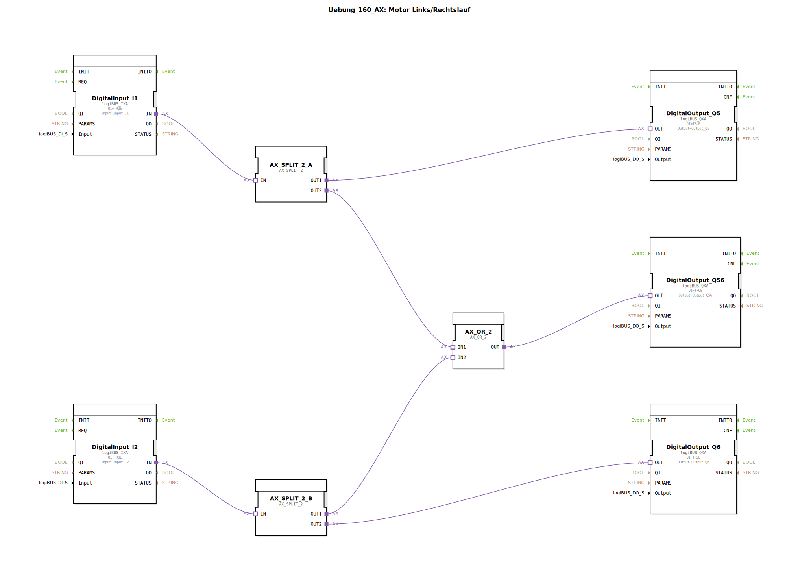

# Uebung_160_AX: Motor Links/Rechtslauf

Dieser Artikel beschreibt die logiBUS®-Übung `Uebung_160_AX`.

----

## Ziel der Übung

Kombination von Einzelausgängen und einer Sammelmeldung.

-----

## Beschreibung und Komponenten

[cite_start]Die Subapplikation `Uebung_160_AX.SUB` steuert zwei Drehrichtungen und einen gemeinsamen Status-Ausgang[cite: 1].

### Funktionsbausteine (FBs)

  * **`I1`**: Taster für Links (`Q5`).
  * **`I2`**: Taster für Rechts (`Q6`).
  * **`AX_OR_2`**: Verknüpft beide Signale.
  * **`Q56`**: Ein dritter Ausgang.

-----

## Funktionsweise

1.  Drückt man `I1`, geht `Q5` an.
2.  Drückt man `I2`, geht `Q6` an.
3.  Der Baustein `AX_OR_2` sorgt dafür, dass `Q56` immer dann an ist, wenn **entweder** `Q5` **oder** `Q6` (oder beide) aktiv sind.

-----

## Anwendungsbeispiel

**Hauptschütz-Ansteuerung**: In einer Motorsteuerung sind `Q5` und `Q6` die Richtungsschütze. `Q56` steuert das Hauptschütz an, das in beiden Fällen angezogen sein muss, um den Leistungsteil mit Strom zu versorgen.