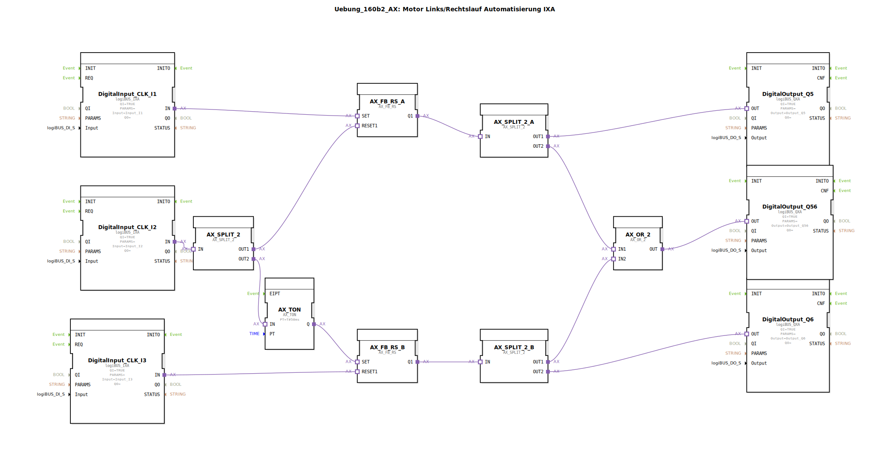

Hier ist die Dokumentation für die Übung `Uebung_160b2_AX` basierend auf den bereitgestellten Dateiinhalten.

# Uebung_160b2_AX: Motor Links/Rechtslauf Automatisierung IXA

* * * * * * * * * *

## Einleitung

Die Übung **Uebung_160b2_AX** realisiert eine Steuerung für einen Motor mit Links- und Rechtslauf-Funktionalität unter Verwendung der Adapter-Technologie (AX/IXA/QXA). Der Fokus liegt auf einer sicheren Umschaltung der Drehrichtung, wobei eine Totzeit (Verzögerung) implementiert ist, um den Motor und die Mechanik beim Wechsel der Drehrichtung zu schützen. Zusätzlich wird der Betriebsstatus über Ausgänge signalisiert.

## Verwendete Funktionsbausteine (FBs)

In dieser Sub-Application werden verschiedene Bausteine aus der `logiBUS` und `adapter` Bibliothek verwendet, um die Ein-/Ausgabesignale zu verarbeiten und die logische Verknüpfung herzustellen.

### Sub-Bausteine: E/A-Schnittstellen (logiBUS)

Diese Bausteine stellen die Verbindung zur physischen Hardware her.

-   **Typ**: `logiBUS::io::DI::logiBUS_IXA` (Eingänge) und `logiBUS::io::DQ::logiBUS_QXA` (Ausgänge)
-   **Verwendete interne FBs**:
    -   **DigitalInput_CLK_I1**: `logiBUS_IXA`
        -   Parameter: `Input` = `Input_I1`
        -   Funktion: Startsignal für Drehrichtung 1 (z.B. Links).
    -   **DigitalInput_CLK_I2**: `logiBUS_IXA`
        -   Parameter: `Input` = `Input_I2`
        -   Funktion: Umschalt-Signal / Stoppt Richtung 1 und startet Richtung 2 verzögert.
    -   **DigitalInput_CLK_I3**: `logiBUS_IXA`
        -   Parameter: `Input` = `Input_I3`
        -   Funktion: Stoppsignal für Drehrichtung 2.
    -   **DigitalOutput_Q5**: `logiBUS_QXA`
        -   Parameter: `Output` = `Output_Q5`
        -   Funktion: Ansteuerung Schütz/Motor Drehrichtung 1.
    -   **DigitalOutput_Q6**: `logiBUS_QXA`
        -   Parameter: `Output` = `Output_Q6`
        -   Funktion: Ansteuerung Schütz/Motor Drehrichtung 2.
    -   **DigitalOutput_Q56**: `logiBUS_QXA`
        -   Parameter: `Output` = `Output_Q56`
        -   Funktion: Sammelanzeige "Motor läuft" (Richtung 1 oder 2).

### Sub-Bausteine: Logik und Speicher (Adapter)

Diese Bausteine verarbeiten die Signale logisch.

-   **Typ**: `adapter::iec61131::bistableElements::AX_FB_RS`
-   **Verwendete interne FBs**:
    -   **AX_SR_A**: `AX_FB_RS`
        -   Funktion: Speicherglied (RS-Flipflop) für Drehrichtung 1.
    -   **AX_SR_B**: `AX_FB_RS`
        -   Funktion: Speicherglied (RS-Flipflop) für Drehrichtung 2.

### Sub-Bausteine: Zeitglieder

-   **Typ**: `adapter::events::unidirectional::timers::AX_TON`
-   **Verwendete interne FBs**:
    -   **AX_TON**: `AX_TON`
        -   Parameter: `PT` = `T#50ms`
        -   Funktion: Einschaltverzögerung von 50 Millisekunden für den sanften Richtungswechsel.

### Sub-Bausteine: Signalverteilung und Verknüpfung

-   **Typ**: `adapter::events::unidirectional::AX_SPLIT_2` und `adapter::booleanOperators::AX_OR_2`
-   **Verwendete interne FBs**:
    -   **AX_SPLIT_2, AX_SPLIT_2_A, AX_SPLIT_2_B**: `AX_SPLIT_2`
        -   Funktion: Verteilt ein eingehendes Adaptersignal auf zwei Ausgänge, um parallele Prozesse anzustoßen oder Signale abzweigen zu können.
    -   **AX_OR_2**: `AX_OR_2`
        -   Funktion: Logisches ODER. Verknüpft die Statusmeldungen beider Drehrichtungen für die Sammelanzeige.

## Programmablauf und Verbindungen

Die Schaltung realisiert eine klassische Wendeschützsteuerung mit einer Besonderheit in der Umschaltung durch Tasterverriegelung und Zeitverzögerung.

1.  **Start Drehrichtung 1 (Q5):**
    *   Das Signal von **Input_I1** setzt den Speicher **AX_SR_A**.
    *   Der Ausgang von **AX_SR_A** wird über einen Splitter (**AX_SPLIT_2_A**) direkt auf **Output_Q5** geleitet. Der Motor läuft in Richtung 1.

2.  **Umschaltung / Start Drehrichtung 2 (Q6):**
    *   Das Signal von **Input_I2** gelangt auf einen Splitter (**AX_SPLIT_2**).
    *   **Zweig 1:** Das Signal resettet sofort den Speicher **AX_SR_A**. Damit wird **Output_Q5** unverzüglich abgeschaltet.
    *   **Zweig 2:** Das Signal startet den Timer **AX_TON**. Nach Ablauf von 50ms (Parameter `PT`) wird der Speicher **AX_SR_B** gesetzt.
    *   Der Ausgang von **AX_SR_B** aktiviert über **AX_SPLIT_2_B** den **Output_Q6**. Der Motor läuft nun in Richtung 2.
    *   *Hinweis:* Die 50ms Verzögerung dient als Verriegelungszeit, um einen Kurzschluss zwischen den Phasen bei direkter Umschaltung zu verhindern.

3.  **Stopp Drehrichtung 2:**
    *   Das Signal von **Input_I3** resettet den Speicher **AX_SR_B**, wodurch **Output_Q6** abschaltet.

4.  **Betriebsanzeige (Q56):**
    *   Die Signale der beiden Drehrichtungen (von den Splittern A und B kommend) werden im Baustein **AX_OR_2** zusammengeführt.
    *   Sobald entweder Q5 oder Q6 aktiv ist, wird **Output_Q56** angesteuert. Dies dient als Indikator, dass der Motor in Betrieb ist.

## Zusammenfassung

Die `Uebung_160b2_AX` demonstriert eine fortgeschrittene Motorsteuerung unter Verwendung von Adapter-Bausteinen. Sie zeigt, wie man durch den Einsatz von Splittern (`AX_SPLIT_2`) Signale vervielfältigt, um gleichzeitige Aktionen (Reset der einen Seite, Starten des Timers für die andere Seite) auszuführen. Die integrierte Sicherheitslogik mittels `AX_TON` verhindert eine sofortige Richtungsumkehr und schützt somit die angeschlossene Hardware. Die Übung ist ideal, um das Verständnis für sequenzielle Steuerungen und Signalrouting in 4diac zu vertiefen.