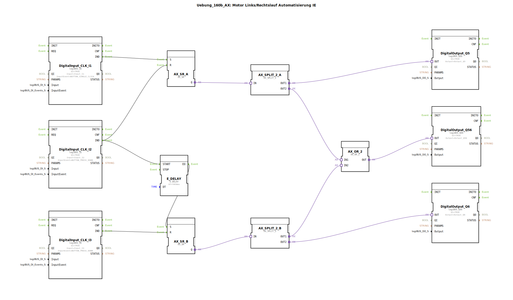

Hier ist die Dokumentation für die Übung `Uebung_160b_AX` basierend auf den bereitgestellten XML-Daten.

# Uebung_160b_AX: Motor Links/Rechtslauf Automatisierung IE

* * * * * * * * * *

## Einleitung
Diese Übung implementiert eine Steuerung für einen Motor mit Links- und Rechtslauf unter Verwendung des Adapter-Konzepts (AX) in 4diac. Ziel der Übung ist es, zwei Ausgänge (Q5 und Q6) über separate Eingangsereignisse zu steuern (Setzen/Rücksetzen) und dabei einen gemeinsamen Statusausgang (Q56) zu aktivieren, sobald einer der beiden Motorausgänge aktiv ist. Zudem wird eine Verzögerung beim Umschaltvorgang über Taster I2 realisiert.

## Verwendete Funktionsbausteine (FBs)

In dieser Übung werden verschiedene Standard-Bausteine aus der `logiBUS`-Bibliothek sowie logische Adapter-Bausteine verwendet.

### Sub-Bausteine: Logik und IO

Hier werden die spezifischen Funktionsbausteine beschrieben, die für die Logik und die Hardware-Anbindung zuständig sind.

*   **DigitalInput_CLK_I1 / I2 / I3**
    *   **Typ**: `logiBUS::io::DI::logiBUS_IE`
    *   **Beschreibung**: Dient der Erfassung von Taster-Eingaben.
    *   **Parameter**:
        *   `QI` = `TRUE`
        *   `Input` = `Input_I1` (bzw. I2, I3)
        *   `InputEvent` = `BUTTON_SINGLE_CLICK` (für I1), `BUTTON_PRESS_DOWN` (für I2, I3)
    *   **Funktionsweise**: Wandelt Hardware-Signale in IEC 61499 Events um.

*   **DigitalOutput_Q5 / Q6 / Q56**
    *   **Typ**: `logiBUS::io::DQ::logiBUS_QXA`
    *   **Beschreibung**: Adapter-basierte Ausgänge zur Ansteuerung der Hardware (Motorrelais oder LEDs).
    *   **Parameter**:
        *   `QI` = `TRUE`
        *   `Output` = `Output_Q5` (bzw. Q6, Q56)
    *   **Funktionsweise**: Gibt den Status des verbundenen Adapters an die Hardware aus.

*   **AX_SR_A / AX_SR_B**
    *   **Typ**: `adapter::events::unidirectional::AX_SR`
    *   **Beschreibung**: Speicherbaustein (Flip-Flop) basierend auf Adapter-Verbindungen.
    *   **Funktionsweise**: Speichert den Zustand "Ein" (Set) oder "Aus" (Reset). `AX_SR_A` steuert den Pfad für Q5, `AX_SR_B` den Pfad für Q6.
        *   Eingang S (Set): Aktiviert den Adapter-Ausgang Q.
        *   Eingang R (Reset): Deaktiviert den Adapter-Ausgang Q.

*   **AX_SPLIT_2_A / AX_SPLIT_2_B**
    *   **Typ**: `adapter::events::unidirectional::AX_SPLIT_2`
    *   **Beschreibung**: Signalverteiler für Adapter-Verbindungen.
    *   **Funktionsweise**: Nimmt ein Adapter-Signal entgegen und stellt es an zwei Ausgängen (OUT1, OUT2) zur Verfügung. Dies ermöglicht, dass ein SR-Flip-Flop sowohl den direkten Motorausgang als auch das ODER-Gatter für die Statusanzeige speist.

*   **AX_OR_2**
    *   **Typ**: `adapter::booleanOperators::AX_OR_2`
    *   **Beschreibung**: Logisches ODER für Adapter.
    *   **Funktionsweise**: Der Ausgang OUT ist aktiv, wenn IN1 *oder* IN2 aktiv sind. Hier verwendet, um Q56 einzuschalten, wenn entweder Q5 oder Q6 läuft.

*   **E_DELAY**
    *   **Typ**: `iec61499::events::E_DELAY`
    *   **Beschreibung**: Einschaltverzögerung.
    *   **Parameter**:
        *   `DT` = `T#50ms`
    *   **Funktionsweise**: Verzögert das Event-Signal um 50 Millisekunden.

## Programmablauf und Verbindungen

Das Netzwerk realisiert eine verriegelte Steuerung mit folgendem Ablauf:

1.  **Motor Links (Q5) Starten:**
    *   Das Event `BUTTON_SINGLE_CLICK` an **Input_I1** setzt den Baustein **AX_SR_A** (Eingang S).
    *   Das Signal von `AX_SR_A` wird durch **AX_SPLIT_2_A** aufgeteilt:
        *   Ein Pfad aktiviert direkt **DigitalOutput_Q5**.
        *   Der zweite Pfad geht in das ODER-Gatter **AX_OR_2**, welches **DigitalOutput_Q56** (Betriebsanzeige) aktiviert.

2.  **Umschalten / Stoppen Links (I2):**
    *   Das Event `BUTTON_PRESS_DOWN` an **Input_I2** hat zwei Funktionen:
        *   Es setzt **AX_SR_A** zurück (Reset). Der Motor an Q5 stoppt sofort.
        *   Gleichzeitig startet es den Timer **E_DELAY**.

3.  **Motor Rechts (Q6) Starten (Verzögert):**
    *   Nach Ablauf der Verzögerung (50ms) durch **E_DELAY** wird das Event `EO` ausgelöst.
    *   Dieses Event setzt **AX_SR_B** (Eingang S).
    *   Das Signal von `AX_SR_B` wird durch **AX_SPLIT_2_B** aufgeteilt:
        *   Ein Pfad geht in das ODER-Gatter **AX_OR_2** und hält **DigitalOutput_Q56** aktiv.
        *   Der zweite Pfad aktiviert **DigitalOutput_Q6**.

4.  **Motor Rechts Stoppen (I3):**
    *   Das Event `BUTTON_PRESS_DOWN` an **Input_I3** setzt **AX_SR_B** zurück (Reset). Der Motor an Q6 stoppt und Q56 erlischt (sofern Q5 nicht aktiv ist).

**Zusammenfassend:**
*   **I1**: Startet Q5.
*   **I2**: Stoppt Q5 und startet (nach 50ms) Q6.
*   **I3**: Stoppt Q6.
*   **Q56**: Leuchtet, wenn Q5 oder Q6 aktiv sind.

## Zusammenfassung
Die Übung `Uebung_160b_AX` demonstriert die fortgeschrittene Nutzung von Adapter-Bausteinen zur Kapselung von Logik und Datenfluss. Durch den Einsatz von Splittern (`AX_SPLIT`) und logischen Operatoren (`AX_OR`) auf Adapter-Ebene wird der Schaltplan übersichtlich gehalten, während gleichzeitig komplexe Abhängigkeiten (gemeinsame Statusanzeige, Umschaltlogik) realisiert werden. Die Verzögerung (`E_DELAY`) sorgt für eine kurze Totzeit beim Umschalten der Drehrichtung über I2, was in realen Motoranwendungen wichtig für den Maschinenschutz ist.