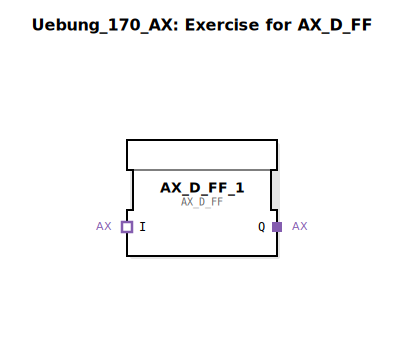

Hier ist die Dokumentation für die Übung `Uebung_170_AX`, basierend auf den bereitgestellten XML-Daten.

# Uebung_170_AX: Exercise for AX_D_FF

* * * * * * * * * *

## Einleitung
Die Sub-Applikation **Uebung_170_AX** ist eine grundlegende Übungseinheit, die speziell für den Funktionsbaustein `AX_D_FF` erstellt wurde. Ziel dieser Übung ist es, die Instanziierung und das Verhalten dieses spezifischen Adapter-Bausteins in einer IEC 61499 Umgebung zu demonstrieren.

## Verwendete Funktionsbausteine (FBs)

In dieser Übung wird der folgende Hauptbaustein innerhalb des SubApp-Netzwerks verwendet:

### Sub-Bausteine: AX_D_FF_1
Dieser Baustein ist die zentrale Komponente dieser Sub-Applikation.

- **Typ**: `adapter::events::unidirectional::AX_D_FF`
- **Verwendete interne FBs**:
    - Da es sich hierbei um die Instanziierung eines Bibliothekselements handelt, sind die internen FBs dieses Bausteins in dessen eigener Typ-Definition verborgen und nicht in dieser SubApp-Datei sichtbar.
- **Funktionsweise**:
    - Der Baustein `AX_D_FF` (D-Flip-Flop Adapter) dient vermutlich der Speicherung von Zuständen basierend auf Event-Triggern innerhalb einer unidirektionalen Adapter-Struktur. Er kapselt die Logik eines D-Flip-Flops für die Verwendung in Adapter-basierten Event-Ketten.

## Programmablauf und Verbindungen

### 🌐 Netzwerkstruktur
Das Netzwerk dieser Sub-Applikation ist minimalistisch aufgebaut:
- Es enthält eine einzelne Instanz des Bausteins `AX_D_FF` (benannt als `AX_D_FF_1`).
- Positioniert bei den Koordinaten x=-1700, y=0.

### Verbindungen
In der vorliegenden Definition sind **keine expliziten Event- oder Datenverbindungen** innerhalb dieser Sub-Applikation definiert.
- Dies deutet darauf hin, dass diese Übung entweder als Vorlage dient, in der der Lernende Verbindungen hinzufügen muss, oder dass der Baustein über Adapter-Schnittstellen (Plugs/Sockets) verfügt, die auf einer höheren Ebene verbunden werden.
- Die Übung konzentriert sich auf die Bereitstellung der `AX_D_FF` Instanz.

### Lernziele & Hinweise
- **Schwierigkeitsgrad**: Einsteiger.
- **Vorkenntnisse**: Verständnis von Adaptern und D-Flip-Flops in IEC 61499.
- **Starten der Übung**: Platzieren Sie diese SubApp in einer Applikation und verbinden Sie die entsprechenden Adapter-Schnittstellen, um das Schaltverhalten des Flip-Flops zu beobachten.

## Zusammenfassung
Die **Uebung_170_AX** stellt eine isolierte Umgebung für den `AX_D_FF` Baustein bereit. Sie dient als Container für dieses spezifische Adapter-Element, ohne dabei interne Verschaltungen vorzugeben, und bildet somit einen Baustein für komplexere Steuerungsaufgaben oder Testszenarien.