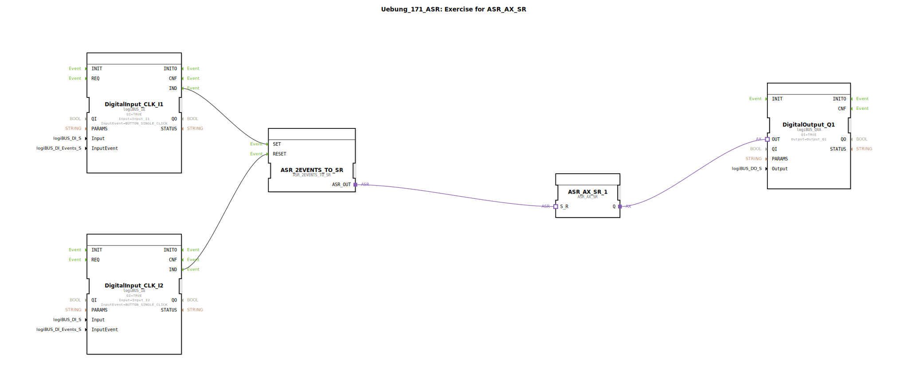

# Uebung_171_ASR: Exercise for ASR_AX_SR

* * * * * * * * * *

## Einleitung

Diese Übung zeigt die Anwendung eines asynchronen Set-Reset-Flipflops (ASR) in der 4diac-IDE. Zwei Taster an den digitalen Eingängen I1 und I2 steuern das Setzen und Rücksetzen eines Speicherbausteins, dessen Ausgang einen digitalen Ausgang Q1 schaltet. Die Übung vermittelt grundlegende Konzepte der Ereignisverarbeitung und der Kopplung von Hardware-Eingängen mit einem RS-Speichermodul.

## Verwendete Funktionsbausteine (FBs)

### Sub-Bausteine: DigitalInput_CLK_I1 und DigitalInput_CLK_I2

- **Typ**: `logiBUS::io::DI::logiBUS_IE`
- **Verwendete interne FBs**: keine (Hardware-Konfigurationsbaustein)
  - **Parameter**:
    - `QI` = TRUE
    - `Input` = `Input_I1` bzw. `Input_I2`
    - `InputEvent` = `BUTTON_SINGLE_CLICK`
  - **Ereignisausgang**: `IND` (wird bei Betätigung des Tasters ausgelöst)
  - **Datenausgang**: keine
- **Funktionsweise**: Die Bausteine repräsentieren die digitalen Eingänge der logiBUS-Hardware. Sie detektieren einen einzelnen Tastendruck (Single Click) auf dem entsprechenden Eingangskanal und geben ein Ereignis (`IND`) aus.

### Sub-Baustein: ASR_2EVENTS_TO_SR

- **Typ**: `adapter::conversion::unidirectional::ASR_2EVENTS_TO_SR`
- **Verwendete interne FBs**: keine (Konvertierungsbaustein)
  - **Parameter**: keine
  - **Ereigniseingänge**: `SET`, `RESET`
  - **Adapterausgang**: `ASR_OUT` (verbindet sich mit einem ASR-Adapter)
- **Funktionsweise**: Dieser Baustein wandelt zwei separate Ereignisse (SET und RESET) in eine Adapter-Schnittstelle um, die das Ansteuern eines ASR-Flipflops ermöglicht. Ein eingehendes SET-Ereignis setzt den Ausgangsadapter auf den Set-Zustand, ein RESET-Ereignis auf den Reset-Zustand.

### Sub-Baustein: ASR_AX_SR_1

- **Typ**: `adapter::events::unidirectional::ASR_AX_SR`
- **Verwendete interne FBs**: keine (ASR-Speicherbaustein)
  - **Parameter**: keine
  - **Adaptereingang**: `S_R` (erhält SET/RESET-Signale vom Konverter)
  - **Datenausgang**: `Q` (boolescher Wert, Zustand des Flipflops)
- **Funktionsweise**: Der Baustein realisiert ein asynchrones Set-Reset-Flipflop. Der interne Zustand wird über den Adaptereingang `S_R` gesteuert: Ein Set-Signal aktiviert den Ausgang `Q` (TRUE), ein Reset-Signal deaktiviert ihn (FALSE). Der Ausgang bleibt bis zum nächsten Signal stabil.

### Sub-Baustein: DigitalOutput_Q1

- **Typ**: `logiBUS::io::DQ::logiBUS_QXA`
- **Verwendete interne FBs**: keine (Hardware-Konfigurationsbaustein)
  - **Parameter**:
    - `QI` = TRUE
    - `Output` = `Output_Q1`
  - **Daten eingang**: `OUT` (erhält den Schaltbefehl vom ASR)
  - **Ereignisausgang**: keine
- **Funktionsweise**: Der Baustein steuert den digitalen Ausgang Q1 der logiBUS-Hardware. Sobald am Dateneingang `OUT` ein TRUE-Signal anliegt, wird der angeschlossene Aktor (z. B. eine Lampe) eingeschaltet; bei FALSE wird er ausgeschaltet.

## Programmablauf und Verbindungen

Der Ablauf wird durch die Ereignis- und Datenverbindungen im SubApp-Netzwerk bestimmt:

1. **Eingangsereignisse**:
   - Ein Tastendruck an `Input_I1` löst im Baustein `DigitalInput_CLK_I1` das Ereignis `IND` aus. Dieses wird an den Ereigniseingang `SET` des Konverters `ASR_2EVENTS_TO_SR` geleitet.
   - Ein Tastendruck an `Input_I2` löst im Baustein `DigitalInput_CLK_I2` das Ereignis `IND` aus. Dieses wird an den Ereigniseingang `RESET` des Konverters geleitet.

2. **Adapterverarbeitung**:
   - Der Konverter `ASR_2EVENTS_TO_SR` setzt den Ausgangsadapter `ASR_OUT` entsprechend dem letzten eingehenden Ereignis (SET oder RESET).
   - Der Adapterausgang ist mit dem Adaptereingang `S_R` des ASR-Bausteins `ASR_AX_SR_1` verbunden.

3. **Speicher und Ausgabe**:
   - Der ASR-Baustein reagiert auf das anliegende Adaptersignal und aktualisiert seinen Ausgang `Q`.
   - Der Ausgang `Q` ist mit dem Dateneingang `OUT` des digitalen Ausgangsbausteins `DigitalOutput_Q1` verbunden. Dadurch wird der physische Ausgang Q1 entsprechend ein- oder ausgeschaltet.

- **Lernziele**: Verständnis der Ereignissteuerung, Umgang mit Adapterbausteinen, einfache Speicherfunktion (RS-Flipflop).
- **Schwierigkeitsgrad**: Mittel
- **Benötigte Vorkenntnisse**: Grundlagen der 4diac-IDE, Umgang mit Ereignis- und Datenverbindungen, logiBUS-Konfiguration.
- **Ausführung**: Die Übung kann nach dem Laden und Kompilieren in der 4diac-Runtime ausgeführt werden. Die Eingangskanäle I1 und I2 müssen mit Tastern belegt sein; der Ausgang Q1 steuert einen Aktor (z. B. LED oder Relais).

## Zusammenfassung

Die Übung `Uebung_171_ASR` demonstriert die Realisierung eines asynchronen RS-Speichers mit zwei Tastern als Eingänge und einem digitalen Ausgang. Durch die Kombination von Hardware-Konfigurationsbausteinen (logiBUS), einem Ereignis-zu-Adapter-Konverter und einem ASR-Speichermodul wird eine einfache, aber typische Steuerungsaufgabe abgebildet. Der Nutzer lernt, wie diskrete Ereignisse über Adapter an einen Speicherbaustein weitergegeben und schließlich auf einen physischen Ausgang geschaltet werden.