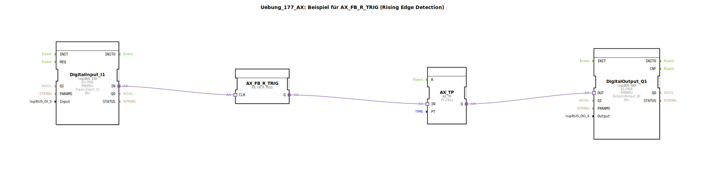

Hier ist die Dokumentation für die Übung `Uebung_177_AX`, basierend auf den bereitgestellten Daten.

# Uebung_177_AX: Beispiel für AX_FB_R_TRIG (Rising Edge Detection)

* * * * * * * * * *

## Einleitung

Diese Übung demonstriert die Verwendung der **Flankenerkennung (Rising Edge Detection)** in Kombination mit einem **Impulstimer**. Ziel ist es, ein Signal am physikalischen Eingang nur im Moment des Einschaltens (Wechsel von 0 auf 1) auszuwerten und daraufhin einen Ausgang für eine definierte Zeitdauer zu aktivieren.

Der Fokus liegt auf dem Baustein `AX_FB_R_TRIG`, der eine steigende Flanke erkennt.

## Verwendete Funktionsbausteine (FBs)

In dieser Sub-Application kommen Hardware-Treiberbausteine sowie Logik- und Zeitbausteine zum Einsatz.

### Sub-Bausteine:

#### 1. Hardware-Eingang
- **Name**: `DigitalInput_I1`
- **Typ**: `logiBUS::io::DI::logiBUS_IXA`
- **Parameter**:
    - `Input` = `Input_I1` (Verweis auf den physikalischen Eingang I1)
- **Funktionsweise**: Stellt den Zustand des digitalen Eingangs für die Logik bereit.

#### 2. Flankenerkennung (Rising Trigger)
- **Name**: `AX_FB_R_TRIG`
- **Typ**: `adapter::iec61131::edgeDetection::AX_FB_R_TRIG`
- **Funktionsweise**: Dieser Baustein überwacht das Eingangssignal. Er gibt nur dann ein Signal am Ausgang `Q` aus, wenn das Eingangssignal `CLK` von `FALSE` (0) auf `TRUE` (1) wechselt (steigende Flanke). Dauersignale werden ignoriert.

#### 3. Impuls-Timer (Pulse Timer)
- **Name**: `AX_TP`
- **Typ**: `adapter::events::unidirectional::timers::AX_TP`
- **Parameter**:
    - `PT` = `T#1s` (Process Time: 1 Sekunde)
- **Funktionsweise**: Erzeugt einen Impuls am Ausgang `Q` mit der Dauer, die in `PT` definiert ist, sobald der Eingang `IN` aktiviert wird.

#### 4. Hardware-Ausgang
- **Name**: `DigitalOutput_Q1`
- **Typ**: `logiBUS::io::DQ::logiBUS_QXA`
- **Parameter**:
    - `Output` = `Output_Q1` (Verweis auf den physikalischen Ausgang Q1)
- **Funktionsweise**: Schaltet den physikalischen Ausgang basierend auf dem Logiksignal.

## Programmablauf und Verbindungen

Der Ablauf der Schaltung gestaltet sich wie folgt:

1.  **Signaleingang**: Das Signal von `DigitalInput_I1` (Eingang I1) wird an den `CLK`-Eingang des Flankenerkennungsbausteins `AX_FB_R_TRIG` geleitet.
2.  **Flankenauswertung**:
    *   Wenn der Taster an I1 gedrückt wird, erkennt `AX_FB_R_TRIG` die positive Flanke.
    *   Der Ausgang `Q` des Triggers wird kurzzeitig aktiv.
3.  **Zeitsteuerung**: Dieses Signal wird an den Eingang `IN` des Timers `AX_TP` weitergeleitet.
4.  **Ausgabe**: Der Timer aktiviert seinen Ausgang `Q` für genau **1 Sekunde** (`PT=T#1s`). Dieses Signal steuert den `DigitalOutput_Q1` an.

**Zusammenhang der Verbindungen:**
*   `DigitalInput_I1.IN` → `AX_FB_R_TRIG.CLK`
*   `AX_FB_R_TRIG.Q` → `AX_TP.IN`
*   `AX_TP.Q` → `DigitalOutput_Q1.OUT`

## Zusammenfassung

Die `Uebung_177_AX` zeigt eine klassische Anwendung in der Automatisierungstechnik: Das Entkoppeln eines mechanischen Tastendrucks von der Ausführungsdauer einer Aktion. Durch die Verwendung von `AX_FB_R_TRIG` spielt es keine Rolle, wie lange der Taster gedrückt gehalten wird; der Prozess wird nur einmal beim Drücken gestartet. Der Timer `AX_TP` sorgt dafür, dass der Ausgang (z.B. eine Lampe oder ein Motor) für eine exakte Zeitspanne (hier 1 Sekunde) läuft.