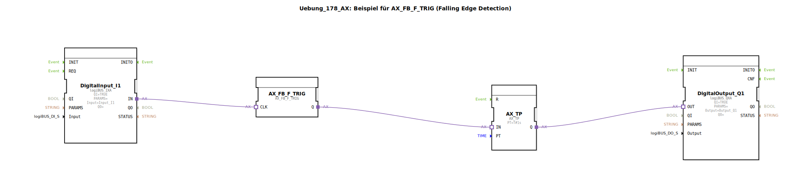

Hier ist die Dokumentation für die Übung `Uebung_178_AX` basierend auf den bereitgestellten Daten.

# Uebung_178_AX: Beispiel für AX_FB_F_TRIG (Falling Edge Detection)

* * * * * * * * * *

## Einleitung
Diese Übung demonstriert die Verwendung des Funktionsbausteins `AX_FB_F_TRIG` zur Erkennung einer fallenden Flanke (Falling Edge Detection). Ziel der Schaltung ist es, ein Ereignis oder Signal genau in dem Moment auszulösen, wenn ein Eingangssignal von einem hohen Status (TRUE) auf einen niedrigen Status (FALSE) wechselt (z.B. beim Loslassen eines Tasters).

## Verwendete Funktionsbausteine (FBs)

In dieser Sub-Application werden verschiedene Funktionsbausteine kombiniert, um die Logik abzubilden. Da es sich hierbei um eine SubApp handelt, werden im Folgenden die intern verschalteten Bausteine beschrieben.

### Sub-Bausteine: Interne Logik
Diese Übung besteht aus einer Vernetzung der folgenden Standard- und Adapter-Bausteine:

- **Verwendete interne FBs**:

    - **DigitalInput_I1**: `logiBUS::io::DI::logiBUS_IXA`
        - **Funktion**: Liest den physikalischen Eingang `Input_I1` ein.
        - **Parameter**: 
            - `Input` = `Input_I1`
            - `QI` = `TRUE`

    - **AX_FB_F_TRIG**: `adapter::iec61131::edgeDetection::AX_FB_F_TRIG`
        - **Funktion**: Erkennt eine fallende Flanke am Eingangssignal. Der Ausgang wird aktiv, wenn der Eingang von TRUE auf FALSE wechselt.
    
    - **AX_TP**: `adapter::events::unidirectional::timers::AX_TP`
        - **Funktion**: Timer Pulse (Impulsgeber). Erzeugt einen Impuls definierter Länge, sobald der Eingang aktiviert wird.
        - **Parameter**: 
            - `PT` = `T#1s` (Impulsdauer von 1 Sekunde).

    - **DigitalOutput_Q1**: `logiBUS::io::DQ::logiBUS_QXA`
        - **Funktion**: Steuert den physikalischen Ausgang `Output_Q1` an.
        - **Parameter**: 
            - `Output` = `Output_Q1`
            - `QI` = `TRUE`

## Programmablauf und Verbindungen

Der Ablauf des Programms lässt sich wie folgt beschreiben:

1.  **Signaleingang**: Der digitale Eingang `DigitalInput_I1` überwacht den Status des Hardware-Eingangs `Input_I1`.
2.  **Flankenerkennung**: Das Signal wird über eine Adapter-Verbindung an den Baustein `AX_FB_F_TRIG` (Eingang `CLK`) weitergeleitet. Dieser Baustein überwacht das Signal auf eine negative Flanke. Das bedeutet, er reagiert genau dann, wenn das Signal von 1 (TRUE) auf 0 (FALSE) abfällt (z.B. wenn ein Taster losgelassen wird).
3.  **Zeitglied**: Sobald die fallende Flanke erkannt wird, sendet der `AX_FB_F_TRIG` über seinen Ausgang `Q` ein Signal an den Timer `AX_TP` (Eingang `IN`).
4.  **Ausgabe**: Der Timer `AX_TP` ist als Impulsgeber konfiguriert (`TP`). Durch das Eingangssignal wird der Timer gestartet und setzt seinen Ausgang `Q` für die Dauer von 1 Sekunde (`PT` = `T#1s`) auf TRUE.
5.  **Hardware-Ansteuerung**: Das Ausgangssignal des Timers wird an den `DigitalOutput_Q1` weitergeleitet, welcher den Hardware-Ausgang `Output_Q1` für die Dauer des Impulses aktiviert.

**Zusammenfassend**: Wenn der Eingang I1 ausgeschaltet wird (fallende Flanke), wird der Ausgang Q1 für genau eine Sekunde eingeschaltet.

## Zusammenfassung
Die Übung `Uebung_178_AX` veranschaulicht die Verarbeitung von Signalen basierend auf deren Abschaltmoment. Durch die Kombination einer fallenden Flankenerkennung (`F_TRIG`) mit einem Impuls-Timer (`TP`) wird eine zeitgesteuerte Reaktion auf das Ende eines Eingangssignals realisiert. Dies ist eine typische Anwendung für Nachlaufsteuerungen oder Reaktionen auf das Loslassen von Bedienelementen.