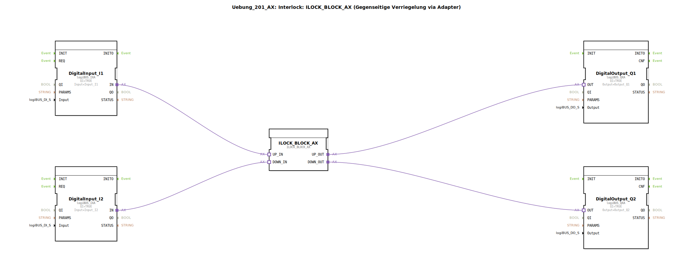

# Uebung_201_AX: Interlock: ILOCK_BLOCK_AX (Gegenseitige Verriegelung via Adapter)

* * * * * * * * * *

## Einleitung

Diese Übung demonstriert die Realisierung einer gegenseitigen Verriegelung (Interlock) mithilfe des Funktionsbausteins `ILOCK_BLOCK_AX`. Zwei digitale Eingänge werden über Adapter an den Verriegelungsblock angeschlossen. Die Ausgänge sind so geschaltet, dass immer nur einer der beiden Ausgänge aktiv sein kann – ein gleichzeitiges Schalten wird verhindert. Dies ist eine typische Sicherheitsfunktion in der Automatisierungstechnik, z. B. um gegenläufige Antriebe zu schützen.

## Verwendete Funktionsbausteine (FBs)

Die Übung besteht aus fünf Funktionsbausteinen im Netzwerk:

- **DigitalInput_I1** – liest den ersten digitalen Eingang (`Input_I1`)
- **DigitalInput_I2** – liest den zweiten digitalen Eingang (`Input_I2`)
- **ILOCK_BLOCK_AX** – führt die gegenseitige Verriegelung durch
- **DigitalOutput_Q1** – steuert den ersten digitalen Ausgang (`Output_Q1`)
- **DigitalOutput_Q2** – steuert den zweiten digitalen Ausgang (`Output_Q2`)

### Baustein: `DigitalInput_I1` (Typ: `logiBUS::io::DI::logiBUS_IXA`)
- **Typ**: Digitaleingabe-Baustein (Adapter-Schnittstelle)
- **Parameter**:
  - `QI` = `TRUE`
  - `Input` = `Input_I1`
- **Ereignisse/Adapter**: Gibt ein Adapter-Interface `IN` aus, das mit dem Interlock-Block verbunden wird.

### Baustein: `DigitalInput_I2` (Typ: `logiBUS::io::DI::logiBUS_IXA`)
- **Typ**: Digitaleingabe-Baustein (Adapter-Schnittstelle)
- **Parameter**:
  - `QI` = `TRUE`
  - `Input` = `Input_I2`
- **Ereignisse/Adapter**: Gibt ein Adapter-Interface `IN` aus.

### Baustein: `ILOCK_BLOCK_AX` (Typ: `logiBUS::signalprocessing::interlock::ILOCK_BLOCK_AX`)
- **Typ**: Verriegelungslogik-Baustein (Adapter-basiert)
- **Parameter**: Keine expliziten Parameter in der XML
- **Adapter-Schnittstellen**:
  - `UP_IN` – Eingang für den ersten Kanal (verbunden mit `DigitalInput_I1.IN`)
  - `DOWN_IN` – Eingang für den zweiten Kanal (verbunden mit `DigitalInput_I2.IN`)
  - `UP_OUT` – Ausgang für den ersten Kanal (verbunden mit `DigitalOutput_Q1.OUT`)
  - `DOWN_OUT` – Ausgang für den zweiten Kanal (verbunden mit `DigitalOutput_Q2.OUT`)
- **Funktionsweise**: Der Baustein implementiert eine gegenseitige Verriegelung. Wenn der `UP_IN`-Eingang aktiv ist, wird `UP_OUT` aktiviert und gleichzeitig `DOWN_OUT` deaktiviert (sperrt den zweiten Kanal). Wird `DOWN_IN` aktiv, schaltet der Baustein entsprechend um. Ein gleichzeitiges Aktivieren beider Ausgänge ist nicht möglich.

### Baustein: `DigitalOutput_Q1` (Typ: `logiBUS::io::DQ::logiBUS_QXA`)
- **Typ**: Digitalausgabe-Baustein (Adapter-Schnittstelle)
- **Parameter**:
  - `QI` = `TRUE`
  - `Output` = `Output_Q1`
- **Ereignisse/Adapter**: Empfängt ein Adapter-Interface `OUT` vom Interlock-Block.

### Baustein: `DigitalOutput_Q2` (Typ: `logiBUS::io::DQ::logiBUS_QXA`)
- **Typ**: Digitalausgabe-Baustein (Adapter-Schnittstelle)
- **Parameter**:
  - `QI` = `TRUE`
  - `Output` = `Output_Q2`
- **Ereignisse/Adapter**: Empfängt ein Adapter-Interface `OUT` vom Interlock-Block.

## Programmablauf und Verbindungen

Der Ablauf der Übung ist wie folgt:

1. Die beiden digitalen Eingangssignale `Input_I1` und `Input_I2` werden durch die `DigitalInput_I1`- bzw. `DigitalInput_I2`-Bausteine erfasst.
2. Die Adapterausgänge dieser Eingangsbausteine (`IN`) werden mit den entsprechenden Eingängen des `ILOCK_BLOCK_AX` verbunden:
   - `DigitalInput_I1.IN` → `ILOCK_BLOCK_AX.UP_IN`
   - `DigitalInput_I2.IN` → `ILOCK_BLOCK_AX.DOWN_IN`
3. Im `ILOCK_BLOCK_AX` wird die Verriegelungslogik ausgeführt:
   - Bei Aktivierung von `UP_IN` wird `UP_OUT` auf TRUE gesetzt und `DOWN_OUT` auf FALSE.
   - Bei Aktivierung von `DOWN_IN` wird `DOWN_OUT` auf TRUE gesetzt und `UP_OUT` auf FALSE.
   - Falls beide Eingänge gleichzeitig aktiv sind, wird durch die interne Logik ein definierter Vorrang (meist der zuerst erkannte) sichergestellt.
4. Die Ausgangsadapter des Interlock-Blocks werden mit den Ausgangsbausteinen verbunden:
   - `ILOCK_BLOCK_AX.UP_OUT` → `DigitalOutput_Q1.OUT`
   - `ILOCK_BLOCK_AX.DOWN_OUT` → `DigitalOutput_Q2.OUT`
5. Die Ausgangsbausteine geben die Signale an die physikalischen Ausgänge `Output_Q1` und `Output_Q2` weiter.

**Lernziele:**
- Kennenlernen des Interlock-Konzepts (gegenseitige Verriegelung)
- Arbeiten mit Adapter-basierten Funktionsbausteinen in 4diac
- Verständnis für Sicherheitslogik in der Automatisierung

**Schwierigkeitsgrad:** Einsteiger / Fortgeschrittene – Grundkenntnisse in IEC 61499 und Adapterverbindungen sind hilfreich.

## Zusammenfassung

In dieser Übung wird die gegenseitige Verriegelung zweier Ausgänge mithilfe des Funktionsbausteins `ILOCK_BLOCK_AX` umgesetzt. Die Struktur zeigt eine typische Anwendung von Adapterverbindungen zur Steuerung von Ein- und Ausgängen in der 4diac-IDE. Die Verriegelung verhindert, dass beide Ausgänge gleichzeitig aktiv werden – eine wichtige Sicherheitsfunktion für viele industrielle Steuerungsaufgaben.