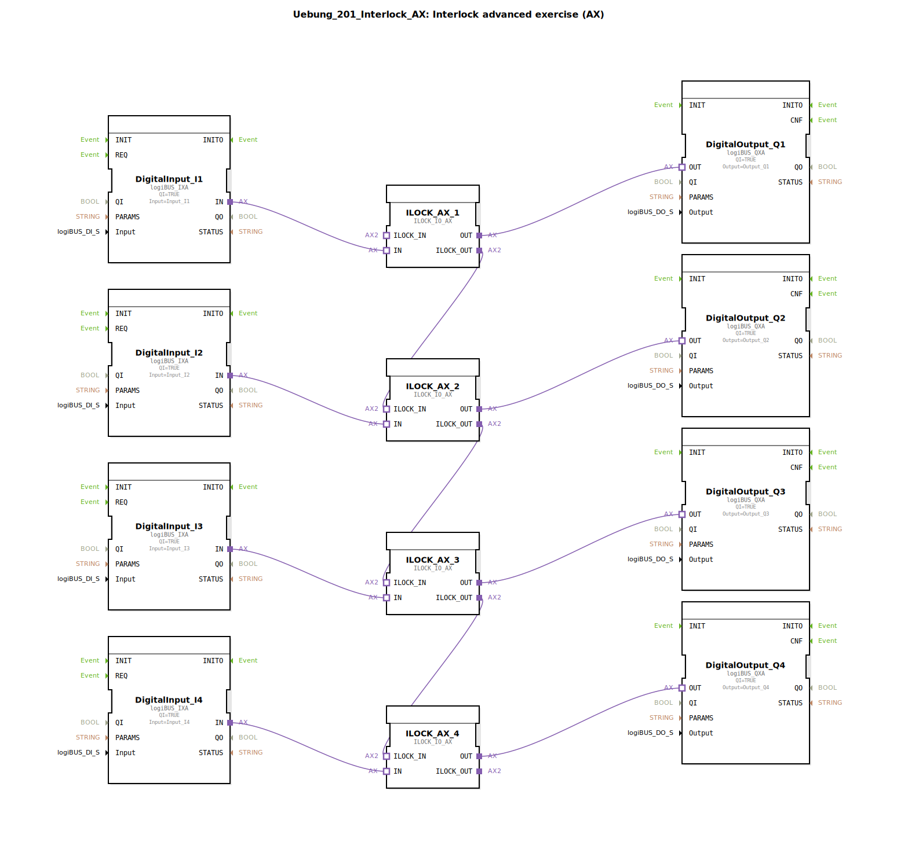

# Uebung_201_Interlock_AX: Interlock advanced exercise (AX)

* * * * * * * * * *
## Einleitung
Diese Übung erweitert die grundlegende Interlock-Schaltung auf eine komplexere Anwendung (Advanced eXercise). Ziel ist es, vier digitale Eingänge (I1–I4) über eine verkettete Verriegelungslogik (Interlock) mit vier digitalen Ausgängen (Q1–Q4) zu verbinden. Die Besonderheit liegt in der seriellen Verschaltung der Interlock-Bausteine: Der Freigabeausgang eines Bausteins wird mit dem Freigabeeingang des nächsten Bausteins verbunden, sodass eine Abhängigkeitskette entsteht. Dies ermöglicht zeitliche oder logische Sperren zwischen aufeinanderfolgenden Ausgängen und eignet sich für Anwendungen wie sequenzielle Maschinensteuerungen oder Sicherheitsschaltungen.

## Verwendete Funktionsbausteine (FBs)

### Sub-Bausteine: DigitalInput_Ix
- **Typ**: `logiBUS::io::DI::logiBUS_IXA`
- **Verwendete interne FBs**: Keine (Hardware-nah)
- **Parameter**:
  - `QI` = `TRUE`
  - `Input` = entsprechendes physikalisches Eingangssignal (Input_I1–I4)
- **Funktionsweise**: Wandelt ein digitales Eingangssignal der logiBUS-Hardware in ein internes Adapter- oder Datensignal um. Stellt den Sensorwert am Adapterausgang `IN` bereit.

### Sub-Bausteine: DigitalOutput_Qx
- **Typ**: `logiBUS::io::DQ::logiBUS_QXA`
- **Verwendete interne FBs**: Keine (Hardware-nah)
- **Parameter**:
  - `QI` = `TRUE`
  - `Output` = entsprechendes physikalisches Ausgangssignal (Output_Q1–Q4)
- **Funktionsweise**: Empfängt ein Signal am Adaptereingang `OUT` und aktiviert den zugehörigen digitalen Hardware-Ausgang (z. B. Relais, Ventil, Lampe).

### Sub-Baustein: ILOCK_AX_x
- **Typ**: `logiBUS::signalprocessing::interlock::ILOCK_IO_AX`
- **Verwendete interne FBs**: Keine (geschlossener Funktionsbaustein)
- **Parameter**: Keine expliziten Parameter in diesem Projekt (Standardparameter)
- **Adaptereingänge**:
  - `IN`: Digitaleingangsfreigabe-Schnittstelle
  - `ILOCK_IN`: Interlock-Verkettungseingang (von vorherigem Baustein)
- **Adapterausgänge**:
  - `OUT`: Digitalausgangsfreigabe-Schnittstelle
  - `ILOCK_OUT`: Interlock-Verkettungsausgang (zum nächsten Baustein)
- **Funktionsweise**: Der Baustein realisiert eine verriegelnde Steuerlogik (Interlock). Der Ausgang `OUT` wird nur dann aktiviert, wenn der Eingang `IN` aktiv *und* der Verkettungseingang `ILOCK_IN` freigegeben ist. Nach Aktivierung gibt er selbst am `ILOCK_OUT` die Freigabe für den nächsten Baustein in der Kette weiter. So entsteht eine sequenzielle Abhängigkeit: Q1 muss zuerst kommen, damit Q2 freigegeben wird, dann Q3, dann Q4.

## Programmablauf und Verbindungen
Die Schaltung besteht aus vier identischen Interlock-Stufen, die in Reihe geschaltet sind. Jede Stufe enthält:
- einen digitalen Eingang (DigitalInput)
- einen ILOCK_IO_AX-Baustein
- einen digitalen Ausgang (DigitalOutput)

Die Verbindungen im Netzwerk:
1. **Eingangsseite**: Jeder `DigitalInput` ist mit seinem zugehörigen `ILOCK_AX`-Baustein über den Adapter `IN` verbunden.
   - `DigitalInput_I1.IN` → `ILOCK_AX_1.IN`
   - `DigitalInput_I2.IN` → `ILOCK_AX_2.IN`
   - `DigitalInput_I3.IN` → `ILOCK_AX_3.IN`
   - `DigitalInput_I4.IN` → `ILOCK_AX_4.IN`

2. **Ausgangsseite**: Jeder `ILOCK_AX` leitet sein Freigabesignal über den Adapter `OUT` an den zugehörigen `DigitalOutput` weiter.
   - `ILOCK_AX_1.OUT` → `DigitalOutput_Q1.OUT`
   - `ILOCK_AX_2.OUT` → `DigitalOutput_Q2.OUT`
   - `ILOCK_AX_3.OUT` → `DigitalOutput_Q3.OUT`
   - `ILOCK_AX_4.OUT` → `DigitalOutput_Q4.OUT`

3. **Verkettete Verriegelung (Interlock-Kette)**:
   - `ILOCK_AX_1.ILOCK_OUT` → `ILOCK_AX_2.ILOCK_IN`
   - `ILOCK_AX_2.ILOCK_OUT` → `ILOCK_AX_3.ILOCK_IN`
   - `ILOCK_AX_3.ILOCK_OUT` → `ILOCK_AX_4.ILOCK_IN`

Der Ablauf: Um Q2 zu aktivieren, muss zuerst Q1 aktiv sein (weil `ILOCK_IN` von Baustein 2 vom `ILOCK_OUT` von Baustein 1 kommt). Analog muss für Q3 sowohl Q1 als auch Q2 aktiv sein, für Q4 alle vorherigen. Diese Kette stellt sicher, dass die Ausgänge nur in der vorgegebenen Reihenfolge zugeschaltet werden können – ein typisches Sicherheits- oder Sequenzverhalten.

**Hinweise zur Bedienung**: Die Übung kann in der 4diac-IDE durch das Laden des SubApp-Typs `Uebung_201_Interlock_AX` und anschließendes Ausführen auf einer logiBUS-Hardwareplattform getestet werden. Die Eingänge sollten wechselweise oder nacheinander aktiviert werden, um die sequenzielle Freigabe zu beobachten.

## Zusammenfassung
Die Übung `Uebung_201_Interlock_AX` demonstriert die praktische Anwendung verketteter Interlock-Bausteine (`ILOCK_IO_AX`) in einer 4diac-Umgebung. Vier unabhängige Eingangs-/Ausgangspaare werden seriell so verschaltet, dass jeder nachfolgende Ausgang nur freigegeben wird, wenn der vorherige Ausgang bereits aktiv ist. Dieses Prinzip wird häufig in der Automatisierungstechnik für Anlaufsequenzen, Schutzverriegelungen oder Maschinensicherheit eingesetzt. Der Lernende vertieft das Verständnis für die Verschaltung von Adaptern und die Erstellung von Abhängigkeitsketten in IEC 61499.