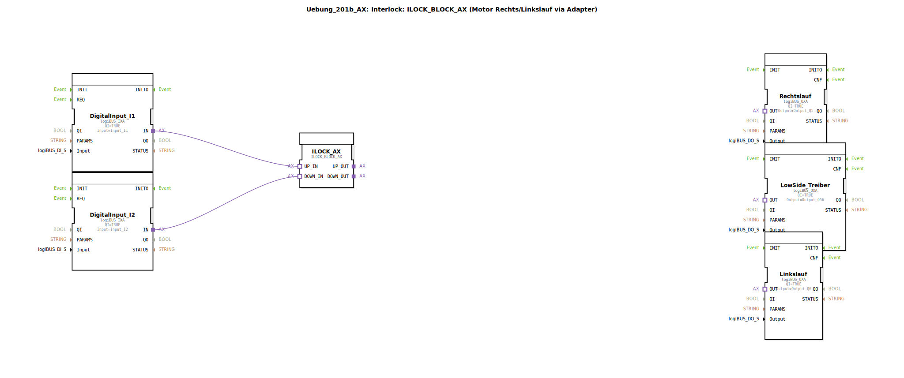

# Uebung_201b_AX: Interlock: ILOCK_BLOCK_AX (Motor Rechts/Linkslauf via Adapter)

* * * * * * * * * *

## Einleitung

Diese Übung demonstriert die Steuerung eines Motors mit Rechts- und Linkslauf unter Verwendung einer Interlock-Schaltung (Verriegelung). Der Funktionsbaustein `ILOCK_BLOCK_AX` verhindert, dass beide Drehrichtungen gleichzeitig aktiv werden. Die Eingangssignale stammen von zwei digitalen Sensoren (I1 und I2) über logiBUS-Digitalsignal-Adapter. Die Ausgänge steuern über logiBUS-Ausgangsbausteine den Motor (Rechtslauf Q5, Linkslauf Q6) sowie einen gemeinsamen Low-Side-Treiber (Q56). Die Signalanpassung wird durch den Sub-Applikationsbaustein `AX_2_TO_3` realisiert.

## Verwendete Funktionsbausteine (FBs)

- **DigitalInput_I1** / **DigitalInput_I2**  
  Typ: `logiBUS::io::DI::logiBUS_IXA`  
  Parametrisiert mit den physikalischen Eingängen `Input_I1` bzw. `Input_I2`. Diese Bausteine wandeln die binären Sensorsignale in Adapter-Signale um.

- **ILOCK_AX**  
  Typ: `logiBUS::signalprocessing::interlock::ILOCK_BLOCK_AX`  
  Zentraler Interlock-Baustein. Er erhält zwei Eingänge (`UP_IN`, `DOWN_IN`) und gibt zwei Ausgänge (`UP_OUT`, `DOWN_OUT`) weiter – jedoch nur dann, wenn nicht beide Eingänge gleichzeitig aktiv sind. Dadurch wird eine gegenseitige Verriegelung der Drehrichtungen sichergestellt.

- **Rechtslauf** / **Linkslauf**  
  Typ: `logiBUS::io::DQ::logiBUS_QXA`  
  Parametrisiert mit den Ausgängen `Output_Q5` (Rechtslauf) und `Output_Q6` (Linkslauf). Diese Bausteine schalten die entsprechenden Motorphasen.

- **LowSide_Treiber**  
  Typ: `logiBUS::io::DQ::logiBUS_QXA`  
  Parametrisiert mit `Output_Q56`. Dieser Ausgang aktiviert den gemeinsamen Low-Side-Schalter (z. B. Masseverbindung für den Motor).

### Sub-Bausteine: `AX_2_TO_3`

- **Typ**: `MyLib::sys::AX_2_TO_3` (SubApplikation, keine eigenständige FB-Deklaration)
- **Verwendete interne FBs**: Die interne Struktur ist in dieser Übung nicht weiter aufgeschlüsselt. Es handelt sich um eine logische Umsetzung, die zwei Adapter-Eingänge (`UP_IN`, `DOWN_IN`) in drei Ausgangssignale (`UP_OUT`, `DOWN_OUT`, `OR_OUT`) aufteilt.
- **Funktionsweise**:  
  - `UP_IN` → `UP_OUT` (Rechtslauf-Signal)  
  - `DOWN_IN` → `DOWN_OUT` (Linkslauf-Signal)  
  - Die ODER-Verknüpfung beider Eingänge erzeugt das Signal für den Low-Side-Treiber (`OR_OUT`), da der Motor bei jeder Drehrichtung eine gemeinsame Masse benötigt.  
  Die genaue Logik (z. B. Flankenverarbeitung oder Verzögerung) bleibt dem Hersteller des Sub-Bausteins vorbehalten.

## Programmablauf und Verbindungen

1. **Digitale Eingänge**: Die Sensoren an `Input_I1` und `Input_I2` werden über `DigitalInput_I1` und `DigitalInput_I2` als Adapter-Signale bereitgestellt.
2. **Interlock**: Diese Signale gehen an die Adapter-Eingänge `UP_IN` und `DOWN_IN` des `ILOCK_BLOCK_AX`. Nur wenn nicht beide gleichzeitig aktiv sind, werden die Signale nach `UP_OUT` bzw. `DOWN_OUT` durchgeschaltet.
3. **Signalumsetzung**: Die Ausgänge des Interlock-Bausteins (`UP_OUT`, `DOWN_OUT`) werden mit den entsprechenden Eingängen des Sub-Applikationsbausteins `AX_2_TO_3` verbunden. Dieser wandelt die zwei Adapter-Signale in drei Ausgangssignale:
   - `UP_OUT` → Rechtslauf (an `Rechtslauf.OUT`)
   - `DOWN_OUT` → Linkslauf (an `Linkslauf.OUT`)
   - `OR_OUT` → Low-Side-Treiber (an `LowSide_Treiber.OUT`)
4. **Ausgangsbausteine**: Die drei logiBUS_QXA-Bausteine setzen die Adapter-Signale in physikalische Ausgänge an `Output_Q5`, `Output_Q56` und `Output_Q6` um.

**Lernziele**:  
- Verständnis des Interlock-Prinzips für Motordrehrichtungen  
- Umgang mit logiBUS-Ein-/Ausgangsadaptern  
- Signalaufbereitung durch Sub-Applikationen  
- Fehlervermeidung durch gegenseitige Verriegelung

**Hinweise**: Die Übung kann in der 4diac-IDE gestartet werden, nachdem die benötigten logiBUS-Bibliotheken importiert wurden. Der gesamte Ablauf ist Echtzeit-fähig und simuliert eine sichere Motorsteuerung.

## Zusammenfassung

Die Übung `Uebung_201b_AX` realisiert eine Interlock-gesteuerte Motorsteuerung mit Rechts- und Linkslauf. Kern ist der `ILOCK_BLOCK_AX`, der eine gleichzeitige Aktivierung beider Drehrichtungen verhindert. Die Adapter-basierten Ein- und Ausgänge werden über logiBUS-Bausteine an die Peripherie angebunden. Ein Sub-Applikationsbaustein (`AX_2_TO_3`) sorgt für die korrekte Verteilung der Signale auf drei Ausgänge (Rechtslauf, Linkslauf, Low-Side-Treiber). Die Schaltung ist ein einfaches, aber praxisnahes Beispiel für Verriegelungslogik in der Automatisierungstechnik.