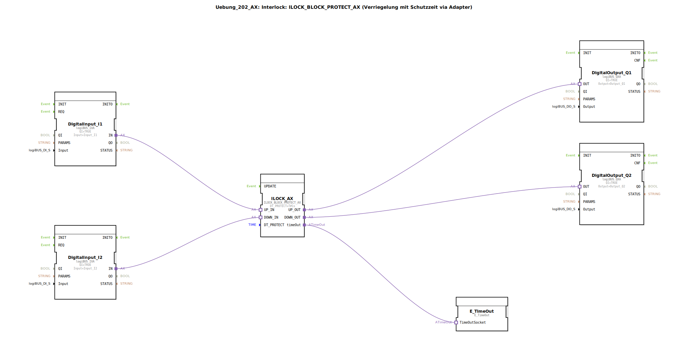

# Uebung_202_AX: Interlock: ILOCK_BLOCK_PROTECT_AX (Verriegelung mit Schutzzeit via Adapter)

* * * * * * * * * *

## Einleitung

Diese Übung demonstriert die Implementierung einer Verriegelung (Interlock) mit Schutzzeit unter Verwendung von Adaptern. Der Funktionsbaustein `ILOCK_BLOCK_PROTECT_AX` wird eingesetzt, um zwei Eingangssignale (z. B. Schalter oder Sensoren) gegenseitig zu verriegeln und über eine konfigurierbare Schutzzeit zu überwachen. Die Ausgänge steuern entsprechende Aktoren. Ein zusätzlicher Timer (`E_TimeOut`) zeigt an, wenn die Schutzzeit abläuft.

Das Netzwerk ist als SubAppType realisiert und kann in übergeordnete Applikationen eingebunden werden.

## Verwendete Funktionsbausteine (FBs)

### Sub-Bausteine:

#### DigitalInput_I1 / DigitalInput_I2 (je `logiBUS::io::DI::logiBUS_IXA`)

- **Typ**: logiBUS Digital Input Adapter
- **Parameter**:  
  - `QI` = TRUE  
  - `Input` = `Input_I1` (bzw. `Input_I2`)
- **Funktionsweise**: Stellt den physikalischen digitalen Eingang als Adapter-Socket zur Verfügung. Die eingehenden Signale werden über die logiBUS-Hardware gelesen und stehen über den Ausgang `IN` für weitere Verbindungen bereit.

#### ILOCK_AX (`logiBUS::signalprocessing::interlock::ILOCK_BLOCK_PROTECT_AX`)

- **Typ**: Interlock-Block mit Schutzzeit (Adapter)
- **Parameter**:  
  - `DT_PROTECT` = `T#1s` (Schutzzeit 1 Sekunde)
- **Verwendete interne FBs**: Keine (Blackbox)
- **Funktionsweise**: Realisiert eine gegenseitige Verriegelung zweier Eingänge (`UP_IN`, `DOWN_IN`) und gibt die entsprechenden Ausgänge (`UP_OUT`, `DOWN_OUT`) frei. Die Schutzzeit verhindert ein ungewolltes schnelles Umschalten. Bei Aktivierung der Schutzzeit wird zudem ein Ereignis am Ausgang `timeOut` ausgelöst.

#### DigitalOutput_Q1 / DigitalOutput_Q2 (je `logiBUS::io::DQ::logiBUS_QXA`)

- **Typ**: logiBUS Digital Output Adapter
- **Parameter**:  
  - `QI` = TRUE  
  - `Output` = `Output_Q1` (bzw. `Output_Q2`)
- **Funktionsweise**: Nimmt das Signal am Eingang `OUT` entgegen und gibt es über den logiBUS-Ausgangskanal an die angeschlossene Hardware weiter.

#### E_TimeOut (`iec61499::events::E_TimeOut`)

- **Typ**: Ereignis-Timer
- **Parameter**: Keine
- **Funktionsweise**: Ein einfacher Timer, der durch ein eingehendes Ereignis am Eingang `TimeOutSocket` gestartet wird und nach Ablauf der eingestellten Zeit ein Ausgangsereignis auslöst. Wird hier verwendet, um das Timeout-Signal des ILOCK-Blocks aufzufangen und einer weiteren Verarbeitung zuzuführen.

## Programmablauf und Verbindungen

Die SubApp ist wie folgt verschaltet:

1. **Eingänge**: Die beiden logiBUS-Digital-Input-Adapter (`DigitalInput_I1`, `DigitalInput_I2`) lesen die Hardware-Signale von den Kanälen `Input_I1` und `Input_I2` ein. Ihre `IN`-Ausgänge sind über **Adapterverbindungen** mit den entsprechenden Eingängen des Interlock-Blocks verbunden:
   - `DigitalInput_I1.IN` → `ILOCK_AX.UP_IN`
   - `DigitalInput_I2.IN` → `ILOCK_AX.DOWN_IN`

2. **Interlock-Verarbeitung**: Der FB `ILOCK_AX` wertet die Signale aus. Solange keine Verriegelung aktiv ist, werden die Ausgänge `UP_OUT` bzw. `DOWN_OUT` entsprechend der Eingänge gesetzt. Überschreitet die Umschaltzeit die eingestellte Schutzzeit (`DT_PROTECT`), wird der Ausgang `timeOut` aktiv.

3. **Ausgänge**: Die freigegebenen Signale werden über Adapterverbindungen zu den logiBUS-Digital-Output-Adaptern geführt:
   - `ILOCK_AX.UP_OUT` → `DigitalOutput_Q1.OUT`
   - `ILOCK_AX.DOWN_OUT` → `DigitalOutput_Q2.OUT`  
   Die Ausgänge `Output_Q1` und `Output_Q2` steuern die angeschlossenen Aktoren.

4. **Timer**: Das Timeout-Ereignis des Interlock-Blocks (`ILOCK_AX.timeOut`) ist mit dem Socket `E_TimeOut.TimeOutSocket` verbunden. Der Timer kann in einer übergeordneten Applikation genutzt werden, um eine Fehler- oder Quittierungsmeldung zu generieren.

**Lernziele der Übung**:
- Verständnis des Interlock-Konzepts mit Schutzzeit  
- Einsatz von logiBUS-IO-Adaptern in 4diac  
- Verwendung von Ereignis-Timern (`E_TimeOut`)  
- Fehlersuche und Analyse von Zeitproblemen in Steuerungen  

**Schwierigkeitsgrad**: Mittel  
**Vorkenntnisse**: Grundlegende Bedienung der 4diac-IDE, Kenntnisse der logiBUS-Hardware, Umgang mit Funktionsbausteinen und Adaptern.

## Zusammenfassung

Die Übung `Uebung_202_AX` veranschaulicht eine industrietypische Verriegelungsschaltung mit Schutzzeit auf Basis des Funktionsbausteins `ILOCK_BLOCK_PROTECT_AX`. Durch den Einsatz von logiBUS-Adaptern werden digitale Ein- und Ausgänge angebunden, während ein zusätzlicher Timer das Timeout-Ereignis verarbeitet. Das Zusammenspiel der Bausteine wird über Adapterverbindungen hergestellt, was eine flexible und modulare Struktur ermöglicht.