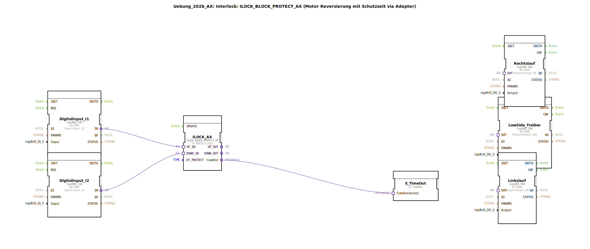

# Uebung_202b_AX: Interlock: ILOCK_BLOCK_PROTECT_AX (Motor Reversierung mit Schutzzeit via Adapter)

* * * * * * * * * *

## Einleitung

Diese Übung zeigt die Verwendung des Funktionsbausteins `ILOCK_BLOCK_PROTECT_AX` zur sicheren Ansteuerung eines Motors mit Reversierfunktion.  
Dabei wird eine **Umschaltverzögerung (Schutzzeit)** realisiert, die verhindert, dass der Motor sofort von einer Drehrichtung in die andere umschaltet.  
Zusätzlich wird ein **Low-Side-Treiber** für die gemeinsame Versorgung der Ausgänge eingesetzt.  
Die Logik ist als Subapplikation aufgebaut und nutzt einen Adapter-basierten Datenfluss.

---

## Verwendete Funktionsbausteine (FBs)

- **DigitalInput_I1** – Typ: `logiBUS::io::DI::logiBUS_IXA`
  - Parameter: QI = TRUE, Input = `Input_I1`
  - Wandelt ein digitales Eingangssignal (z. B. Taster für Aufwärts) in ein Logiksignal um.

- **DigitalInput_I2** – Typ: `logiBUS::io::DI::logiBUS_IXA`
  - Parameter: QI = TRUE, Input = `Input_I2`
  - Wandelt ein digitales Eingangssignal (z. B. Taster für Abwärts) in ein Logiksignal um.

- **ILOCK_AX** – Typ: `logiBUS::signalprocessing::interlock::ILOCK_BLOCK_PROTECT_AX`
  - Parameter: DT_PROTECT = `T#1s` (Schutzzeit von 1 Sekunde)
  - Kernbaustein der Übung: Erzeugt aus den beiden Eingangssignalen (`UP_IN`, `DOWN_IN`) verzögerte Ausgangssignale (`UP_OUT`, `DOWN_OUT`) und ein Zeitsignal (`timeOut`). Die Schutzzeit verhindert ein zu schnelles Umschalten.

- **LowSide_Treiber** – Typ: `logiBUS::io::DQ::logiBUS_QXA`
  - Parameter: QI = TRUE, Output = `Output_Q56`
  - Steuert einen gemeinsamen Low-Side-Ausgang (z. B. für die Freigabe der Motorbremse oder gemeinsame Versorgung).

- **Linkslauf** – Typ: `logiBUS::io::DQ::logiBUS_QXA`
  - Parameter: QI = TRUE, Output = `Output_Q6`
  - Schaltet den Motor für Linkslauf.

- **Rechtslauf** – Typ: `logiBUS::io::DQ::logiBUS_QXA`
  - Parameter: QI = TRUE, Output = `Output_Q5`
  - Schaltet den Motor für Rechtslauf.

- **E_TimeOut** – Typ: `iec61499::events::E_TimeOut`
  - Nimmt das Zeitsignal von `ILOCK_AX` entgegen (z. B. zur Visualisierung oder weiteren Verarbeitung).

### Sub-Baustein: `AX_2_TO_3`

- **Typ**: `MyLib::sys::AX_2_TO_3` (Subapplikation)
- **Verwendete interne FBs**: nicht in dieser Übungsdatei definiert (gekapselte Logik)
- **Funktionsweise** (abgeleitet aus den Adapterverbindungen):
  - Empfängt die Signale `UP_IN` und `DOWN_IN` von `ILOCK_AX`.
  - Leitet `UP_IN` an `UP_OUT` und `DOWN_IN` an `DOWN_OUT` weiter (oder führt eine logische Verknüpfung durch).
  - Erzeugt ein ODER-Signal (`OR_OUT`) aus beiden Eingängen, das den **LowSide_Treiber** ansteuert.
  - Dient als Aufteilung der ILOCK-Ausgänge auf die einzelnen Motorausgänge und den gemeinsamen Freigabeausgang.

---

## Programmablauf und Verbindungen

1. **Eingänge**  
   - Die digitalen Eingänge `Input_I1` (Auf) und `Input_I2` (Ab) werden über die Bausteine `DigitalInput_I1` und `DigitalInput_I2` eingelesen.  
   - Ihre Signale werden direkt an die Adaptereingänge `UP_IN` und `DOWN_IN` des `ILOCK_AX` weitergegeben.

2. **Interlock-Logik**  
   - `ILOCK_AX` wertet die anstehenden Signale aus. Bei einem Wechsel von einer Drehrichtung in die andere wird die parametrierte **Schutzzeit DT_PROTECT = 1s** aktiv.  
   - Erst nach Ablauf dieser Zeit wird das neue Ausgangssignal auf `UP_OUT` oder `DOWN_OUT` geschaltet.  
   - Gleichzeitig wird das Zeitgebersignal `timeOut` für die Dauer der Schutzzeit auf `TRUE` gesetzt und an `E_TimeOut` übertragen.

3. **Signalverteilung über SubApp `AX_2_TO_3`**  
   - Die verzögerten Ausgänge `UP_OUT` und `DOWN_OUT` von `ILOCK_AX` gelangen über Adapterverbindungen in die SubApp `AX_2_TO_3`.  
   - Diese SubApp leitet die Signale an die entsprechenden Ausgänge `UP_OUT` und `DOWN_OUT` weiter und erzeugt ein ODER-Signal (`OR_OUT`), das den **LowSide_Treiber** aktiviert, sobald eine der beiden Drehrichtungen angefordert wird.

4. **Ausgänge**  
   - `Rechtslauf` und `Linkslauf` werden direkt von den Ausgängen der SubApp angesteuert.  
   - `LowSide_Treiber` wird über das ODER-Signal aktiviert und steuert den gemeinsamen Ausgang `Output_Q56`.

**Lernziele**  
- Verständnis des Interlock-Konzepts für Motor-Reversierung  
- Anwendung eines Schutzzeit-Bausteins (`ILOCK_BLOCK_PROTECT_AX`)  
- Arbeiten mit Adapterverbindungen und Subapplikationen in 4diac  
- Einbindung von Low-Side-Treibern in sicherheitsrelevante Steuerungen

**Schwierigkeitsgrad:** Fortgeschritten  
**Vorkenntnisse:** Grundlagen der 4diac-IDE, Umgang mit logiBUS-Bausteinen, Verständnis von Ereignis-/Datenflüssen

---

## Zusammenfassung

In dieser Übung wird eine vollständige Motor-Reversiersteuerung mit **Umschaltverzögerung (Schutzzeit)** realisiert.  
Der Baustein `ILOCK_BLOCK_PROTECT_AX` übernimmt die sichere Verriegelung der Drehrichtungen, während die SubApp `AX_2_TO_3` die Signalverteilung auf die einzelnen Ausgänge und den gemeinsamen Low-Side-Treiber übernimmt.  
Die Übung vermittelt praxisnahe Kenntnisse zur sicheren Steuerung von Aktoren in der Automatisierungstechnik.