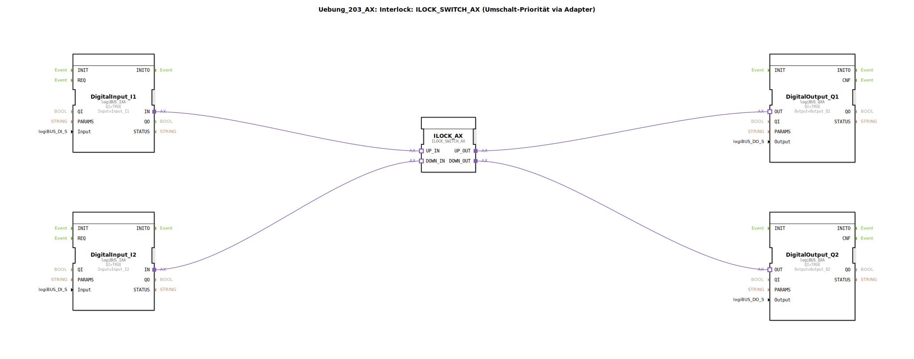

# Uebung_203_AX: Interlock: ILOCK_SWITCH_AX (Umschalt-Priorität via Adapter)

* * * * * * * * * *
## Einleitung
Diese Übung demonstriert die Verwendung eines **Interlock-Funktionsbausteins mit Prioritätsumschaltung** (ILOCK_SWITCH_AX). Zwei digitale Eingänge (Input_I1, Input_I2) steuern über einen Adapter-basierten Interlock-Baustein zwei digitale Ausgänge (Output_Q1, Output_Q2). Der Interlock sorgt dafür, dass immer nur ein Ausgang aktiv sein kann – bei gleichzeitigen Eingangssignalen setzt sich ein definierter Prioritätsmechanismus durch. Die Kommunikation mit der Peripherie erfolgt über logiBUS-Adapterschnittstellen.

## Verwendete Funktionsbausteine (FBs)
Die SubApp enthält fünf Funktionsbausteine aus der logiBUS-Bibliothek:

- **DigitalInput_I1** (Typ: `logiBUS::io::DI::logiBUS_IXA`)  
  - Parameter: `QI = TRUE`, `Input = Input_I1`  
  - Übernahme des digitalen Eingangssignals vom logiBUS-Kanal Input_I1.

- **DigitalInput_I2** (Typ: `logiBUS::io::DI::logiBUS_IXA`)  
  - Parameter: `QI = TRUE`, `Input = Input_I2`  
  - Übernahme des digitalen Eingangssignals vom logiBUS-Kanal Input_I2.

- **ILOCK_AX** (Typ: `logiBUS::signalprocessing::interlock::ILOCK_SWITCH_AX`)  
  - Dieser Funktionsbaustein implementiert eine **Interlock-Funktion** mit zwei Eingangsadaptern (`UP_IN`, `DOWN_IN`) und zwei Ausgangsadaptern (`UP_OUT`, `DOWN_OUT`).  
  - **Funktionsweise:**  
    - Ist nur ein Eingang aktiv, wird der zugehörige Ausgang gesetzt.  
    - Sind beide Eingänge gleichzeitig aktiv, entscheidet eine interne **Prioritätslogik** (in dieser Konfiguration: „UP“ hat Vorrang vor „DOWN“), welcher Ausgang gesetzt wird.  
    - Der jeweils andere Ausgang wird zurückgesetzt.  
  - Die Priorität kann über Parameter des Bausteins konfiguriert werden (hier Standard: UP priorisiert).

- **DigitalOutput_Q1** (Typ: `logiBUS::io::DQ::logiBUS_QXA`)  
  - Parameter: `QI = TRUE`, `Output = Output_Q1`  
  - Ausgabe des Signals auf den logiBUS-Ausgangskanal Output_Q1.

- **DigitalOutput_Q2** (Typ: `logiBUS::io::DQ::logiBUS_QXA`)  
  - Parameter: `QI = TRUE`, `Output = Output_Q2`  
  - Ausgabe des Signals auf den logiBUS-Ausgangskanal Output_Q2.

## Programmablauf und Verbindungen
Die folgende Adapter-Verbindungsstruktur liegt dem Ablauf zugrunde:

1. **Eingangssignale:**  
   - `DigitalInput_I1.IN` → `ILOCK_AX.UP_IN`  
   - `DigitalInput_I2.IN` → `ILOCK_AX.DOWN_IN`

2. **Interlock-Verarbeitung:**  
   - Der ILOCK_SWITCH_AX-Baustein wertet die eingehenden Signale aus und entscheidet nach Priorität, welcher Ausgang gesetzt wird.

3. **Ausgangssignale:**  
   - `ILOCK_AX.UP_OUT` → `DigitalOutput_Q1.OUT`  
   - `ILOCK_AX.DOWN_OUT` → `DigitalOutput_Q2.OUT`

Bei aktivem Signal an **Input_I1** wird **Output_Q1** gesetzt. Bei aktivem Signal an **Input_I2** wird **Output_Q2** gesetzt. Sind beide Eingänge gleichzeitig aktiv, erhält **Output_Q1** den Vorrang („UP priorisiert“). Dieses Verhalten ist typisch für sicherheitsrelevante Anwendungen, in denen eine gegenseitige Verriegelung von Aktoren (z. B. Richtungswechsel eines Motors) erforderlich ist.

**Hinweise für die Durchführung:**  
- Die Übung richtet sich an Teilnehmer mit Grundkenntnissen der 4diac-IDE und des logiBUS-Adaptersystems.  
- Lernziel ist das Verständnis von Interlock-Mechanismen über Adapter und die Prioritätssteuerung.  
- Voraussetzung: Ein funktionierendes logiBUS-Projekt mit freien Ein-/Ausgangskanälen (Input_I1, Input_I2, Output_Q1, Output_Q2).  
- Starten Sie die Übung, indem Sie die SubApp in Ihr System einbinden und die Klemmen entsprechend verdrahten.

## Zusammenfassung
Die Übung **Uebung_203_AX** vermittelt den Einsatz eines **prioritätsgesteuerten Interlocks** über Adapterschnittstellen. Zwei digitale Eingänge werden über den Baustein `ILOCK_SWITCH_AX` verarbeitet, der bei gleichzeitigen Signalen eine festgelegte Priorität (hier: UP vor DOWN) anwendet und die Ausgänge entsprechend schaltet. Die Implementierung erfolgt vollständig mit logiBUS-I/O-Bausteinen und zeigt eine typische Verriegelungsschaltung, wie sie in der Automatisierungstechnik häufig benötigt wird.