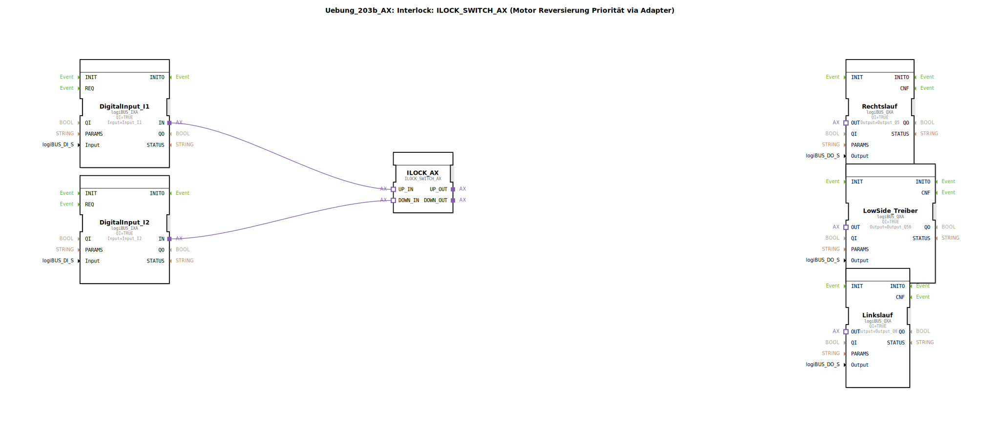

# Uebung_203b_AX: Interlock: ILOCK_SWITCH_AX (Motor Reversierung Priorität via Adapter)

* * * * * * * * * *

## Einleitung

Diese Übung realisiert eine **Motorreversierung mit Interlock (Verriegelung)** unter Verwendung des Funktionsbausteins `ILOCK_SWITCH_AX`. Die Schaltung verhindert, dass beide Drehrichtungen gleichzeitig aktiviert werden, und gibt über einen Adapter die priorisierten Signale an eine nachgeschaltete Logik `AX_2_TO_3` weiter. Diese Logik wandelt die zwei Richtungssignale in drei Ausgänge um – einen für Rechtslauf, einen für Linkslauf und einen gemeinsamen Low-Side-Treiber, wie es für H-Brücken-Ansteuerungen typisch ist.

Zwei digitale Eingänge (I1, I2) dienen als Steuersignale für die Drehrichtung. Die Ausgänge Q5 (Rechtslauf), Q56 (Low-Side) und Q6 (Linkslauf) werden physisch über die logiBUS-Hardware angesteuert.

## Verwendete Funktionsbausteine (FBs)

### Sub-Bausteine: `AX_2_TO_3`

- **Typ**: `MyLib::sys::AX_2_TO_3`
- **Beschreibung**: Dieser Sub-Baustein (SubApp) dient als Verteilerlogik. Er nimmt zwei priorisierte Richtungssignale (`UP_IN`, `DOWN_IN`) von der vorhergehenden Interlock-Stufe entgegen und erzeugt daraus drei Ausgänge:
    - `UP_OUT` → Rechtslauf
    - `DOWN_OUT` → Linkslauf
    - `OR_OUT` → Low-Side-Treiber (aktiv, sobald eine Richtung aktiv ist)
- Die interne Implementierung ist in der Datei `AX_2_TO_3.subapp` definiert und wird in dieser Übung als Blackbox verwendet.

### Weitere Funktionsbausteine

- **DigitalInput_I1**, **DigitalInput_I2**
    - **Typ**: `logiBUS::io::DI::logiBUS_IXA`
    - **Parameter**:
        - `QI` = `TRUE` (Freigabe)
        - `Input` = `Input_I1` bzw. `Input_I2`
    - **Datenausgang**: `OUT` (Adapter-Ausgang, der den digitalen Eingangszustand bereitstellt)

- **ILOCK_AX**
    - **Typ**: `logiBUS::signalprocessing::interlock::ILOCK_SWITCH_AX`
    - **Parameter**: keine
    - **Beschreibung**: Kern der Verriegelung. Er wertet die beiden Eingangssignale aus und gibt über `UP_OUT` und `DOWN_OUT` die jeweils aktive Richtung aus. Bei gleichzeitiger Aktivierung beider Eingänge setzt eine Prioritätslogik (definiert im Baustein) einen der Ausgänge zurück. Die Ausgänge sind Adapter-konform.

- **Rechtslauf**
    - **Typ**: `logiBUS::io::DQ::logiBUS_QXA`
    - **Parameter**:
        - `QI` = `TRUE`
        - `Output` = `Output_Q5`
    - **Beschreibung**: Schaltet das Signal für den Rechtslauf auf den physischen Ausgang Q5.

- **LowSide_Treiber**
    - **Typ**: `logiBUS::io::DQ::logiBUS_QXA`
    - **Parameter**:
        - `QI` = `TRUE`
        - `Output` = `Output_Q56`
    - **Beschreibung**: Schaltet den Low-Side-Treiber (gemeinsame Masse oder Bremse) auf den Ausgang Q56.

- **Linkslauf**
    - **Typ**: `logiBUS::io::DQ::logiBUS_QXA`
    - **Parameter**:
        - `QI` = `TRUE`
        - `Output` = `Output_Q6`
    - **Beschreibung**: Schaltet das Signal für den Linkslauf auf den physischen Ausgang Q6.

## Programmablauf und Verbindungen

Der logische Ablauf folgt einer klaren Kette:

1. **Eingangssignale**: Die beiden digitalen Eingänge (`Input_I1`, `Input_I2`) werden über die Bausteine `DigitalInput_I1` und `DigitalInput_I2` in Adapter-Signale umgewandelt.
2. **Interlock**: Diese Signale gelangen über die Adapter-Verbindungen an `ILOCK_AX`. Dort wird die Prioritätslogik angewendet. Die Ausgänge `UP_OUT` (für Rechtslauf) und `DOWN_OUT` (für Linkslauf) werden freigegeben – jedoch nie gleichzeitig.
3. **Signalverteilung**: Die priorisierten Signale werden an den Sub-Baustein `AX_2_TO_3` weitergeleitet. Dieser erzeugt aus den beiden Richtungssignalen drei Ausgänge:
    - `UP_OUT` → `Rechtslauf` (Q5)
    - `DOWN_OUT` → `Linkslauf` (Q6)
    - `OR_OUT` → `LowSide_Treiber` (Q56) – wird aktiv, sobald eine Richtung aktiv ist.
4. **Ausgangsstufen**: Die drei Ausgangsbausteine vom Typ `logiBUS_QXA` setzen die Signale auf die physikalischen Ausgänge der logiBUS-Hardware um.

**Adapter-Verbindungen** (in der XML als `AdapterConnections` definiert):

- `DigitalInput_I1.IN` → `ILOCK_AX.UP_IN`
- `DigitalInput_I2.IN` → `ILOCK_AX.DOWN_IN`
- `ILOCK_AX.UP_OUT` → `AX_2_TO_3.UP_IN`
- `ILOCK_AX.DOWN_OUT` → `AX_2_TO_3.DOWN_IN`
- `AX_2_TO_3.UP_OUT` → `Rechtslauf.OUT`
- `AX_2_TO_3.DOWN_OUT` → `Linkslauf.OUT`
- `AX_2_TO_3.OR_OUT` → `LowSide_Treiber.OUT`

**Hinweise zur Durchführung**:

- Diese Übung setzt Grundkenntnisse in der 4diac-IDE und dem Umgang mit Adaptern voraus.
- Schwierigkeitsgrad: **mittel**
- Lernziele: Verständnis von Interlock-Logiken, Arbeiten mit Sub-Applikationen und Adapter-basierter Signalweiterleitung, Realisierung einer sicheren Motoransteuerung.
- Um die Übung zu starten, muss die SubApp `Uebung_203b_AX` in ein Projekt eingebunden und mit den entsprechenden logiBUS-Eingängen und -Ausgängen verknüpft werden.

## Zusammenfassung

Die Übung `Uebung_203b_AX` demonstriert eine vollständige Motorreversierung mit Verriegelung unter Verwendung des `ILOCK_SWITCH_AX`-Bausteins und einer nachgeschalteten Signalverteilung (`AX_2_TO_3`). Durch die Verwendung von Adaptern wird eine klare, modulare Struktur erreicht. Die Schaltung verhindert zuverlässig Kurzschlüsse oder Fehlansteuerungen und eignet sich für den Einsatz in der industriellen Steuerungstechnik.