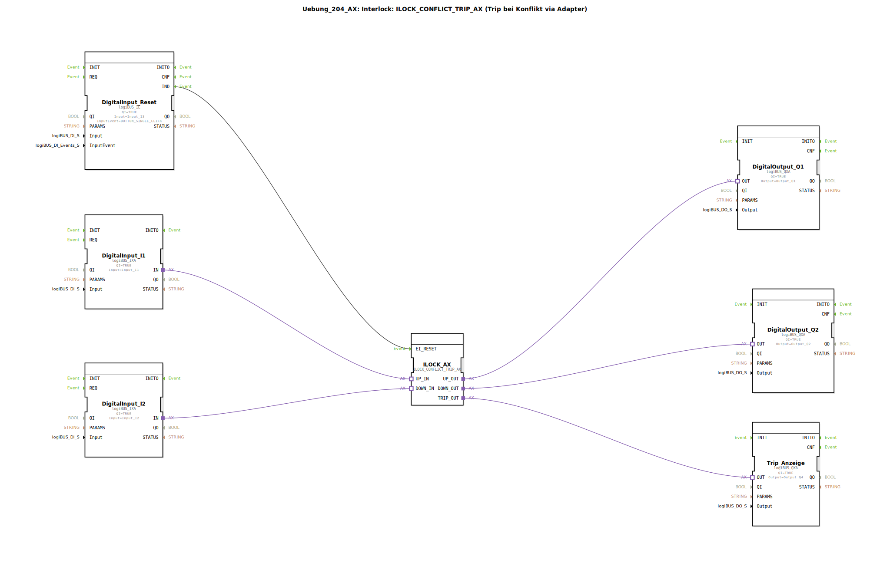

# Uebung_204_AX: Interlock: ILOCK_CONFLICT_TRIP_AX (Trip bei Konflikt via Adapter)

* * * * * * * * * *
## Einleitung

Diese Übung implementiert eine Interlock-Logik mit Konflikterkennung und Trip-Auslösung unter Verwendung des Funktionsbausteins **ILOCK_CONFLICT_TRIP_AX**.  
Zwei digitale Eingänge (über einen logiBUS-Adapter) melden Anforderungen in entgegengesetzte Richtungen (z. B. „Auf“ und „Ab“).  
Tritt ein gleichzeitiges oder unzulässiges Signal auf, wird ein Trip ausgelöst, der über einen separaten Ausgang angezeigt wird. Ein Reset-Eingang (Einzelflanke) kann den Trip zurücksetzen.  
Die Ausgänge steuern zwei digitale Aktoren (Q1, Q2) und eine Tripanzeige (Q4).

## Verwendete Funktionsbausteine (FBs)

### Sub-Bausteine: *keine*  
Die gesamte Übung ist als eigenständige Subapplikation aufgebaut. Alle FBs werden direkt im Netzwerk eingesetzt.

### Übersicht der FBs im Netzwerk

| Bausteinname | Typ | Parameter | Ereignisverbindungen | Adapter-/Datenverbindungen |
|---|---|---|---|---|
| **DigitalInput_I1** | `logiBUS::io::DI::logiBUS_IXA` | `QI = TRUE` `Input = Input_I1` | – | Adapter `IN` → ILOCK_AX.UP_IN |
| **DigitalInput_I2** | `logiBUS::io::DI::logiBUS_IXA` | `QI = TRUE` `Input = Input_I2` | – | Adapter `IN` → ILOCK_AX.DOWN_IN |
| **DigitalInput_Reset** | `logiBUS::io::DI::logiBUS_IE` | `QI = TRUE` `Input = Input_I3` `InputEvent = BUTTON_SINGLE_CLICK` | Ereignisausgang `IND` → ILOCK_AX.EI_RESET | – |
| **ILOCK_AX** | `logiBUS::signalprocessing::interlock::ILOCK_CONFLICT_TRIP_AX` | *(keine Parameter gesetzt)* | Ereigniseingang `EI_RESET` von DigitalInput_Reset | Adaptereingänge: `UP_IN` (von DigitalInput_I1), `DOWN_IN` (von DigitalInput_I2) Adapterausgänge: `UP_OUT` → DigitalOutput_Q1, `DOWN_OUT` → DigitalOutput_Q2, `TRIP_OUT` → Trip_Anzeige |
| **DigitalOutput_Q1** | `logiBUS::io::DQ::logiBUS_QXA` | `QI = TRUE` `Output = Output_Q1` | – | Adaptereingang `OUT` von ILOCK_AX.UP_OUT |
| **DigitalOutput_Q2** | `logiBUS::io::DQ::logiBUS_QXA` | `QI = TRUE` `Output = Output_Q2` | – | Adaptereingang `OUT` von ILOCK_AX.DOWN_OUT |
| **Trip_Anzeige** | `logiBUS::io::DQ::logiBUS_QXA` | `QI = TRUE` `Output = Output_Q4` | – | Adaptereingang `OUT` von ILOCK_AX.TRIP_OUT |

## Programmablauf und Verbindungen

1. **Eingänge**:  
   - Die digitalen Eingänge *Input_I1* (über FB „DigitalInput_I1“) und *Input_I2* (über FB „DigitalInput_I2“) stellen die Adapterschnittstellen `UP_IN` bzw. `DOWN_IN` für den ILOCK-Baustein bereit.  
   - Der Reset-Eingang *Input_I3* wird über den FB „DigitalInput_Reset“ als Ereignis ausgewertet (Einzelflanke, Parameter `BUTTON_SINGLE_CLICK`). Das Ereignis `IND` triggert den Reset-Eingang `EI_RESET` des ILOCK-Bausteins.

2. **Interlock-Logik**:  
   - Der Baustein **ILOCK_CONFLICT_TRIP_AX** überwacht die beiden Eingänge und erkennt einen Konflikt (z. B. gleichzeitige Anforderung in beide Richtungen).  
   - Im Normalbetrieb gibt er die Signale unverändert an die Ausgänge `UP_OUT` und `DOWN_OUT` weiter.  
   - Bei einem Konflikt wird der Ausgang `TRIP_OUT` aktiv gesetzt und die Ausgänge `UP_OUT`/`DOWN_OUT` werden in einen definierten (gesperrten) Zustand gebracht.

3. **Ausgänge**:  
   - Der Adapterausgang `UP_OUT` steuert den digitalen Ausgang *Output_Q1* (FB „DigitalOutput_Q1“).  
   - Der Adapterausgang `DOWN_OUT` steuert *Output_Q2* (FB „DigitalOutput_Q2“).  
   - Der Trip-Ausgang `TRIP_OUT` aktiviert *Output_Q4* (FB „Trip_Anzeige“).  

4. **Reset-Verhalten**:  
   - Solange ein Trip aktiv ist, bleibt der `TRIP_OUT` gesetzt. Durch Betätigen des Reset-Eingangs (Einzelflanke auf *Input_I3*) wird der ILOCK-Baustein zurückgesetzt und die Ausgänge schalten wieder in den Normalzustand.

## Zusammenfassung

Die Übung **Uebung_204_AX** demonstriert den Einsatz eines Interlock-Bausteins mit integrierter Konflikterkennung und Trip-Auslösung über Adapter.  
Sie verknüpft:

- zwei digitale Eingänge für Auf-/Ab-Signale,
- einen Reset-Eingang mit Flankenauswertung,
- den ILOCK-Baustein zur Konfliktüberwachung,
- drei digitale Ausgänge (Q1, Q2, Q4) zur Ansteuerung von Aktoren und Anzeige.

Das Beispiel eignet sich zur Einführung in die Interlock-Mechanismen der logiBUS-Bibliothek und zeigt, wie eine sichere Verriegelung mit automatischer Fehlerreaktion realisiert wird.

* * * * * * * * * *