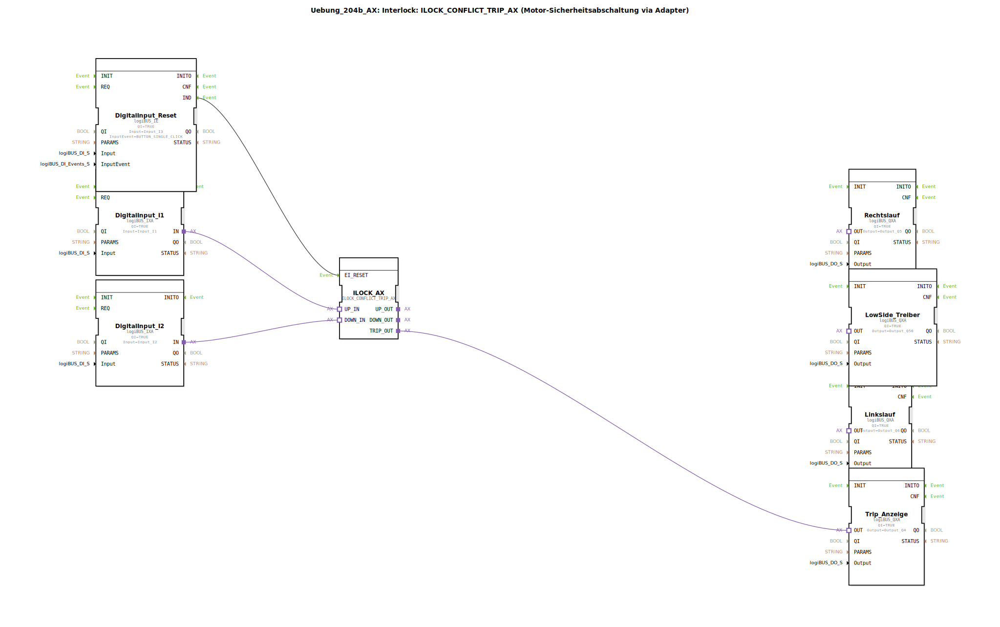

# Uebung_204b_AX: Interlock: ILOCK_CONFLICT_TRIP_AX (Motor-Sicherheitsabschaltung via Adapter)

* * * * * * * * * *
## Einleitung

Diese Übung demonstriert die Verwendung des Funktionsbausteins **ILOCK_CONFLICT_TRIP_AX** zur sicherheitsgerichteten Motorabschaltung. Es wird eine Interlock-Logik realisiert, bei der zwei gegensätzliche Anforderungen (z. B. Rechts- und Linkslauf) überwacht und bei einem Konflikt ein Trip ausgelöst wird. Die gesamte Steuerung erfolgt über Adapterverbindungen und einen zwischengeschalteten SubApp (AX_2_TO_3), der die Aufteilung der Signale auf die Ausgänge vornimmt.

## Verwendete Funktionsbausteine (FBs)

- **DigitalInput_I1** (Typ: `logiBUS::io::DI::logiBUS_IXA`)
    - Parameter: `QI` = `TRUE`, `Input` = `Input_I1`
    - Funktion: Digitaleingang für das erste Richtungssignal (z. B. Rechtslauf-Anforderung)

- **DigitalInput_I2** (Typ: `logiBUS::io::DI::logiBUS_IXA`)
    - Parameter: `QI` = `TRUE`, `Input` = `Input_I2`
    - Funktion: Digitaleingang für das zweite Richtungssignal (z. B. Linkslauf-Anforderung)

- **DigitalInput_Reset** (Typ: `logiBUS::io::DI::logiBUS_IE`)
    - Parameter: `QI` = `TRUE`, `Input` = `Input_I3`, `InputEvent` = `BUTTON_SINGLE_CLICK`
    - Funktion: Digitaleingang mit Ereignisunterstützung; dient als Reset-Taster für die Interlock-Einheit

- **ILOCK_AX** (Typ: `logiBUS::signalprocessing::interlock::ILOCK_CONFLICT_TRIP_AX`)
    - Parameter: keine
    - Funktion: Zentraler Interlock-Baustein. Überwacht die beiden Adaptereingänge **UP_IN** und **DOWN_IN** auf widersprüchliche Zustände. Bei einem Konflikt wird der Ausgang **TRIP_OUT** aktiviert. Bei konfliktfreien Zuständen werden **UP_OUT** und **DOWN_OUT** entsprechend durchgeschaltet.

- **Rechtslauf** (Typ: `logiBUS::io::DQ::logiBUS_QXA`)
    - Parameter: `QI` = `TRUE`, `Output` = `Output_Q5`
    - Funktion: Digitalausgang für Rechtslauf-Steuerung

- **Linkslauf** (Typ: `logiBUS::io::DQ::logiBUS_QXA`)
    - Parameter: `QI` = `TRUE`, `Output` = `Output_Q6`
    - Funktion: Digitalausgang für Linkslauf-Steuerung

- **LowSide_Treiber** (Typ: `logiBUS::io::DQ::logiBUS_QXA`)
    - Parameter: `QI` = `TRUE`, `Output` = `Output_Q56`
    - Funktion: Digitalausgang für einen gemeinsamen Low-Side-Treiber (z. B. Freigabe einer Motor-Endstufe)

- **Trip_Anzeige** (Typ: `logiBUS::io::DQ::logiBUS_QXA`)
    - Parameter: `QI` = `TRUE`, `Output` = `Output_Q4`
    - Funktion: Digitalausgang zur Anzeige eines ausgelösten Trips

### Sub-Bausteine: **AX_2_TO_3**

- **Typ**: `MyLib::sys::AX_2_TO_3`
- **Verwendete interne FBs**: Keine Angabe – die interne Implementierung ist in dieser Übung nicht näher definiert und wird als Bibliotheksbaustein vorausgesetzt.
- **Funktionsweise**: Der SubApp dient als Adapter, der die beiden Adaptereingänge **UP_IN** und **DOWN_IN** auf drei separate Ausgänge verteilt: **UP_OUT**, **DOWN_OUT** und **OR_OUT**. Die genaue Logik ist abhängig von der internen Realisierung; in diesem Aufbau werden damit die Ausgänge für Rechtslauf, Linkslauf und den Low-Side-Treiber angesteuert.

## Programmablauf und Verbindungen

1. **Eingangssignale**: Die digitalen Eingänge **I1** und **I2** (über `DigitalInput_I1` und `DigitalInput_I2`) werden als Adaptersignale an den Interlock-Baustein `ILOCK_AX` übergeben (Verbindungen: `DigitalInput_I1.IN` → `ILOCK_AX.UP_IN`, `DigitalInput_I2.IN` → `ILOCK_AX.DOWN_IN`).

2. **Interlock-Logik**: `ILOCK_AX` prüft auf widersprüchliche Anforderungen. Falls beide Eingänge gleichzeitig aktiv sind, wird der Trip-Ausgang **TRIP_OUT** gesetzt. Bei konfliktfreien Zuständen werden die Signale auf **UP_OUT** und **DOWN_OUT** durchgeschleift.

3. **Signalverteilung**: Die Ausgänge von `ILOCK_AX` werden an den SubApp `AX_2_TO_3` weitergeleitet:
    - `ILOCK_AX.UP_OUT` → `AX_2_TO_3.UP_IN`
    - `ILOCK_AX.DOWN_OUT` → `AX_2_TO_3.DOWN_IN`
    - `ILOCK_AX.TRIP_OUT` → `Trip_Anzeige.OUT`

4. **Endstufenansteuerung**: Der SubApp `AX_2_TO_3` teilt die Signale auf die finalen Ausgänge auf:
    - `AX_2_TO_3.UP_OUT` → `Rechtslauf.OUT`
    - `AX_2_TO_3.DOWN_OUT` → `Linkslauf.OUT`
    - `AX_2_TO_3.OR_OUT` → `LowSide_Treiber.OUT`

5. **Reset-Funktion**: Der digitale Eingang **I3** (über `DigitalInput_Reset`) wird mit einem Tastendruck-Ereignis (`BUTTON_SINGLE_CLICK`) an den Ereigniseingang **EI_RESET** von `ILOCK_AX` angeschlossen, um einen ausgelösten Trip zurückzusetzen.

**Hinweise zur Übung**:
- Schwierigkeitsgrad: Mittel
- Lernziele: Verständnis von Interlock-Mechanismen, Adapter-basierter Kommunikation, Signalweiterleitung über SubApp
- Voraussetzung: Grundkenntnisse in 4diac-IDE und IEC 61499

## Zusammenfassung

Die Übung vermittelt den Aufbau einer sicherheitsgerichteten Motorsteuerung unter Verwendung des Interlock-Bausteins `ILOCK_CONFLICT_TRIP_AX`. Durch die strukturierte Aufteilung der Signale mittels eines SubApp (`AX_2_TO_3`) werden die Ausgänge für Rechtslauf, Linkslauf, Low-Side-Treiber und Trip-Anzeige realisiert. Ein Reset-Eingang erlaubt das Zurücksetzen der Sicherheitsabschaltung.