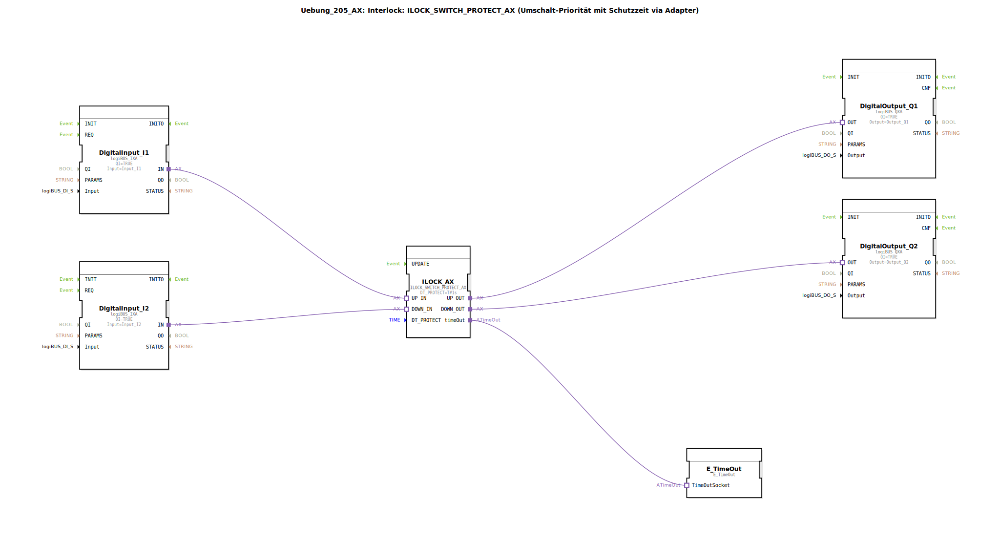

# Uebung_205_AX: Interlock: ILOCK_SWITCH_PROTECT_AX (Umschalt-Priorität mit Schutzzeit via Adapter)

* * * * * * * * * *

## Einleitung

Die Übung **Uebung_205_AX** realisiert eine sichere Umschaltsteuerung mit Priorität und Schutzzeit.  
Zwei digitale Eingänge (I1, I2) steuern über einen Interlock-Baustein zwei digitale Ausgänge (Q1, Q2).  
Der Interlock verhindert gleichzeitige Aktivierungen und erzwingt eine Schutzzeit von 1 s zwischen Umschaltvorgängen.  
Ein zusätzlicher E_TimeOut-Baustein dient der Überwachung des Timeout-Signals.

Die Übung ist als SubAppType modelliert und verwendet logiBUS-Adapter für die Ein‑/Ausgabeanbindung.

## Verwendete Funktionsbausteine (FBs)

Die SubApp enthält folgende Funktionsbausteine:

### Sub-Bausteine: DigitalInput_I1 & DigitalInput_I2 (logiBUS_IXA)

- **Typ**: `logiBUS::io::DI::logiBUS_IXA`  
- **Verwendete interne FBs**: keine (einfacher Adapterbaustein)  
- **Parameter**:
  - `QI` = TRUE
  - `Input` = `Input_I1` bzw. `Input_I2`  
- **Funktionsweise**:  
  Liest den jeweiligen digitalen Eingang (I1/I2) ein und stellt den Signalzustand am Ausgang `IN` bereit.

### Sub-Baustein: ILOCK_AX (ILOCK_SWITCH_PROTECT_AX)

- **Typ**: `logiBUS::signalprocessing::interlock::ILOCK_SWITCH_PROTECT_AX`  
- **Verwendete interne FBs**: keine (komplexer, vorgefertigter Baustein)  
- **Parameter**:
  - `DT_PROTECT` = T#1s (Schutzzeit 1 Sekunde)  
- **Ereignis-/Datenschnittstellen**:
  - **Adapter-Eingänge**: `UP_IN`, `DOWN_IN`  
  - **Adapter-Ausgänge**: `UP_OUT`, `DOWN_OUT`, `timeOut`  
- **Funktionsweise**:  
  Realisiert eine **umschaltpriorisierte Verriegelung** mit Schutzzeit.  
  – Bei aktivem `UP_IN` wird der Ausgang `UP_OUT` gesetzt, während `DOWN_OUT` für die Schutzzeit gesperrt bleibt.  
  – Bei aktivem `DOWN_IN` analog in die andere Richtung.  
  – Das Signal `timeOut` wird aktiv, wenn die Schutzzeit überschritten wird (z. B. Blockade oder Überlast).

### Sub-Bausteine: DigitalOutput_Q1 & DigitalOutput_Q2 (logiBUS_QXA)

- **Typ**: `logiBUS::io::DQ::logiBUS_QXA`  
- **Verwendete interne FBs**: keine (einfacher Adapterbaustein)  
- **Parameter**:
  - `QI` = TRUE
  - `Output` = `Output_Q1` bzw. `Output_Q2`  
- **Funktionsweise**:  
  Setzt den jeweiligen digitalen Ausgang (Q1/Q2) gemäß dem am Eingang `OUT` anliegenden Signal.

### Sub-Baustein: E_TimeOut (E_TimeOut)

- **Typ**: `iec61499::events::E_TimeOut`  
- **Verwendete interne FBs**: keine  
- **Parameter**: keine (Standardeinstellungen)  
- **Funktionsweise**:  
  Erzeugt ein Ereignis an seinem Ausgang, sobald eine Zeitverzögerung abgelaufen ist.  
  In dieser Übung ist der Eingang `TimeOutSocket` mit dem `timeOut`-Ausgang des Interlock-Bausteins verbunden – zur weiteren Verarbeitung (z. B. Alarmierung).

## Programmablauf und Verbindungen

1. **DigitalInput_I1** und **DigitalInput_I2** lesen die binären Signale von `Input_I1` bzw. `Input_I2` ein.  
2. Die **Adapter-Ausgänge `IN`** dieser Bausteine sind mit den **Adapter-Eingängen `UP_IN`** bzw. **`DOWN_IN`** des Interlock-Bausteins verbunden.  
3. **ILOCK_AX** wertet die Eingänge aus, wendet die Schutzzeit (`DT_PROTECT = T#1s`) an und steuert seine Ausgänge:  
   - `UP_OUT` → verbunden mit dem **OUT-Eingang** von **DigitalOutput_Q1**  
   - `DOWN_OUT` → verbunden mit dem **OUT-Eingang** von **DigitalOutput_Q2**  
   - `timeOut` → verbunden mit dem **TimeOutSocket** des **E_TimeOut**-Bausteins  
4. **DigitalOutput_Q1** und **DigitalOutput_Q2** setzen die entsprechenden physischen Ausgänge (`Output_Q1`, `Output_Q2`).  
5. Der **E_TimeOut**-Baustein kann optional für eine Zeitüberwachung genutzt werden (z. B. um einen Alarm bei längerem Timeout auszulösen).

**Lernziel**:  
Diese Übung vermittelt den Umgang mit Interlock-Bausteinen zur Realisierung von **Prioritätssteuerungen** und **Schutzzeiten** in Steuerungsanwendungen. Sie zeigt die Kopplung von digitalen Ein‑/Ausgängen über Adapter sowie die Überwachung von Timeout-Signalen.

**Schwierigkeitsgrad**: Mittel  
**Vorkenntnisse**: Grundlagen der IEC 61499‑Modellierung, Umgang mit logiBUS-Adaptern.

## Zusammenfassung

Die Übung **Uebung_205_AX** demonstriert den Einsatz des Interlock-Bausteins `ILOCK_SWITCH_PROTECT_AX` in einer SubApp.  
Durch die Schutzzeit von einer Sekunde wird eine sichere und priorisierte Umschaltung zwischen zwei digitalen Eingängen gewährleistet.  
Die Ein‑/Ausgabe erfolgt über logiBUS-Adapter, der integrierte E_TimeOut-Baustein erlaubt eine einfache Überwachung des Timeout-Zustands.  
Die Übung eignet sich als Grundlage für sicherheitsgerichtete Steuerungen wie Motorumschaltungen oder Ventilsteuerungen.