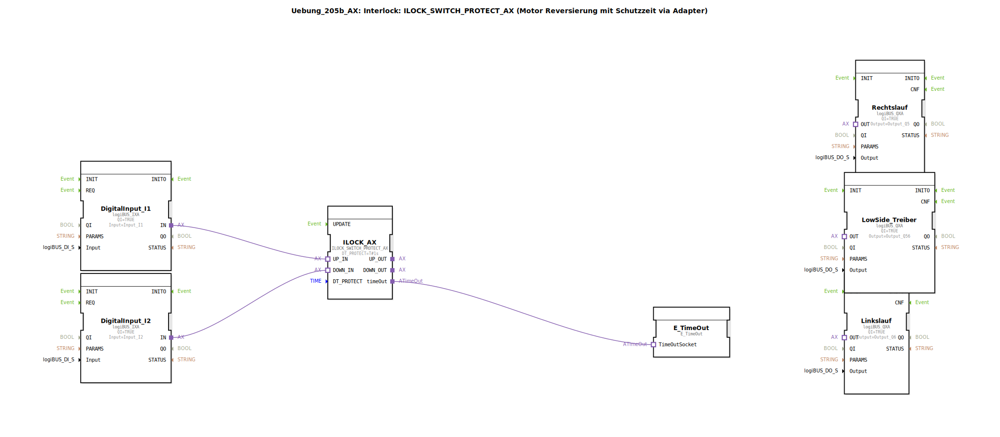

# Uebung_205b_AX: Interlock: ILOCK_SWITCH_PROTECT_AX (Motor Reversierung mit Schutzzeit via Adapter)

* * * * * * * * * *
## Einleitung

Diese Übung behandelt die Motorreversierung mit Schutzzeit unter Verwendung eines Interlock-Bausteins (ILOCK_SWITCH_PROTECT_AX). Ziel ist es, einen Motor über zwei Eingänge (Aufwärts/Abwärts) zu steuern, wobei eine festgelegte Schutzzeit (hier 1 Sekunde) das gleichzeitige Einschalten beider Richtungen verhindert und einen zu schnellen Richtungswechsel blockiert. Die Steuerung erfolgt über Adapter-Schnittstellen, was die Wiederverwendbarkeit des Subapplikationstyps erhöht.

Schwierigkeitsgrad: Fortgeschritten  
Vorkenntnisse: Grundlagen der 4diac-IDE, Umgang mit Ein-/Ausgangsbausteinen, Verständnis von Interlock-Logiken.

## Verwendete Funktionsbausteine (FBs)

- **DigitalInput_I1** (logiBUS::io::DI::logiBUS_IXA)  
  - Parameter: QI = TRUE, Input = Input_I1  
  - Ereignisausgang/-eingang: —  
  - Datenausgang/-eingang: IN (Adapter-Schnittstelle)

- **DigitalInput_I2** (logiBUS::io::DI::logiBUS_IXA)  
  - Parameter: QI = TRUE, Input = Input_I2  
  - Ereignisausgang/-eingang: —  
  - Datenausgang/-eingang: IN (Adapter-Schnittstelle)

- **ILOCK_AX** (logiBUS::signalprocessing::interlock::ILOCK_SWITCH_PROTECT_AX)  
  - Parameter: DT_PROTECT = T#1s  
  - Ereignisausgang/-eingang: timeOut (Ereignisausgang)  
  - Datenausgang/-eingang: UP_IN, DOWN_IN (Eingänge); UP_OUT, DOWN_OUT (Ausgänge)

- **Rechtslauf** (logiBUS::io::DQ::logiBUS_QXA)  
  - Parameter: QI = TRUE, Output = Output_Q5  
  - Ereignisausgang/-eingang: —  
  - Datenausgang/-eingang: OUT (Adapter-Schnittstelle)

- **Linkslauf** (logiBUS::io::DQ::logiBUS_QXA)  
  - Parameter: QI = TRUE, Output = Output_Q6  
  - Ereignisausgang/-eingang: —  
  - Datenausgang/-eingang: OUT (Adapter-Schnittstelle)

- **LowSide_Treiber** (logiBUS::io::DQ::logiBUS_QXA)  
  - Parameter: QI = TRUE, Output = Output_Q56  
  - Ereignisausgang/-eingang: —  
  - Datenausgang/-eingang: OUT (Adapter-Schnittstelle)

- **E_TimeOut** (iec61499::events::E_TimeOut)  
  - Parameter: keine (Standard-Timeout-Baustein)  
  - Ereignisausgang/-eingang: TimeOutSocket (Ereigniseingang, verbunden mit ILOCK_AX.timeOut)  
  - Datenausgang/-eingang: —

### Sub-Bausteine: AX_2_TO_3

- **Typ**: MyLib::sys::AX_2_TO_3  
- **Verwendete interne FBs**: (keine detaillierten Informationen in der Übung enthalten)  
- **Funktionsweise**:  
  Dieser Sub-Baustein dient der Weiterleitung und logischen Verknüpfung der Auf- und Abwärtssignale.  
  - **UP_IN** und **DOWN_IN** werden als Eingänge empfangen.  
  - **UP_OUT** gibt das Signal von UP_IN unverändert weiter.  
  - **DOWN_OUT** gibt das Signal von DOWN_IN unverändert weiter.  
  - **OR_OUT** ist eine ODER-Verknüpfung der beiden Eingänge (UP_IN ODER DOWN_IN). Dieses Signal wird verwendet, um den LowSide-Treiber zu aktivieren, sobald eine der beiden Richtungen angefordert wird.  

  Damit werden die getrennten Richtungssignale auf zwei Ausgänge verteilt, gleichzeitig aber ein gemeinsames Signal für die Low-Side-Ansteuerung erzeugt.

## Programmablauf und Verbindungen

1. **Eingangssignale**  
   Die digitalen Eingänge `Input_I1` und `Input_I2` werden über die Bausteine `DigitalInput_I1` und `DigitalInput_I2` eingelesen. Diese stellen die Anforderungen `UP_IN` und `DOWN_IN` an den Interlock-Baustein `ILOCK_AX` bereit.

2. **Interlock-Logik**  
   `ILOCK_AX` wertet die beiden Anforderungen aus.  
   - Bei einer aktiven Anforderung (z.B. `UP_IN`) wird der entsprechende Ausgang (`UP_OUT`) aktiviert, sofern nicht gleichzeitig die Gegenrichtung anliegt.  
   - Die Schutzzeit `DT_PROTECT = 1s` verhindert, dass nach einem Richtungswechsel sofort die andere Richtung geschaltet werden kann.  
   - Wenn die Schutzzeit aktiv ist und eine Anforderung für die Gegenrichtung kommt, wird der Ausgang blockiert und der `timeOut`-Ereignisausgang getriggert.

3. **Zeitüberwachung**  
   Der Ereignisausgang `timeOut` von `ILOCK_AX` ist mit dem `E_TimeOut`-Baustein verbunden. Dieser kann z.B. für weitere Verarbeitung oder Visualisierung genutzt werden (hier nicht weiter ausgeführt).

4. **Signalverteilung via AX_2_TO_3**  
   Die Ausgänge `UP_OUT` und `DOWN_OUT` von `ILOCK_AX` werden an die SubApp `AX_2_TO_3` übergeben.  
   - `UP_OUT` → `AX_2_TO_3.UP_IN`  
   - `DOWN_OUT` → `AX_2_TO_3.DOWN_IN`  
   Der Sub-Baustein leitet die Signale getrennt an die Ausgangsbausteine `Rechtslauf` (Q5) und `Linkslauf` (Q6) weiter.  
   Das ODER-Signal `OR_OUT` aktiviert den `LowSide_Treiber` (Q56), der die gemeinsame Low-Side-Versorgung für den Motor schaltet.

5. **Ausgangsbausteine**  
   - `Rechtslauf` (Output_Q5): Steuert das Relais für Rechtslauf.  
   - `Linkslauf` (Output_Q6): Steuert das Relais für Linkslauf.  
   - `LowSide_Treiber` (Output_Q56): Schaltet die Low-Side-Spannung – notwendig, sobald eine der beiden Richtungen aktiv ist.

Die gesamte Logik ist als wiederverwendbare SubApp gekapselt und kann in übergeordneten Steuerungsprojekten eingebunden werden.

## Zusammenfassung

Die Übung **Uebung_205b_AX** vermittelt die Umsetzung einer motorischen Reversiersteuerung mit Interlock und Schutzzeit. Durch die Verwendung des spezialisierten Bausteins `ILOCK_SWITCH_PROTECT_AX` wird eine sichere Richtungsumkehr gewährleistet. Die Adapter-basierte Kommunikation zwischen den Bausteinen ermöglicht eine flexible und modulare Struktur. Die SubApp `AX_2_TO_3` übernimmt die Aufteilung der Richtungssignale und die Erzeugung eines gemeinsamen Low-Side-Signals. Diese Übung eignet sich zur Vertiefung des Verständnisses von Interlock-Logiken sowie der Arbeit mit Adaptern in 4diac.