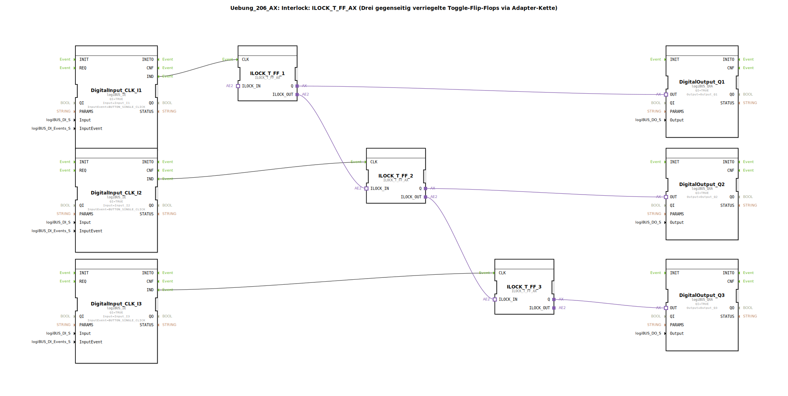

# Uebung_206_AX: Interlock: ILOCK_T_FF_AX (Drei gegenseitig verriegelte Toggle-Flip-Flops via Adapter-Kette)

*Bild der Übung nicht verfügbar*

* * * * * * * * * *

## Einleitung

Diese Übung demonstriert die Umsetzung eines **Interlocks** (gegenseitige Verriegelung) mit drei Toggle-Flip-Flops (T-FF). Jedes Flip-Flop wird durch einen Taster (Single-Click) umgeschaltet. Die Besonderheit: Über eine bidirektionale Adapter-Kette wird sichergestellt, dass immer nur genau ein Ausgang aktiv sein kann – sobald ein Flip-Flop gesetzt wird, werden die anderen automatisch zurückgesetzt.

Dadurch eignet sich die Schaltung für sicherheitskritische Anwendungen, z. B. zur exklusiven Ansteuerung von Aktoren.

## Verwendete Funktionsbausteine (FBs)

| Bausteinname        | Typ                                      | Beschreibung                                 |
|---------------------|------------------------------------------|----------------------------------------------|
| `DigitalInput_CLK_I1` | `logiBUS::io::DI::logiBUS_IE`         | Digitaler Eingang für Taster an Kanal I1     |
| `DigitalInput_CLK_I2` | `logiBUS::io::DI::logiBUS_IE`         | Digitaler Eingang für Taster an Kanal I2     |
| `DigitalInput_CLK_I3` | `logiBUS::io::DI::logiBUS_IE`         | Digitaler Eingang für Taster an Kanal I3     |
| `ILOCK_T_FF_1`        | `logiBUS::signalprocessing::interlock::ILOCK_T_FF_AX` | Gegenseitig verriegeltes Toggle-Flip-Flop (zentraler Baustein) |
| `ILOCK_T_FF_2`        | `logiBUS::signalprocessing::interlock::ILOCK_T_FF_AX` | Gleicher Typ wie ILOCK_T_FF_1                |
| `ILOCK_T_FF_3`        | `logiBUS::signalprocessing::interlock::ILOCK_T_FF_AX` | Gleicher Typ wie ILOCK_T_FF_1                |
| `DigitalOutput_Q1`    | `logiBUS::io::DQ::logiBUS_QXA`        | Digitaler Ausgang an Kanal Q1                |
| `DigitalOutput_Q2`    | `logiBUS::io::DQ::logiBUS_QXA`        | Digitaler Ausgang an Kanal Q2                |
| `DigitalOutput_Q3`    | `logiBUS::io::DQ::logiBUS_QXA`        | Digitaler Ausgang an Kanal Q3                |

### Sub-Baustein: ILOCK_T_FF_AX

- **Typ**: `logiBUS::signalprocessing::interlock::ILOCK_T_FF_AX` (Bibliotheksbaustein)
- **Verwendete interne FBs**: *keine detaillierten Informationen öffentlich* – der Baustein ist als vorgefertigter Logikbaustein aus der Bibliothek eingebunden.
- **Funktionsweise**:
  - Der Baustein realisiert ein **Toggle-Flip-Flop** (T-FF): Bei jedem positiven Flanke am Takteingang `CLK` wechselt der Ausgang `Q` seinen Zustand (von FALSE auf TRUE oder umgekehrt).
  - Zusätzlich besitzt er eine **Adapter-Schnittstelle** (`ILOCK_IN` / `ILOCK_OUT`), über die eine Verriegelungskette aufgebaut wird. Sobald der eigene Ausgang `Q` auf TRUE gesetzt wird, sendet der Baustein ein Sperrsignal über `ILOCK_OUT`. Empfangt er ein Sperrsignal von einem vorherigen Baustein über `ILOCK_IN`, wird der eigene Ausgang sofort auf FALSE zurückgesetzt (falls aktiv). Dadurch kann immer nur ein Flip-Flop in der Kette aktiv sein.

- **Parameter**:
  - Keine benutzerspezifischen Parameter (alle Standardwerte aus der Bibliothek).

- **Ereignisschnittstellen**:
  - **Eingang**: `CLK` – Ereignis (positive Flanke) zum Umschalten des Ausgangs.
  - **Ausgang**: *keine eigenen Ereignisausgänge* (die Ausgangsdaten werden direkt über Adapter weitergegeben).

- **Datenschnittstellen**:
  - **Datenausgang**: `Q` (BOOL) – der aktuelle Zustand des Flip-Flops.

- **Adapterschnittstellen**:
  - **Plug**: `ILOCK_IN` – Adaptereingang für das Sperrsignal des Vorgängers.
  - **Socket**: `ILOCK_OUT` – Adapterausgang zum Sperren des Nachfolgers.

## Programmablauf und Verbindungen

1. **Eingangsereignisse**  
   Die drei Digital-Eingänge (`DigitalInput_CLK_Ix`) wandeln Taster-Signale (Single-Click-Ereignis) in Ereignisse am Ausgang `IND` um. Diese werden direkt mit dem `CLK`-Eingang des jeweiligen `ILOCK_T_FF_Ax`-Bausteins verbunden.

2. **Interlock-Kette**  
   Die drei Flip-Flops werden über ihre Adapter-Schnittstellen in einer Kette verbunden:
   - `ILOCK_T_FF_1.ILOCK_OUT` → `ILOCK_T_FF_2.ILOCK_IN`
   - `ILOCK_T_FF_2.ILOCK_OUT` → `ILOCK_T_FF_3.ILOCK_IN`
   - (Der Ausgang von `ILOCK_T_FF_3.ILOCK_OUT` bleibt ungenutzt; die Kette ist an dieser Stelle offen.)

   Durch diese Verkettung wird sichergestellt, dass bei Setzen eines Flip-Flops (z. B. Nr. 1) der Nachfolger (Nr. 2) ein Sperrsignal erhält, das wiederum an Nr. 3 weitergegeben wird. Sobald in der Kette ein aktives Sperrsignal anliegt, schaltet der betroffene Baustein seinen Ausgang `Q` sofort aus.

3. **Ausgangsansteuerung**  
   Die Ausgänge `Q` der drei Flip-Flops sind mit den Digitalausgängen (`DigitalOutput_Q1` … `DigitalOutput_Q3`) verbunden. Diese geben den Zustand an die Hardware‑Kanäle Q1, Q2 und Q3 weiter.

**Lernziele**:
- Verständnis des Interlock-Prinzips (gegenseitige Verriegelung) in der Automatisierungstechnik.
- Kennenlernen des Bibliotheksbausteins `ILOCK_T_FF_AX` und seiner Adapter-Schnittstelle.
- Anwendung von Ereignis- und Adapter-Verbindungen in 4diac.

**Schwierigkeitsgrad**: Mittel – Vorkenntnisse in IEC 61499, Grundlagen der Ereignissteuerung und Adapter-Handhabung werden empfohlen.

**Hinweise zur Ausführung**:
- Die Übung ist für den Einsatz mit einem logiBUS‑System (z. B. Raspberry Pi mit I/O‑Erweiterung) ausgelegt.
- Vor dem Start müssen die Hardware‑Kanäle (Input_I1 … Input_I3, Output_Q1 … Output_Q3) korrekt an die realen Taster und Aktoren angeschlossen sein.
- Der Baustein `logiBUS_DI_Events::BUTTON_SINGLE_CLICK` wird als Ereignisquelle genutzt – ein einfacher Tastendruck erzeugt ein einzelnes Takt-Ereignis (Entprellung ist im Treiber integriert).

## Zusammenfassung

Die Übung „Uebung_206_AX“ zeigt einen eleganten Weg, drei Toggle-Flip-Flops gegenseitig zu verriegeln, sodass stets nur ein Ausgang aktiv ist. Die Verwendung einer Adapter-Kette vereinfacht die Verkabelung und macht die Logik modular erweiterbar auf mehrere Stufen. Der Bibliotheksbaustein `ILOCK_T_FF_AX` kapselt die komplexe Verriegelungslogik und erlaubt eine klare, übersichtliche Netzwerktopologie.