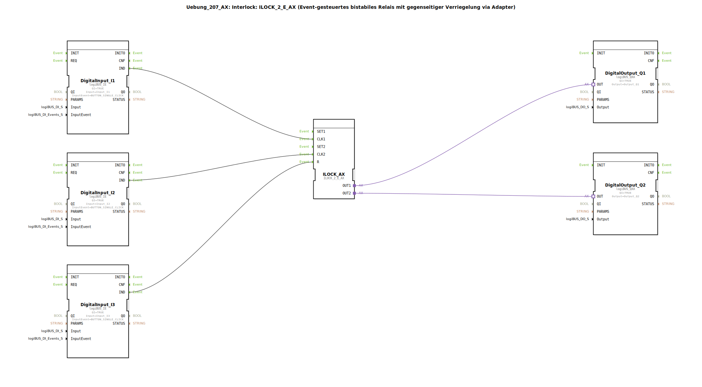

# Uebung_207_AX: Interlock: ILOCK_2_E_AX (Event-gesteuertes bistabiles Relais mit gegenseitiger Verriegelung via Adapter)

* * * * * * * * * *

## Einleitung

Diese Übung demonstriert den Einsatz eines event-gesteuerten bistabilen Relais mit gegenseitiger Verriegelung (Interlock).  
Mithilfe des Funktionsbausteins `ILOCK_2_E_AX` wird ein einfaches Zwei-Kanal-Set/Reset-System aufgebaut, das über zwei digitale Eingänge getaktet wird und zwei digitale Ausgänge ansteuert. Ein dritter digitaler Eingang dient als separater Rücksetzeingang.

## Verwendete Funktionsbausteine (FBs)

| FB-Name | Typ | Beschreibung |
|----------|------|---------------|
| `DigitalInput_I1` | `logiBUS::io::DI::logiBUS_IE` | Digitaler Eingang, parametriert mit `Input_I1` und Ereignis `BUTTON_SINGLE_CLICK` |
| `DigitalInput_I2` | `logiBUS::io::DI::logiBUS_IE` | Digitaler Eingang, parametriert mit `Input_I2` und Ereignis `BUTTON_SINGLE_CLICK` |
| `DigitalInput_I3` | `logiBUS::io::DI::logiBUS_IE` | Digitaler Eingang, parametriert mit `Input_I3` und Ereignis `BUTTON_SINGLE_CLICK` |
| `ILOCK_AX` | `logiBUS::signalprocessing::interlock::ILOCK_2_E_AX` | Interlock-Baustein mit zwei ereignisgesteuerten Set/Reset-Eingängen und Adapter-Ausgängen |
| `DigitalOutput_Q1` | `logiBUS::io::DQ::logiBUS_QXA` | Digitaler Ausgang, parametriert mit `Output_Q1` |
| `DigitalOutput_Q2` | `logiBUS::io::DQ::logiBUS_QXA` | Digitaler Ausgang, parametriert mit `Output_Q2` |

### Sub-Bausteine (keine eigenen Sub-Applikationen)

In dieser Übung werden keine benutzerdefinierten Sub-Bausteine verwendet – alle FBs stammen aus den Bibliotheken `logiBUS` (Digitale Ein-/Ausgabe und Signalverarbeitung).

## Programmablauf und Verbindungen

1. **Ereignisverknüpfung**  
   - Die Ereignisausgänge `IND` der drei `logiBUS_IE`-Eingänge sind wie folgt mit dem `ILOCK_2_E_AX` verbunden:  
     - `DigitalInput_I1.IND` → `ILOCK_AX.CLK1` (Setzen von Kanal 1)  
     - `DigitalInput_I2.IND` → `ILOCK_AX.CLK2` (Setzen von Kanal 2)  
     - `DigitalInput_I3.IND` → `ILOCK_AX.R`   (gemeinsamer Reset)

2. **Adapterverbindungen**  
   - Die Ausgänge des Interlock-Bausteins werden über Adapterverbindungen an die digitalen Ausgänge weitergegeben:  
     - `ILOCK_AX.OUT1` → `DigitalOutput_Q1.OUT`  
     - `ILOCK_AX.OUT2` → `DigitalOutput_Q2.OUT`

3. **Funktionsweise**  
   - Ein Ereignis (Single-Click) auf `I1` setzt den Ausgang `Q1` und löscht gleichzeitig `Q2` (gegenseitige Verriegelung).  
   - Ein Ereignis auf `I2` setzt `Q2` und löscht `Q1`.  
   - Ein Ereignis auf `I3` setzt beide Ausgänge zurück (`R = Reset`).  
   - Der Interlock-Baustein arbeitet flankengesteuert: Nur bei eintreffenden Ereignissen ändern sich die Ausgangszustände.

**Lernziele**:
- Verständnis des Prinzips der gegenseitigen Verriegelung (Interlock) in der Automatisierungstechnik
- Umgang mit ereignisgesteuerten Funktionsbausteinen (event-gesteuert)
- Kommunikation über Adapterschnittstellen zwischen Signalverarbeitung und Ein-/Ausgabe
- Parametrierung von digitalen Eingängen mit verschiedenen Ereignistypen

**Schwierigkeitsgrad**: Mittel  
**Vorkenntnisse**: Grundlagen der IEC 61499, Bedienung der 4diac-IDE, Aufbau einfacher Netzwerke mit Ein-/Ausgabe-FBs

**Ausführung**: Nach dem Öffnen der Übung in der 4diac-IDE kann das System auf einer geeigneten Hardware (z.B. logiBUS-kompatibles System) gestartet werden. Die Taster an den Eingängen I1, I2 und I3 schalten die Ausgänge Q1 und Q2 entsprechend der Interlock-Logik.

## Zusammenfassung

Die Übung `Uebung_207_AX` vermittelt die praktische Anwendung eines event-gesteuerten Interlock-Bausteins. Sie zeigt, wie zwei Ausgänge wechselseitig gesperrt werden können und wie ein separater Reset-Eingang das System in einen definierten Grundzustand versetzt. Durch die Verwendung von Adapterverbindungen wird die lose Kopplung zwischen Signalverarbeitung und Peripherie deutlich – ein Kernkonzept der IEC 61499.