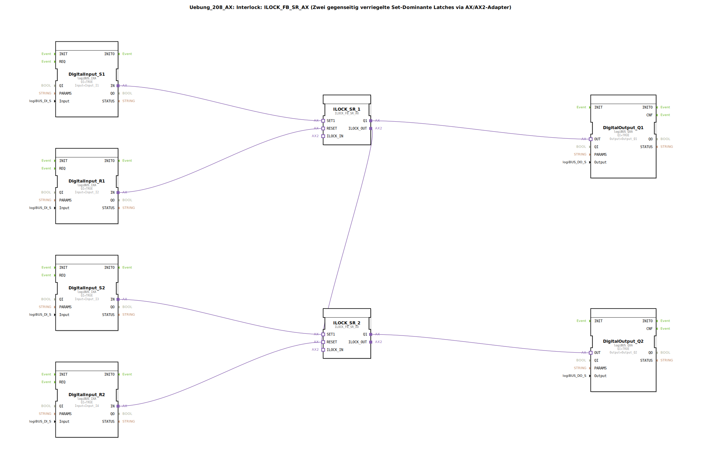

# Uebung_208_AX: Interlock: ILOCK_FB_SR_AX (Zwei gegenseitig verriegelte Set-Dominante Latches via AX/AX2-Adapter)

- **Titel**: Uebung_208_AX  
  *Interlock: ILOCK_FB_SR_AX (Zwei gegenseitig verriegelte Set-Dominante Latches via AX/AX2-Adapter)*

* * * * * * * * * *

## Einleitung

Diese Übung veranschaulicht die Realisierung einer gegenseitigen Verriegelung (Interlock) zwischen zwei Set-dominanten SR-Latches. Die beiden Latches sind so miteinander verschaltet, dass immer nur einer der beiden Ausgänge aktiv sein kann. Die Ansteuerung erfolgt über digitale Eingänge, die Ausgänge werden über digitale Ausgänge ausgegeben. Die Verriegelung wird über die speziellen Adapter `ILOCK_IN` und `ILOCK_OUT` der Bausteine `ILOCK_FB_SR_AX` realisiert.

## Verwendete Funktionsbausteine (FBs)

### Sub-Bausteine: DigitalInput_S1, DigitalInput_R1, DigitalInput_S2, DigitalInput_R2
- **Typ**: `logiBUS::io::DI::logiBUS_IXA`
- **Verwendete interne FBs**: Keine (Hardware-Adapterbaustein)
- **Parameter**:
  - `QI` = `TRUE`
  - `Input` = `Input_I1` (bzw. `Input_I2`, `Input_I3`, `Input_I4`)
- **Funktionsweise**: Diese Bausteine lesen die digitalen Eingangssignale der logiBUS-Hardware ein und stellen sie über den Adapterausgang `IN` zur Verfügung. Sie dienen als Schnittstelle zu den physikalischen Eingängen.

### Sub-Bausteine: ILOCK_SR_1, ILOCK_SR_2
- **Typ**: `logiBUS::signalprocessing::interlock::ILOCK_FB_SR_AX`
- **Verwendete interne FBs**: Keine (vordefinierter Interlock-Baustein)
- **Parameter**: Keine (Standardkonfiguration)
- **Funktionsweise**: Diese Bausteine realisieren je ein set-dominantes SR-Latch (Set-Dominant). Sie besitzen zwei Adapterschnittstellen:
  - `SET1`: Set-Eingang (aktiv-high)
  - `RESET`: Reset-Eingang (aktiv-high)
  - `Q1`: Ausgang (aktiv-high)
  - `ILOCK_IN`: Eingang für die Verriegelung von einem anderen Latch
  - `ILOCK_OUT`: Ausgang zur Verriegelung eines anderen Latches

  Die Verriegelung bewirkt, dass ein aktiver `ILOCK_IN` das Setzen des eigenen Latches blockiert. Dadurch kann immer nur eines der beiden Latches gesetzt sein.

### Sub-Bausteine: DigitalOutput_Q1, DigitalOutput_Q2
- **Typ**: `logiBUS::io::DQ::logiBUS_QXA`
- **Verwendete interne FBs**: Keine (Hardware-Adapterbaustein)
- **Parameter**:
  - `QI` = `TRUE`
  - `Output` = `Output_Q1` (bzw. `Output_Q2`)
- **Funktionsweise**: Diese Bausteine geben den Zustand des Eingangs `OUT` als digitales Ausgangssignal auf die logiBUS-Hardware aus. Sie dienen als Schnittstelle zu den physikalischen Ausgängen.

## Programmablauf und Verbindungen

Die Übung besteht aus zwei identischen parallelen Zweigen, die über eine gegenseitige Verriegelung verbunden sind.

- **Erster Zweig**:  
  Digitaleingang `DigitalInput_S1` (verbunden mit Hardware-Eingang `Input_I1`) liefert das Set-Signal an `ILOCK_SR_1.SET1`.  
  Digitaleingang `DigitalInput_R1` (verbunden mit `Input_I2`) liefert das Reset-Signal an `ILOCK_SR_1.RESET`.  
  Der Ausgang `ILOCK_SR_1.Q1` wird auf `DigitalOutput_Q1.OUT` gegeben und schaltet den Hardware-Ausgang `Output_Q1`.

- **Zweiter Zweig**:  
  Analog wird `ILOCK_SR_2` durch `DigitalInput_S2` (über `Input_I3`) gesetzt und durch `DigitalInput_R2` (über `Input_I4`) zurückgesetzt. Sein Ausgang `Q1` steuert `Output_Q2`.

- **Interlock-Verbindung**:  
  Der Ausgang `ILOCK_SR_1.ILOCK_OUT` ist mit dem Eingang `ILOCK_SR_2.ILOCK_IN` verbunden. Dadurch wird erreicht, dass wenn `ILOCK_SR_1` gesetzt ist (Q1 = TRUE), das Setzen von `ILOCK_SR_2` blockiert wird. Umgekehrt (Symmetrie) – in dieser Konfiguration ist nur eine Richtung explizit verdrahtet, die andere wird implizit durch die interne Logik des Bausteins realisiert. Tatsächlich besitzt `ILOCK_FB_SR_AX` eine bidirektionale Verriegelung: beide Latches blockieren sich gegenseitig. Die zusätzliche Verbindung des `ILOCK_OUT` des einen zum `ILOCK_IN` des anderen stellt sicher, dass immer nur einer aktiv ist.

**Ablauf**:
1. Liegt an `S1` ein TRUE-Signal an (und `ILOCK_SR_1` ist nicht durch `ILOCK_SR_2` blockiert), so wird `Q1` gesetzt.
2. Liegt an `S2` ein TRUE-Signal an (und `ILOCK_SR_2` ist nicht durch `ILOCK_SR_1` blockiert), so wird `Q2` gesetzt.
3. Ein Reset über `R1` bzw. `R2` setzt das jeweilige Latch zurück.
4. Durch die Verriegelung kann nie gleichzeitig `Q1` und `Q2` TRUE sein. Ein Setzversuch am blockierten Latch bleibt wirkungslos.

**Lernziele**:
- Verständnis von gegenseitigen Verriegelungen (Interlocks) in der Steuerungstechnik.
- Anwendung set-dominanter SR-Latches.
- Umgang mit Adapterverbindungen in 4diac-IDE (AX/AX2-Konzept).

**Schwierigkeitsgrad**: Mittel  
**Vorkenntnisse**: Grundlagen der logiBUS-Ein-/Ausgabe, SR-Latch-Funktionalität.

## Zusammenfassung

Die Übung `Uebung_208_AX` demonstriert den Aufbau einer gegenseitigen Verriegelung zwischen zwei set-dominanten Latches mithilfe der speziellen Interlock-Bausteine `ILOCK_FB_SR_AX`. Durch die Adapterverbindungen `ILOCK_IN` und `ILOCK_OUT` wird sichergestellt, dass stets nur einer der beiden Ausgänge aktiv sein kann. Dies ist typisch für Anwendungen, bei denen sich zwei Zustände gegenseitig ausschließen müssen (z.B. Motorenrichtungen, Ventilsteuerungen). Die Übung festigt den Umgang mit Hardware-Adaptern und den Interlock-Mechanismen der logiBUS-Bibliothek.