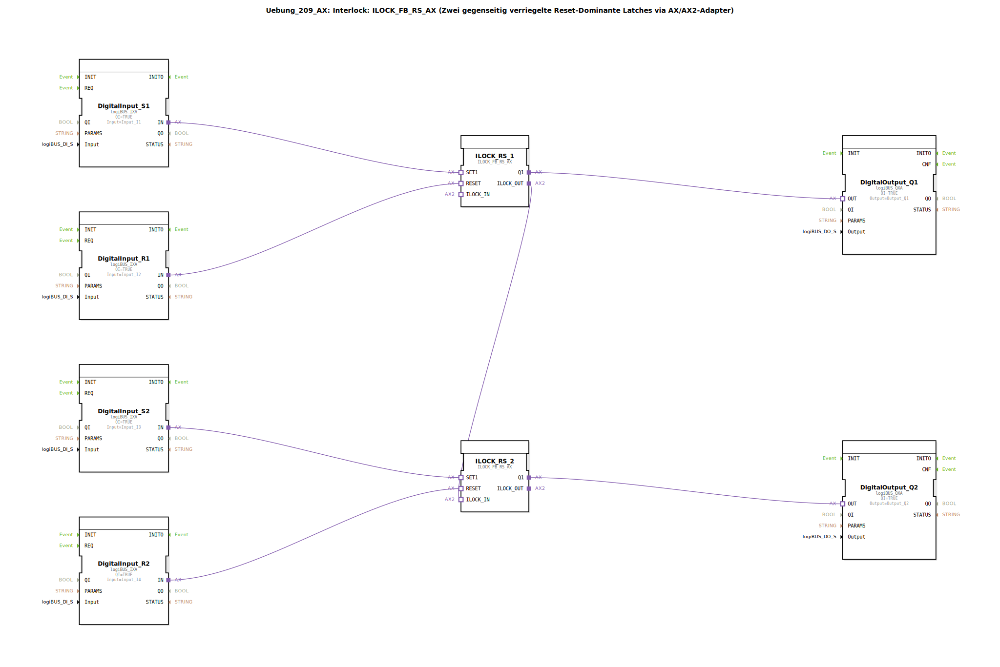

# Uebung_209_AX: Interlock: ILOCK_FB_RS_AX (Zwei gegenseitig verriegelte Reset-Dominante Latches via AX/AX2-Adapter)

* * * * * * * * * *
## Einleitung

Diese Übung demonstriert den Aufbau einer **gegenseitigen Verriegelung (Interlock)** zwischen zwei reset-dominanten RS-Latches. Die Schaltung verhindert, dass beide Ausgänge gleichzeitig aktiv werden – ein typisches Sicherheitsmerkmal in der Steuerungstechnik. Die Realisierung erfolgt über zwei **ILOCK_FB_RS_AX**-Blöcke, die über einen AX/AX2-Adapter miteinander verbunden sind. Jeweils ein Setz- und ein Rücksetzeingang steuern die Latches, während die Ausgänge die digitalen Ausgänge Q1 und Q2 ansteuern.

## Verwendete Funktionsbausteine (FBs)

In der Übung werden folgende Funktionsbausteine eingesetzt:

| FB-Name                | Typ                             | Zweck                                     |
| ---------------------- | ------------------------------- | ----------------------------------------- |
| `DigitalInput_S1`      | `logiBUS_IXA`                   | Einlesen des Setz-Signals S1 (Eingang I1) |
| `DigitalInput_R1`      | `logiBUS_IXA`                   | Einlesen des Rücksetz-Signals R1 (I2)     |
| `DigitalInput_S2`      | `logiBUS_IXA`                   | Einlesen des Setz-Signals S2 (I3)         |
| `DigitalInput_R2`      | `logiBUS_IXA`                   | Einlesen des Rücksetz-Signals R2 (I4)     |
| `ILOCK_RS_1`           | `ILOCK_FB_RS_AX`                | Erstes verriegeltes RS-Latch              |
| `ILOCK_RS_2`           | `ILOCK_FB_RS_AX`                | Zweites verriegeltes RS-Latch             |
| `DigitalOutput_Q1`     | `logiBUS_QXA`                   | Ausgabe an Q1                             |
| `DigitalOutput_Q2`     | `logiBUS_QXA`                   | Ausgabe an Q2                             |

### Sub-Bausteine: `ILOCK_FB_RS_AX`

- **Typ**: Bibliotheksbaustein aus der logiBUS-Bibliothek (`logiBUS::signalprocessing::interlock::ILOCK_FB_RS_AX`)
- **Verwendete interne FBs** (Konzeptuell):
  - Zwei reset-dominante RS-Latches (SR)
  - Ein Interlock-Gatter, das die Ausgänge der Latches gegenseitig sperrt
- **Schnittstellen (Adapter)**:
  - `SET1`: Setz-Eingang über AX-Adapter
  - `RESET`: Rücksetz-Eingang über AX-Adapter
  - `Q1`: Ausgang des Latches (AX-Adapter)
  - `ILOCK_IN`: Eingang für die Verriegelung vom anderen Latch
  - `ILOCK_OUT`: Ausgang, der den eigenen Zustand an den anderen Latch meldet
- **Funktionsweise**:  
  Der Baustein realisiert ein reset-dominantes RS-Latch, dessen Ausgang `Q1` gesetzt wird, wenn `SET1` aktiv ist und kein aktives RESET anliegt. Der Ausgang bleibt gesetzt, bis `RESET` aktiv wird (Reset-Dominanz). Zusätzlich wird über `ILOCK_IN` der Zustand des anderen Latches empfangen: Wenn der andere Latch aktiv ist, wird das Setzen des eigenen Latches unterbunden. Der eigene Zustand wird über `ILOCK_OUT` an den anderen Latch weitergegeben.

## Programmablauf und Verbindungen

Die Verdrahtung im `SubAppNetwork` erfolgt über Adapterverbindungen:

1. **Eingangsverarbeitung**:  
   - `DigitalInput_S1` liefert den Setz-Befehl für `ILOCK_RS_1` (S1).  
   - `DigitalInput_R1` liefert den Rücksetz-Befehl für `ILOCK_RS_1` (R1).  
   - Analog für die zweite Gruppe: `DigitalInput_S2` → `ILOCK_RS_2.SET1`, `DigitalInput_R2` → `ILOCK_RS_2.RESET`.

2. **Interlock-Verkettung**:  
   - Der Ausgang `ILOCK_RS_1.ILOCK_OUT` ist mit `ILOCK_RS_2.ILOCK_IN` verbunden.  
   - Diese Verbindung stellt sicher, dass `ILOCK_RS_2` nur dann gesetzt werden kann, wenn `ILOCK_RS_1` nicht aktiv ist (bzw. umgekehrt, da der zweite Block ebenfalls seinen ILOCK_OUT angeben müsste – in dieser Konfiguration ist nur eine Richtung explizit verdrahtet, die interne Logik berücksichtigt jedoch die gegenseitige Sperre).

3. **Ausgangssteuerung**:  
   - `ILOCK_RS_1.Q1` steuert über `DigitalOutput_Q1` den Ausgang Q1.  
   - `ILOCK_RS_2.Q1` steuert über `DigitalOutput_Q2` den Ausgang Q2.

**Ablauf**:  
Ein Taster an S1 setzt den ersten Latch (Q1 ein), solange R1 nicht gedrückt ist. Wird S2 betätigt, kann der zweite Latch nur aktiv werden, wenn der erste Latch inaktiv ist (durch Interlock). Erst nach einem Reset des ersten Latches (R1) kann der zweite Latch gesetzt werden. Dadurch wird ein gleichzeitiges Einschalten beider Ausgänge ausgeschlossen.

## Zusammenfassung

Die Übung **Uebung_209_AX** vermittelt das grundlegende Prinzip eines **Interlocks** mit zwei reset-dominanten RS-Latches. Durch die Verwendung des vorgefertigten Bausteins `ILOCK_FB_RS_AX` und der AX-Adapter wird die Verriegelung einfach und übersichtlich realisiert. Lernziele sind:

- Verständnis des Interlock-Mechanismus in der Steuerungstechnik
- Umgang mit Adapter-basierten Verbindungen in 4diac
- Erkennen von Sicherheitsanforderungen (gegenseitige Sperre)

Diese Schaltung findet beispielsweise Anwendung bei der Ansteuerung von zwei gegenläufigen Motoren oder bei Zustandsmaschinen, bei denen nur ein Zustand gleichzeitig aktiv sein darf.