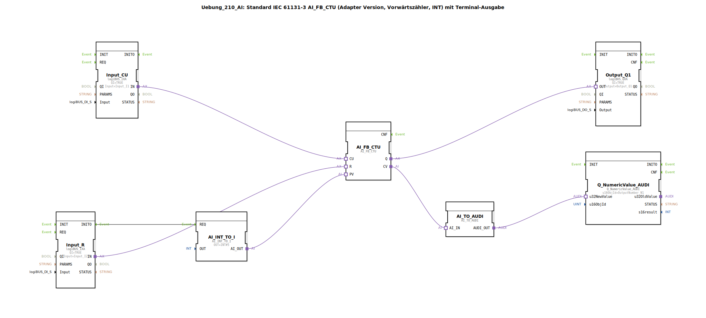

# Uebung_210_AI: Standard IEC 61131-3 AI_FB_CTU (Adapter Version, Vorwärtszähler, INT) mit Terminal-Ausgabe

* * * * * * * * * *

## Einleitung

Diese Übung implementiert einen Vorwärtszähler (CTU) gemäß IEC 61131-3 in einer Adapter-basierten Variante. Der gezählte Wert wird über ein Terminal ausgegeben. Die Schaltung zeigt die Interaktion zwischen logiBUS-Eingängen, einem Zählerbaustein, Konvertierungsbausteinen und einer Terminalausgabe.

## Verwendete Funktionsbausteine (FBs)

### FB: AI_FB_CTU
- **Typ**: `adapter::iec61131::counters::AI_FB_CTU`
- **Funktion**: Vorwärtszähler mit Adapterschnittstelle. Zählt bei jedem positiven Ereignis am Eingang CU den internen Zähler um 1 hoch. Der Zähler wird über den Eingang R zurückgesetzt. Der aktuelle Zählerwert (CV) und der Ausgang Q (wenn CV ≥ PV) werden über Adapterausgänge bereitgestellt.

### FB: AI_INT_TO_I
- **Typ**: `adapter::conversion::unidirectional::AI_INT_TO_I`
- **Parameter**: `OUT = INT#5` (fester Preset-Wert)
- **Funktion**: Wandelt einen konstanten Integer-Wert (5) in das erforderliche Adapterformat um und stellt ihn als Preset-Wert (PV) für den Zähler bereit.

### FB: Input_CU
- **Typ**: `logiBUS::io::DI::logiBUS_IXA`
- **Parameter**: `QI = TRUE`, `Input = Input_I1`
- **Funktion**: Liest den digitalen Eingang `Input_I1` und stellt ihn über einen Adapterausgang als Zählimpuls (CU) bereit.

### FB: Input_R
- **Typ**: `logiBUS::io::DI::logiBUS_IXA`
- **Parameter**: `QI = TRUE`, `Input = Input_I2`
- **Funktion**: Liest den digitalen Eingang `Input_I2` und stellt ihn über einen Adapterausgang als Rücksetzsignal (R) bereit.

### FB: Output_Q1
- **Typ**: `logiBUS::io::DQ::logiBUS_QXA`
- **Parameter**: `QI = TRUE`, `Output = Output_Q1`
- **Funktion**: Steuert den digitalen Ausgang `Output_Q1`. Der Ausgang wird aktiv, sobald der Zähler den Preset-Wert erreicht oder überschreitet.

### FB: AI_TO_AUDI
- **Typ**: `adapter::conversion::unidirectional::AI_TO_AUDI`
- **Funktion**: Wandelt den analogen Zählerwert (CV) in das AUDI-Format um, das für die Terminalausgabe benötigt wird. **Hinweis**: Der Baustein kann keine negativen Zahlen darstellen.

### FB: Q_NumericValue_AUDI
- **Typ**: `isobus::UT::Q::Q_NumericValue_AUDI`
- **Parameter**: `u16ObjId = OutputNumber_N1`
- **Funktion**: Gibt den übergebenen numerischen Wert auf dem Terminal aus. Die Objekt-ID `OutputNumber_N1` definiert die Position der Anzeige.

## Programmablauf und Verbindungen

Die Schaltung arbeitet wie folgt zusammen:

1. **Eingangssignale**:  
   - Der digitale Eingang `Input_I1` wird über `Input_CU` als Zählimpuls (CU) an den Zähler `AI_FB_CTU` weitergeleitet.  
   - Der digitale Eingang `Input_I2` wird über `Input_R` als Rücksetzsignal (R) an den Zähler weitergeleitet.

2. **Preset-Wert**:  
   - Der Baustein `AI_INT_TO_I` liefert einen festen Wert von 5. Dieser wird einmalig über eine Ereignisverbindung von `Input_R.INITO` (Initialisierungsereignis) zu `AI_INT_TO_I.REQ` gesetzt und dann als Preset-Wert (PV) an den Zähler übergeben.

3. **Zählerverhalten**:  
   - Bei jeder steigenden Flanke an CU wird der interne Zähler um 1 erhöht.  
   - Ein positiver Impuls an R setzt den Zähler auf 0 zurück.  
   - Erreicht der Zählerstand (CV) den Preset-Wert (5), wird der Ausgang Q gesetzt.  
   - Der Ausgang Q wird über den Adapterausgang an den digitalen Ausgang `Output_Q1` geleitet.

4. **Terminalausgabe**:  
   - Der aktuelle Zählerstand (CV) wird über `AI_TO_AUDI` in das AUDI-Format konvertiert.  
   - Anschließend wird der Wert über `Q_NumericValue_AUDI` auf dem Terminal dargestellt.

5. **Hinweise aus den Kommentaren**:  
   - Der Baustein `AI_TO_AUDI` unterstützt keine negativen Zahlen (kann bei bestimmten Anwendungen zu Fehlern führen).  
   - Um die Ereignisrate zu reduzieren, kann optional ein `AX_D_FF` (D-Flipflop) zwischengeschaltet werden.

## Zusammenfassung

Die Übung demonstriert die Realisierung eines IEC 61131-3 Vorwärtszählers mit Adapterschnittstelle (CTU) in 4diac. Die Ein- und Ausgänge sind über logiBUS-Komponenten an die Hardware angebunden. Der Zählerstand wird kontinuierlich auf einem Terminal ausgegeben, während der Ausgang Q einen digitalen Ausgang ansteuert. Die Konfiguration zeigt den Umgang mit Adapter-basierten Funktionsbausteinen, Typkonvertierungen und Terminalausgabe.