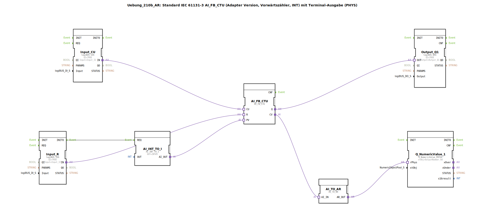

# Uebung_210b_AR: Standard IEC 61131-3 AI_FB_CTU (Adapter Version, Vorwärtszähler, INT) mit Terminal-Ausgabe (PHYS)

* * * * * * * * * *
## Einleitung

Diese Übung zeigt die Verwendung eines IEC 61131-3 Vorwärtszählers (CTU) in einer Adapter-Version. Der Zähler wird über zwei digitale Eingänge (CU für Zählimpulse, R für Reset) gesteuert. Der aktuelle Zählerstand wird über einen Analogausgang auf ein Terminal ausgegeben (PHYS). Ein Voreinstellwert (PV) wird beim Start auf 5 gesetzt. Der Ausgang Q des Zählers wird auf einen digitalen Ausgang geführt.

---

## Verwendete Funktionsbausteine (FBs)

- **AI_FB_CTU**  
  Typ: `adapter::iec61131::counters::AI_FB_CTU`  
  Vorwärtszähler (CTU) mit INT-Datentyp. Zählt bei jedem positiven Flanke am CU-Eingang hoch und setzt den Ausgang Q, wenn CV >= PV.

- **AI_INT_TO_I**  
  Typ: `adapter::conversion::unidirectional::AI_INT_TO_I`  
  Wandelt einen konstanten Integer-Wert in ein IBN‑konformes Signal. Parameter: `OUT = INT#5` (Voreinstellwert).

- **Input_CU**  
  Typ: `logiBUS::io::DI::logiBUS_IXA`  
  Digitaler Eingang für die Zählimpulse, verbunden mit `Input_I1`. Parameter: `QI = TRUE`.

- **Input_R**  
  Typ: `logiBUS::io::DI::logiBUS_IXA`  
  Digitaler Eingang für den Reset, verbunden mit `Input_I2`. Parameter: `QI = TRUE`.

- **Output_Q1**  
  Typ: `logiBUS::io::DQ::logiBUS_QXA`  
  Digitaler Ausgang, verbunden mit `Output_Q1`. Aktiv, wenn Zählerstand ≥ PV.

- **AI_TO_AR**  
  Typ: `adapter::conversion::unidirectional::AI_TO_AR`  
  Wandelt den analogen Zählerstand (CV) in einen AR‑Wert für die Terminalausgabe.

- **Q_NumericValue_1**  
  Typ: `isobus::UT::Q::Q_NumericValue_PHYSA`  
  Terminal‑Ausgabe (PHYS), zeigt den Zählerstand numerisch an. Parameter: `stObj = OutputNumber_N3`.

---

## Programmablauf und Verbindungen

1. **Initialisierung**  
   Beim Start wird über den Ereignisausgang `Input_R.INITO` der Baustein `AI_INT_TO_I` getriggert. Dieser liefert den konstanten Wert 5 an den PV-Eingang des Zählers.

2. **Zählen**  
   Jeder positive Flanke am digitalen Eingang `Input_CU` (verbunden mit `Input_I1`) erhöht den Zählerstand (CV) um 1.

3. **Reset**  
   Ein Signal am Eingang `Input_R` (verbunden mit `Input_I2`) setzt den Zählerstand auf 0 zurück.

4. **Ausgang Q**  
   Wenn CV >= PV (5), wird der Ausgang Q aktiv. Dieser ist mit dem digitalen Ausgang `Output_Q1` verbunden.

5. **Anzeige am Terminal**  
   Der aktuelle Zählerstand (CV) wird über `AI_TO_AR` in einen AR‑Wert gewandelt und an die Terminalausgabe `Q_NumericValue_1` gesendet. Dadurch kann der Wert auf einem physischen Display oder einer Visualisierung angezeigt werden.

**Hinweise aus der Konfiguration:**
- Im Kommentar wird darauf hingewiesen, dass negative Werte möglich sind.
- Für eine Reduzierung der Ereignisrate könnte ggf. ein `AX_D_FF`‑Baustein eingefügt werden.

---

## Zusammenfassung

Die Übung vermittelt den Umgang mit einem IEC 61131-3‑Zähler (CTU) in einer adapterbasierten Umgebung.  
**Lernziele:**
- Aufbau eines Vorwärtszählers mit Preset und Reset.
- Initialisierung eines Voreinstellwerts über einen Konstanten‑Baustein.
- Anbindung digitaler Ein‑ und Ausgänge über logiBUS.
- Ausgabe eines Zählerstands auf ein Terminal (PHYS).

**Schwierigkeitsgrad:** Mittel  
**Vorkenntnisse:** Grundlagen der 4diac‑IDE, Umgang mit logiBUS‑Ein-/Ausgängen.