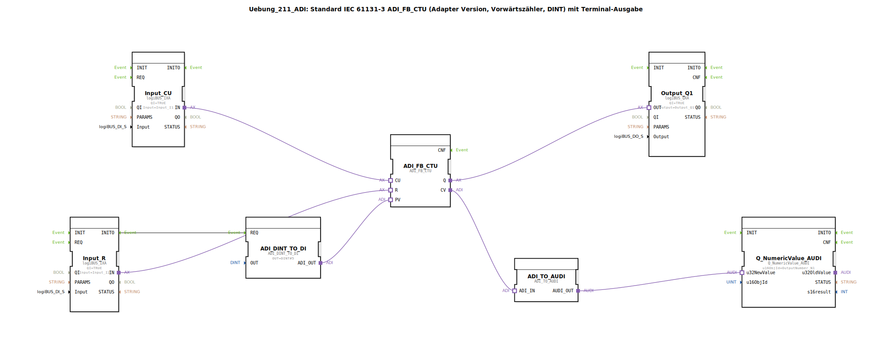

# Uebung_211_ADI: Standard IEC 61131-3 ADI_FB_CTU (Adapter Version, Vorwärtszähler, DINT) mit Terminal-Ausgabe

* * * * * * * * * *
## Einleitung

Diese Übung implementiert einen Standard IEC 61131-3 Vorwärtszähler (Counter Up, CTU) als Adapter-Version für den Datentyp DINT. Der Zählerstand wird zusätzlich über ein Terminal ausgegeben. Die Hardware-Eingänge (CU und R) werden über logiBUS DI-Bausteine eingelesen, der Ausgang Q steuert eine logiBUS DO-Klemme. Der Zählerendwert (PV) wird durch einen konstanten Wert von 5 festgelegt.

## Verwendete Funktionsbausteine (FBs)

### Sub-Bausteine: ADI_FB_CTU
- **Typ**: adapter::iec61131::counters::ADI_FB_CTU
- **Verwendete interne FBs**: Keine (Basisfunktionsbaustein)
- **Parameter**: Keine
- **Ereigniseingänge**: CU (Zählimpuls), R (Reset)
- **Datenausgänge**: Q (Ausgang, wenn CV >= PV), CV (aktueller Zählerstand)
- **Dateneingänge**: PV (Endwert)
- **Funktionsweise**: Der Baustein zählt bei jedem positiven Flanke am Ereigniseingang CU den internen Zähler CV hoch (DINT). Erreicht CV den Wert PV, wird Q gesetzt. Ein Signal am Eingang R setzt CV zurück auf 0 und Q zurück.

### Sub-Bausteine: ADI_DINT_TO_DI
- **Typ**: adapter::conversion::unidirectional::ADI_DINT_TO_DI
- **Verwendete interne FBs**: Keine
- **Parameter**: `OUT = DINT#5` (fester Endwert)
- **Funktionsweise**: Wandelt einen DINT-Wert in einen Adapter-Datenausgang (ADI) um. Hier wird der konstante Wert 5 als PV für den Zähler bereitgestellt.

### Sub-Bausteine: ADI_TO_AUDI
- **Typ**: adapter::conversion::unidirectional::ADI_TO_AUDI
- **Verwendete interne FBs**: Keine
- **Parameter**: Keine
- **Funktionsweise**: Konvertiert den Adapter-Datenausgang (ADI) in einen AUDI-Datenausgang, der für die Terminalausgabe geeignet ist. (Hinweis: Der Baustein unterstützt keine negativen Zahlen – siehe Kommentar im Netzwerk.)

### Sub-Bausteine: Q_NumericValue_AUDI
- **Typ**: isobus::UT::Q::Q_NumericValue_AUDI
- **Verwendete interne FBs**: Keine
- **Parameter**: `u16ObjId = OutputNumber_N1` (Referenz auf das Terminal-Ausgabeobjekt)
- **Funktionsweise**: Nimmt einen AUDI-Datenwert (u32NewValue) entgegen und gibt diesen über das Terminal aus. Die Objekt-ID verweist auf den vordefinierten Ausgabeplatz.

### Sub-Bausteine: Input_CU
- **Typ**: logiBUS::io::DI::logiBUS_IXA
- **Verwendete interne FBs**: Keine
- **Parameter**: `QI = TRUE`, `Input = Input_I1` (physischer Eingang)
- **Funktionsweise**: Liest den digitalen Eingang I1 und stellt ihn als Adapter-Datenausgang (IN) für den Zählimpuls CU bereit. Der Baustein ist immer aktiviert (QI = TRUE).

### Sub-Bausteine: Input_R
- **Typ**: logiBUS::io::DI::logiBUS_IXA
- **Verwendete interne FBs**: Keine
- **Parameter**: `QI = TRUE`, `Input = Input_I2` (physischer Eingang)
- **Funktionsweise**: Liest den digitalen Eingang I2 und stellt ihn als Adapter-Datenausgang (IN) für den Reset R bereit. Zusätzlich löst der Ereignisausgang INITO eine einmalige Initialisierung des PV-Werts aus.

### Sub-Bausteine: Output_Q1
- **Typ**: logiBUS::io::DQ::logiBUS_QXA
- **Verwendete interne FBs**: Keine
- **Parameter**: `QI = TRUE`, `Output = Output_Q1` (physischer Ausgang)
- **Funktionsweise**: Nimmt den Adapter-Dateneingang (OUT) vom Zählerausgang Q entgegen und setzt den physischen Ausgang Q1 entsprechend.

## Programmablauf und Verbindungen

1. **Initialisierung**: Beim Start wird vom Baustein Input_R das Ereignis INITO ausgelöst. Dieses triggert den Baustein ADI_DINT_TO_DI, der den festen PV-Wert (5) als DINT bereitstellt und über den Adapterausgang ADI_OUT an den PV-Eingang von ADI_FB_CTU sendet.

2. **Zählimpulse**: Ein positiver Flanke am Eingang I1 (logiBUS) wird über Input_CU als Adaptersignal (IN) an den CU-Eingang des Zählers weitergeleitet. Der Zähler inkrementiert bei jedem Ereignis seinen internen CV.

3. **Reset**: Ein positiver Flanke am Eingang I2 wird über Input_R als Adaptersignal an den R-Eingang des Zählers weitergeleitet und setzt CV zurück.

4. **Ausgang**: Der Zählerausgang Q (gesetzt wenn CV >= PV) wird über eine Adapterverbindung an den OUT-Eingang von Output_Q1 weitergegeben und schaltet den physischen Ausgang Q1.

5. **Terminalausgabe**: Der aktuelle Zählerstand CV wird über ADI_TO_AUDI in ein AUDI-Format gewandelt und an Q_NumericValue_AUDI übergeben. Der Baustein gibt den Wert auf dem Terminal aus (Objekt OutputNumber_N1).

**Hinweise**:
- Der Kommentar im Netzwerk weist darauf hin, dass ADI_TO_AUDI keine negativen Zahlen verarbeiten kann – hier jedoch nicht relevant, da CV ≥ 0 ist.
- Ein möglicher AX_D_FF könnte die Ereignisrate reduzieren, falls die Zählimpulse zu schnell kommen.

## Zusammenfassung

Die Übung demonstriert den Einsatz eines adaptierbaren Vorwärtszählers (ADI_FB_CTU) nach IEC 61131-3. Durch die Verwendung von Adapter-Bausteinen wird eine flexible und standardisierte Schnittstelle geschaffen. Der Zählerstand wird sowohl als Binärausgang (Q1) als auch numerisch auf einem Terminal ausgegeben, was die Fehlersuche und Visualisierung erleichtert. Die Konfiguration der Ein-/Ausgänge erfolgt über logiBUS-Klemmen und ist für den realen Einsatz vorbereitet.