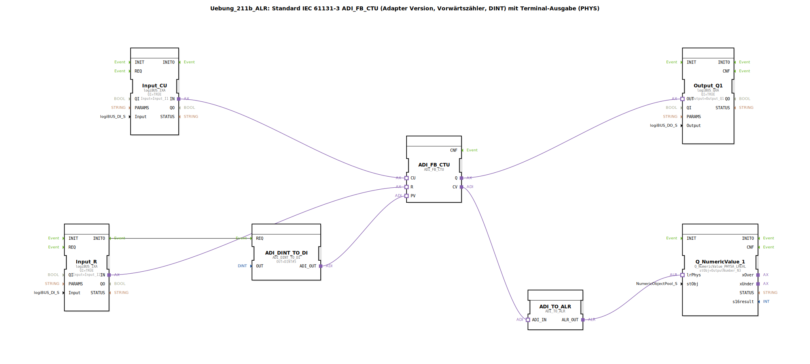

# Uebung_211b_ALR: Standard IEC 61131-3 ADI_FB_CTU (Adapter Version, Vorwärtszähler, DINT) mit Terminal-Ausgabe (PHYS)

* * * * * * * * * *
## Einleitung
Diese Übung realisiert einen Vorwärtszähler nach IEC 61131-3 (ADI_FB_CTU) im Adapter-Format. Der Zählerwert wird auf einem Terminal (PHYS) ausgegeben. Die Konfiguration ermöglicht das Zählen von Impulsen, Rücksetzen des Zählers und die Darstellung des aktuellen Zählwertes inklusive negativer Werte.

## Verwendete Funktionsbausteine (FBs)

- **ADI_FB_CTU**  
  Typ: `adapter::iec61131::counters::ADI_FB_CTU`  
  Vorwärtszähler-Baustein (DINT). Zählt bei jedem positiven Flanke am Eingang CU. Der aktuelle Zählerstand wird am Ausgang CV ausgegeben. Bei Erreichen des an PV angelegten Sollwerts wird der Ausgang Q gesetzt. Der Eingang R setzt den Zähler zurück.

- **ADI_DINT_TO_DI**  
  Typ: `adapter::conversion::unidirectional::ADI_DINT_TO_DI`  
  Wandelt einen DINT-Wert in einen DI-Datenstrom um.  
  Parameter: OUT = DINT#5 (initialer Sollwert für den Zähler).

- **Input_CU**  
  Typ: `logiBUS::io::DI::logiBUS_IXA`  
  Digitaler Eingang für den Zählimpuls (CU).  
  Parameter: QI = TRUE, Input = Input_I1.

- **Input_R**  
  Typ: `logiBUS::io::DI::logiBUS_IXA`  
  Digitaler Eingang für den Rücksetzbefehl (R).  
  Parameter: QI = TRUE, Input = Input_I2.

- **Output_Q1**  
  Typ: `logiBUS::io::DQ::logiBUS_QXA`  
  Digitaler Ausgang für das Zählererreignis (Q).  
  Parameter: QI = TRUE, Output = Output_Q1.

- **ADI_TO_ALR**  
  Typ: `adapter::conversion::unidirectional::ADI_TO_ALR`  
  Wandelt den ADI-Datenstrom des Zählerstandes in ein ALR-Format um (für die Terminalausgabe).

- **Q_NumericValue_1**  
  Typ: `isobus::UT::Q::Q_NumericValue_PHYSA_LREAL`  
  Gibt den Zählerstand als numerischen Wert auf dem Terminal (PHYS) aus.  
  Parameter: stObj = OutputNumber_N3.

## Programmablauf und Verbindungen

Der Programmablauf ist ereignisgesteuert:

1. **Initialisierung**: Beim Start wird der Sollwert (PV) durch den Baustein ADI_DINT_TO_DI auf DINT#5 gesetzt. Dies erfolgt über die Ereignisverbindung von `Input_R.INITO` zu `ADI_DINT_TO_DI.REQ`.

2. **Zählimpulse**: Der digitale Eingang Input_CU (I1) liefert Zählimpulse über den Adapter `Input_CU.IN` an den Zählereingang `ADI_FB_CTU.CU`.

3. **Rücksetzen**: Der digitale Eingang Input_R (I2) liefert Rücksetzsignale über `Input_R.IN` an den R-Eingang `ADI_FB_CTU.R`.

4. **Zählerausgang**: Der Ausgang Q des Zählers wird über `ADI_FB_CTU.Q` an den digitalen Ausgang `Output_Q1.OUT` weitergegeben (z.B. für eine Anzeige oder Steuerung).

5. **Zählerstand**: Der aktuelle Zählerwert (CV) wird über `ADI_FB_CTU.CV` an `ADI_TO_ALR.ADI_IN` übergeben. Der Baustein ADI_TO_ALR wandelt das Format in ALR um und leitet es an `Q_NumericValue_1.lrPhys` weiter. Dies ermöglicht die Ausgabe des Zählerstandes auf dem Terminal (PHYS).

**Hinweise aus der Implementierung**:  
- Negative Zählerwerte sind möglich.  
- Bei hohen Ereignisraten kann ein AX_D_FF (Event-Filter) zwischengeschaltet werden, um die Eventlast zu reduzieren.

## Zusammenfassung
Die Übung demonstriert die Verwendung eines standardisierten IEC 61131-3 Vorwärtszählers (ADI_FB_CTU) in der 4diac-IDE mit Adaptertechnologie. Die Verbindung von digitalen Ein-/Ausgängen, Konvertierungsbausteinen und Terminalausgabe zeigt eine typische Industriesteuerungsaufgabe. Lernziele sind das Verständnis von Zählerlogik, Ereignissteuerung und der Integration physischer I/O in ein Funktionsbaustein-Netzwerk. Voraussetzungen sind Grundkenntnisse der 4diac-IDE und der IEC 61131-3 Adapter-Bausteine.