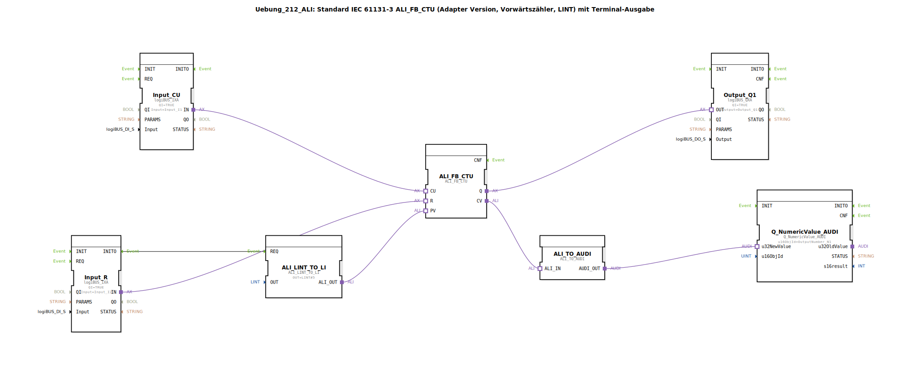

# Uebung_212_ALI: Standard IEC 61131-3 ALI_FB_CTU (Adapter Version, Vorwärtszähler, LINT) mit Terminal-Ausgabe

* * * * * * * * * *
## Einleitung

Diese Übung demonstriert die Verwendung eines Vorwärtszählers (CTU) nach IEC 61131-3 in der Adapter-Version (ALI_FB_CTU). Der Zähler zählt Eingangsimpulse (CU) aufwärts, kann über einen Rücksetzeingang (R) zurückgesetzt werden und gibt den aktuellen Zählerstand über eine Terminalausgabe aus. Zusätzlich wird ein Ausgangssignal (Q) gesetzt, sobald der Zählerstand den vorgegebenen Sollwert (PV) erreicht oder überschreitet.

## Verwendete Funktionsbausteine (FBs)

- **ALI_FB_CTU** (`adapter::iec61131::counters::ALI_FB_CTU`)  
  Vorwärtszähler (Count Up) als Adapterbaustein.  
  - Ereigniseingänge: – (wird über Adapterverbindungen gesteuert)  
  - Daten: PV (Sollwert, LINT), CU (Zählimpuls), R (Rücksetzen)  
  - Ausgänge: Q (bool), CV (aktueller Zählerstand, LINT)

- **ALI_LINT_TO_LI** (`adapter::conversion::unidirectional::ALI_LINT_TO_LI`)  
  Konvertiert einen LINT-Wert in einen LI-Wert (LINT zu LINT?).  
  - Parameter: `OUT` = `LINT#5` (Standardwert, wird beim Initialisieren gesetzt)  
  - Ereigniseingang: `REQ` – löst die Konvertierung aus  
  - Datenausgang: `ALI_OUT` (LI) wird mit `PV` des Zählers verbunden

- **Input_CU** (`logiBUS::io::DI::logiBUS_IXA`)  
  Digitaler Eingang für den Zählimpuls (CU).  
  - Parameter: `QI` = `TRUE`, `Input` = `Input_I1`

- **Input_R** (`logiBUS::io::DI::logiBUS_IXA`)  
  Digitaler Eingang für das Rücksetzen (R).  
  - Parameter: `QI` = `TRUE`, `Input` = `Input_I2`

- **Output_Q1** (`logiBUS::io::DQ::logiBUS_QXA`)  
  Digitaler Ausgang, der den Zählerausgang Q (erreicht/überschritten) signalisiert.  
  - Parameter: `QI` = `TRUE`, `Output` = `Output_Q1`

- **ALI_TO_AUDI** (`adapter::conversion::unidirectional::ALI_TO_AUDI`)  
  Konvertiert einen ALI-Wert (hier den Zählerstand) in einen AUDI-Wert für die Terminalausgabe.  
  - Hinweis: Die Konvertierung unterstützt keine negativen Zahlen (siehe Kommentar im Modell).

- **Q_NumericValue_AUDI** (`isobus::UT::Q::Q_NumericValue_AUDI`)  
  Baustein zur Darstellung eines numerischen Werts auf dem Terminal (HMI).  
  - Parameter: `u16ObjId` = `OutputNumber_N1`

## Programmablauf und Verbindungen

Der Ablauf wird durch Ereignis- und Adapterverbindungen gesteuert:

1. **Initialisierung**  
   Beim Start (Ereignis `INITO` von `Input_R`) wird der Sollwert (PV) über den Baustein `ALI_LINT_TO_LI` gesetzt. Dieser liefert standardmäßig den Wert `LINT#5` als Sollwert.

2. **Zählbetrieb**  
   - Jeder positive Flanke am Eingang `Input_CU` (verbunden mit dem Adaptereingang `CU` des Zählers) erhöht den internen Zählerstand um 1.  
   - Ein Signal an `Input_R` (verbunden mit Adaptereingang `R`) setzt den Zähler zurück auf 0.  
   - Der Ausgang `Q` des Zählers wird `TRUE`, sobald der Zählerstand größer oder gleich dem Sollwert (PV) ist. Dieses Signal wird an den digitalen Ausgang `Output_Q1` weitergegeben.

3. **Ausgabe des Zählerstands**  
   Der aktuelle Zählerstand (CV) wird über die Adapterverbindung an `ALI_TO_AUDI` übergeben, dort in ein AUDI-Format konvertiert und schließlich an den Terminalbaustein `Q_NumericValue_AUDI` gesendet.  
   - **Hinweis**: Die Konvertierung über `ALI_TO_AUDI` kann keine negativen Zahlen verarbeiten. Soll der Zählerstand auch negativ sein, müsste ein anderer Konvertierungsbaustein verwendet werden.  
   - **Optimierungsvorschlag**: Um die Anzahl der Ereignisse zu reduzieren, könnte ein `AX_D_FF` (D-Flipflop) zwischengeschaltet werden (siehe Kommentar im Modell).

## Zusammenfassung

Die Übung zeigt die praktische Anwendung eines IEC-61131-3-konformen Vorwärtszählers (Adapter-Version) mit Terminalausgabe. Der Zähler zählt Impulse auf einen einstellbaren Sollwert hoch, setzt einen Ausgang bei Erreichen des Sollwerts und gibt den Zählerstand auf einem Terminal aus. Die verwendeten Konvertierungsbausteine demonstrieren die Datenfluss- und Adapterkonzepte der 4diac-IDE.