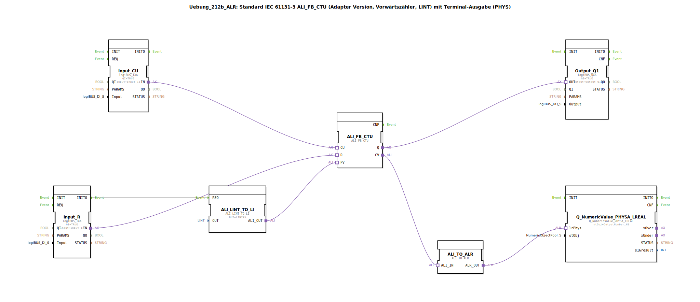

# Uebung_212b_ALR: Standard IEC 61131-3 ALI_FB_CTU (Adapter Version, Vorwärtszähler, LINT) mit Terminal-Ausgabe (PHYS)

* * * * * * * * * *
## Einleitung
Diese Übung implementiert einen Vorwärtszähler (CTU) nach IEC 61131-3 als Adapter-Version. Der Zähler verwendet den Typ `ALI_FB_CTU` und kann auf einen vorgegebenen Preset-Wert (hier 5) voreingestellt werden. Der aktuelle Zählerstand wird über eine physikalische Terminalausgabe (`Q_NumericValue_PHYSA_LREAL`) auf einem Ausgabekanal ausgegeben. Zusätzlich wird ein digitaler Ausgang (`Output_Q1`) gesetzt, sobald der Zählwert den Preset-Wert erreicht oder überschreitet. Die Eingänge für das Zählsignal (CU) und den Reset (R) werden von digitalen Eingängen der logiBUS-Plattform gespeist. Ein Kommentar weist darauf hin, dass negative Zählerstände möglich sind und empfiehlt ggf. den Einbau eines AX_D_FF zur Reduzierung von Ereignissen.

## Verwendete Funktionsbausteine (FBs)
### Sub-Bausteine:

#### **ALI_FB_CTU**
- **Typ**: `adapter::iec61131::counters::ALI_FB_CTU`
- **Parameter**: Keine
- **Ereignis-Eingänge/-Ausgänge**: Keine direkten Event-Verbindungen; Ereignisse werden über die Adapter-Ports `CU`, `R`, `Q`, `CV` transportiert.
- **Daten-Eingänge/-Ausgänge**:
    - **Eingänge**: `CU` (Zählimpuls), `R` (Reset), `PV` (Preset-Wert, über Adapter von `ALI_LINT_TO_LI`)
    - **Ausgänge**: `Q` (Ziel erreicht), `CV` (aktueller Zählerstand, Typ LINT)
- **Funktionsweise**: Der Baustein ist ein Vorwärtszähler für LINT-Werte. Bei jedem steigenden Flanke am `CU`-Eingang wird der interne Zähler um 1 erhöht. Ein Signal am `R`-Eingang setzt den Zähler auf 0 zurück. Der Ausgang `Q` wird TRUE, sobald der aktuelle Zählerstand mindestens den Wert von `PV` erreicht. Der aktuelle Zählerstand ist am Ausgang `CV` verfügbar.

#### **ALI_LINT_TO_LI**
- **Typ**: `adapter::conversion::unidirectional::ALI_LINT_TO_LI`
- **Parameter**:
    - `OUT` = `LINT#5` (konstanter Preset-Wert)
- **Ereignis-Eingänge/-Ausgänge**:
    - **Ereignis-Eingang**: `REQ` (wird durch `INITO` von `Input_R` getriggert)
- **Daten-Eingänge/-Ausgänge**:
    - **Ausgang**: `ALI_OUT` (liefert den konstanten Wert 5 als ALI-Signal an den `PV`-Eingang des Zählers)
- **Funktionsweise**: Dieser Baustein konvertiert einen konstanten LINT-Wert in das ALI-Format, das der Zähler als Preset-Eingang erwartet. Die Ausgabe wird bei einem Ereignis am `REQ`-Eingang aktualisiert (hier einmalig bei Initialisierung).

#### **Input_CU**
- **Typ**: `logiBUS::io::DI::logiBUS_IXA`
- **Parameter**:
    - `QI` = `TRUE` (Qualifier, immer aktiv)
    - `Input` = `Input_I1` (physikalischer DI-Kanal)
- **Ereignis-Eingänge/-Ausgänge**: Keine direkten Event-Verbindungen
- **Daten-Eingänge/-Ausgänge**:
    - **Ausgang**: `IN` (Adapter, liefert das Digitaleingangssignal an den `CU`-Eingang des Zählers)
- **Funktionsweise**: Liest den Zustand des digitalen Eingangs `Input_I1` und stellt ihn als Adapter-Signal bereit.

#### **Input_R**
- **Typ**: `logiBUS::io::DI::logiBUS_IXA`
- **Parameter**:
    - `QI` = `TRUE`
    - `Input` = `Input_I2`
- **Ereignis-Eingänge/-Ausgänge**:
    - **Ereignis-Ausgang**: `INITO` (wird beim ersten Einschalten aktiviert und triggert `ALI_LINT_TO_LI.REQ`)
- **Daten-Eingänge/-Ausgänge**:
    - **Ausgang**: `IN` (Adapter, liefert das Resetsignal an den `R`-Eingang des Zählers)
- **Funktionsweise**: Liest den Zustand des digitalen Eingangs `Input_I2` und stellt ihn als Adapter-Signal für den Zähler-Reset bereit. Der `INITO`-Ereignisausgang wird für die einmalige Initialisierung des Preset-Wertes genutzt.

#### **Output_Q1**
- **Typ**: `logiBUS::io::DQ::logiBUS_QXA`
- **Parameter**:
    - `QI` = `TRUE`
    - `Output` = `Output_Q1` (physikalischer DO-Kanal)
- **Daten-Eingänge/-Ausgänge**:
    - **Eingang**: `OUT` (Adapter, erhält das `Q`-Signal des Zählers)
- **Funktionsweise**: Setzt den digitalen Ausgang `Output_Q1` auf den Wert des Zählerausgangs `Q`.

#### **ALI_TO_ALR**
- **Typ**: `adapter::conversion::unidirectional::ALI_TO_ALR`
- **Parameter**: Keine
- **Daten-Eingänge/-Ausgänge**:
    - **Eingang**: `ALI_IN` (erhält den aktuellen Zählerstand `CV` vom Zähler)
    - **Ausgang**: `ALR_OUT` (liefert den Wert als ALR-Signal an die Terminalausgabe)
- **Funktionsweise**: Wandelt das ALI-Signal (LINT) in ein ALR-Signal (LREAL) um, das für die physikalische Ausgabe benötigt wird.

#### **Q_NumericValue_PHYSA_LREAL**
- **Typ**: `isobus::UT::Q::Q_NumericValue_PHYSA_LREAL`
- **Parameter**:
    - `stObj` = `OutputNumber_N3` (Referenz auf das Terminalausgabeobjekt)
- **Daten-Eingänge/-Ausgänge**:
    - **Eingang**: `lrPhys` (erhält das ALR-Signal von `ALI_TO_ALR`)
- **Funktionsweise**: Gibt den übergebenen LREAL-Wert als numerischen Wert auf der physikalischen Terminalausgabe `OutputNumber_N3` aus.

## Programmablauf und Verbindungen
Die Übung realisiert einen vorwärtszählenden Zähler mit Terminalausgabe. Die Verbindungen sind wie folgt aufgebaut:

1. **Initialisierung**: Beim Start der SPS wird das INITO-Ereignis von `Input_R` ausgelöst. Dieses triggert `ALI_LINT_TO_LI` und setzt den Preset-Wert des Zählers auf `LINT#5`. Der Zähler ist damit für den Zielwert 5 konfiguriert.

2. **Zählbetrieb**: Der digitale Eingang `Input_I1` (Taster oder Sensor) wird über `Input_CU` an den `CU`-Eingang des Zählers geführt. Jede steigende Flanke erhöht den internen Zählerstand. Der digitale Eingang `Input_I2` wird über `Input_R` an den `R`-Eingang geführt. Ein Signal setzt den Zähler auf 0 zurück.

3. **Ausgänge**:
    - Der Ausgang `Q` des Zählers wird über `Output_Q1` auf den digitalen Ausgang `Output_Q1` gegeben. Dieser wird TRUE, sobald der Zählerstand >= 5 ist.
    - Der aktuelle Zählerstand (`CV`) wird über `ALI_TO_ALR` in einen LREAL-Wert konvertiert und über `Q_NumericValue_PHYSA_LREAL` auf dem Terminal `OutputNumber_N3` ausgegeben. Dadurch kann der Zählerstand in einer Visualisierung oder auf einem Display angezeigt werden.

4. **Besonderheiten**: Ein Kommentar im Netzwerk weist darauf hin, dass negative Zählerstände möglich sind (z. B. durch Überlauf oder fehlerhafte Verwendung). Zudem wird empfohlen, bei Bedarf einen AX_D_FF-Baustein einzufügen, um die Anzahl der Ereignisse (insbesondere bei schnellen Zählimpulsen) zu reduzieren und die Systemlast zu verringern.

**Lernziele**: Verständnis des IEC 61131-3 Zählers (CTU) in der Adapter-Version, Umgang mit Konstanten und Konvertierungsbausteinen, Anbindung digitaler Ein- und Ausgänge sowie physikalischer Terminalausgaben.

**Schwierigkeitsgrad**: Mittel – Grundkenntnisse der 4diac-IDE und des logiBUS-Systems werden vorausgesetzt.

**Benötigte Vorkenntnisse**: Umgang mit Funktionsbausteinen, Adapterverbindungen und Ereignissteuerung in 4diac.

## Zusammenfassung
Die Übung `Uebung_212b_ALR` demonstriert einen vollständig konfigurierten Vorwärtszähler mit festem Preset-Wert und physikalischer Ausgabe. Sie kombiniert digitale Ein-/Ausgänge, einen Zählbaustein, Konvertierungsbausteine und eine Terminalausgabe zu einem funktionsfähigen Automatisierungsbeispiel. Die Kommentare geben praktische Hinweise zur Optimierung (Ereignisreduzierung) und weisen auf mögliche Randbedingungen (negative Werte) hin.