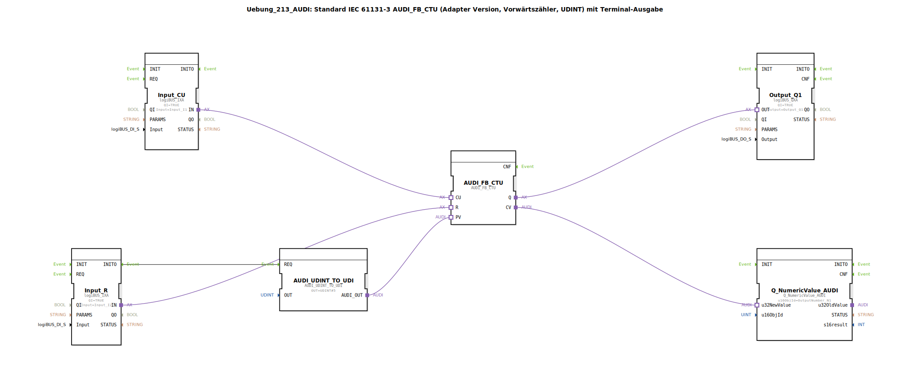

# Uebung_213_AUDI: Standard IEC 61131-3 AUDI_FB_CTU (Adapter Version, Vorwärtszähler, UDINT) mit Terminal-Ausgabe

* * * * * * * * * *

## Einleitung
Diese Übung implementiert einen **Vorwärtszähler (CTU)** nach IEC 61131-3 in einer Adapter‑Variante für den Datentyp **UDINT**. Der Zähler wird über zwei digitale Eingänge gesteuert (Zählimpuls und Reset) und gibt den aktuellen Zählerstand sowie den Zählerendwert auf einem Terminal und einem digitalen Ausgang aus. Ein fester Preset‑Wert von 5 wird über einen Konvertierungsbaustein vorgegeben.

Die Übung dient dem Kennenlernen von:
- Adapter‑basierten Funktionsbausteinen (AUDI_FB_CTU)
- Datenkonvertierung (UDINT → UDI)
- Anbindung von logiBUS‑Ein-/Ausgängen
- Numerischer Terminalausgabe über den Baustein `Q_NumericValue_AUDI`

## Verwendete Funktionsbausteine (FBs)

### Sub‑Bausteine:

#### **AUDI_FB_CTU**
- **Typ**: `adapter::iec61131::counters::AUDI_FB_CTU`
- **Verwendete interne FBs**: Keine
- **Parameter**: Keine expliziten Parameter (alle Steuerung über Adapter‑Schnittstellen)
- **Ereignisseingänge/-ausgänge**:
  - Keine Ereignisse (reine Daten‑ und Adapterverbindungen)
- **Dateneingänge/-ausgänge** (Adapter‑Schnittstellen):
  - **CU** (Count Up) – Zählimpuls (via Adapterverbindung von `Input_CU.IN`)
  - **R** (Reset) – Rücksetzen des Zählerstands auf 0 (von `Input_R.IN`)
  - **PV** (Preset Value) – Vergleichswert für das Setzen von `Q` (von `AUDI_UDINT_TO_UDI.AUDI_OUT`)
  - **Q** (Ausgang) – wird TRUE, wenn `CV ≥ PV` (an `Output_Q1.OUT`)
  - **CV** (Current Value) – aktueller Zählerstand (an `Q_NumericValue_AUDI.u32NewValue`)
- **Funktionsweise**:  
  Bei jeder steigenden Flanke am CU‑Eingang wird der Zähler um 1 erhöht, sofern `R=FALSE` ist. Ein Signal an `R` setzt den Zähler auf 0 zurück. Der Ausgang `Q` ist TRUE, sobald der aktuelle Zählerstand `CV` den Preset‑Wert `PV` erreicht oder überschreitet. Der Zählbereich ist `UDINT` (0 … 4.294.967.295).

---

#### **AUDI_UDINT_TO_UDI**
- **Typ**: `adapter::conversion::unidirectional::AUDI_UDINT_TO_UDI`
- **Verwendete interne FBs**: Keine
- **Parameter**:
  - `OUT` = `UDINT#5` (fester Preset‑Wert)
- **Ereigniseingang/-ausgang**:
  - **REQ** (Ereigniseingang) – löst die Konvertierung aus (verbunden mit `Input_R.INITO`)
- **Datenausgang**:
  - **AUDI_OUT** (Adapter‑Ausgang) – liefert den konvertierten UDI‑Wert (entspricht `UDINT#5`) an `AUDI_FB_CTU.PV`
- **Funktionsweise**:  
  Wandelt den konstanten UDINT‑Wert 5 in ein UDI‑Adapter‑Signal um, das vom nachfolgenden CTU‑Baustein als Preset‑Wert genutzt wird. Die Konvertierung wird einmalig beim Initialisierungsereignis (`INITO`) des Reset‑Eingangs ausgelöst.

---

#### **Input_CU**
- **Typ**: `logiBUS::io::DI::logiBUS_IXA`
- **Parameter**:
  - `QI` = `TRUE` (Baustein aktiv)
  - `Input` = `Input_I1` (physikalischer Eingang 1)
- **Ereignis-/Datenanschlüsse**:
  - Keine Ereignisse
  - **IN** (Adapter‑Ausgang) – liefert den digitalen Eingangswert an `AUDI_FB_CTU.CU`
- **Funktionsweise**:  
  Stellt den ersten digitalen logiBUS‑Eingang (Klemme I1) als Adapter‑Signal für den Zählimpuls bereit.

---

#### **Input_R**
- **Typ**: `logiBUS::io::DI::logiBUS_IXA`
- **Parameter**:
  - `QI` = `TRUE`
  - `Input` = `Input_I2`
- **Ereignis-/Datenanschlüsse**:
  - **INITO** (Ereignisausgang) – wird beim Initialisierungsstart ausgelöst (verbunden mit `AUDI_UDINT_TO_UDI.REQ`)
  - **IN** (Adapter‑Ausgang) – liefert den digitalen Eingangswert an `AUDI_FB_CTU.R`
- **Funktionsweise**:  
  Stellt den zweiten digitalen logiBUS‑Eingang (Klemme I2) als Adapter‑Signal für den Reset des Zählers bereit. Zusätzlich wird beim Start das Ereignis `INITO` erzeugt, das die einmalige Initialisierung des Preset‑Werts auslöst.

---

#### **Output_Q1**
- **Typ**: `logiBUS::io::DQ::logiBUS_QXA`
- **Parameter**:
  - `QI` = `TRUE`
  - `Output` = `Output_Q1` (physikalischer Ausgang 1)
- **Ereignis-/Datenanschlüsse**:
  - Keine Ereignisse
  - **OUT** (Adapter‑Eingang) – empfängt das Signal von `AUDI_FB_CTU.Q`
- **Funktionsweise**:  
  Übernimmt den Zählerendwert (`Q`) und gibt ihn auf dem ersten digitalen logiBUS‑Ausgang (Klemme Q1) aus.

---

#### **Q_NumericValue_AUDI**
- **Typ**: `isobus::UT::Q::Q_NumericValue_AUDI`
- **Parameter**:
  - `u16ObjId` = `OutputNumber_N1` (definiert das Terminal‑Ausgabeobjekt)
- **Ereignis-/Datenanschlüsse**:
  - Keine Ereignisse
  - **u32NewValue** (Dateneingang) – empfängt den aktuellen Zählerstand von `AUDI_FB_CTU.CV`
- **Funktionsweise**:  
  Zeigt den übergebenen 32‑Bit‑Wert (CV) auf einem numerischen Terminal (z. B. HMI) an. Die Objekt‑ID `OutputNumber_N1` legt fest, auf welchem Anzeigeelement die Zahl erscheint.

---

## Programmablauf und Verbindungen

### Ablauf
1. **Initialisierung**:  
   Nach dem Systemstart wird der Reset‑Eingang `Input_R` initialisiert. Das dabei erzeugte Ereignis `INITO` triggert den Konvertierungsbaustein `AUDI_UDINT_TO_UDI`, der den Preset‑Wert `5` an den Zähler `AUDI_FB_CTU.PV` übergibt.

2. **Zählbetrieb**:  
   - Jede positive Flanke am logiBUS‑Eingang I1 (`Input_CU`) inkrementiert den Zähler, solange der Reset (`Input_R`) inaktiv ist.
   - Ein Signal am Eingang I2 (`Input_R`) setzt den Zähler auf 0 zurück.

3. **Ausgabe**:
   - Der Ausgang `Q` des Zählers wird direkt auf den logiBUS‑Ausgang Q1 (`Output_Q1`) geschaltet.
   - Der aktuelle Zählerstand `CV` wird permanent an den Terminalbaustein `Q_NumericValue_AUDI` gesendet und dort angezeigt.

### Verbindungsübersicht (aus dem Netzwerk)

| Quelle | Ziel | Art |
|--------|------|-----|
| `Input_CU.IN` | `AUDI_FB_CTU.CU` | Adapter (Daten) |
| `Input_R.IN` | `AUDI_FB_CTU.R` | Adapter (Daten) |
| `Input_R.INITO` | `AUDI_UDINT_TO_UDI.REQ` | Ereignis |
| `AUDI_UDINT_TO_UDI.AUDI_OUT` | `AUDI_FB_CTU.PV` | Adapter (Daten) |
| `AUDI_FB_CTU.Q` | `Output_Q1.OUT` | Adapter (Daten) |
| `AUDI_FB_CTU.CV` | `Q_NumericValue_AUDI.u32NewValue` | Daten |

> **Hinweis**: Im Netzwerk ist ein Kommentar hinterlegt: *„hier gegebenenfalls einen AX_D_FF einbauen, damit die Events reduziert werden.“* – Dies weist auf eine mögliche Optimierung hin, bei der ein flankengetriggerter Flip‑Flop zur Reduzierung der Ereignisrate eingefügt werden kann.

---

## Zusammenfassung
Die Übung **Uebung_213_AUDI** realisiert einen vollständigen Vorwärtszähler (CTU) nach IEC 61131-3 in einer Adapter‑Variante. Der Zähler wird über zwei logiBUS‑Digitaleingänge bedient, sein aktueller Stand sowie das Erreichen des Preset‑Werts werden sowohl auf einem Terminal als auch auf einem digitalen Ausgang ausgegeben. Die einmalige Initialisierung des Preset‑Werts erfolgt über einen Konverterbaustein. Die Übung vermittelt den Umgang mit Adapter‑basierten Funktionsbausteinen, Datenkonvertierung und der Einbindung von Ein‑/Ausgängen in der 4diac‑IDE.

**Schwierigkeitsgrad**: Mittel  
**Vorkenntnisse**: Grundlagen der 4diac‑IDE, IEC 61131-3, logiBUS‑Ein‑/Ausgänge