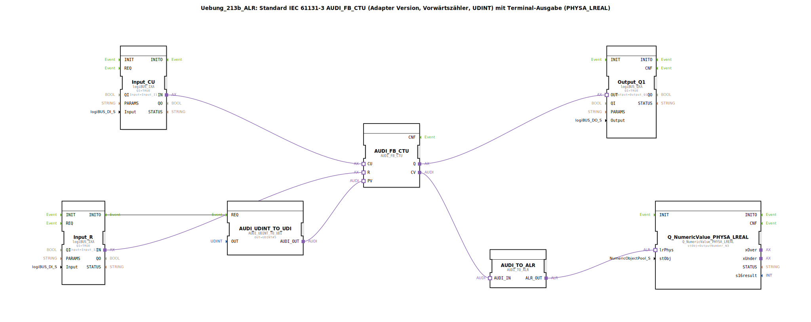

# Uebung_213b_ALR: Standard IEC 61131-3 AUDI_FB_CTU (Adapter Version, Vorwärtszähler, UDINT) mit Terminal-Ausgabe (PHYSA_LREAL)

* * * * * * * * * *

## Einleitung

Diese Übung realisiert einen **Vorwärtszähler (CTU)** nach IEC 61131‑3 mit einem **Zählbereich von UDINT** (vorzeichenloser 32‑Bit‑Integer) als **Adapter‑Version**.  
Das Zählergebnis wird über einen **Analog‑Ausgang (LREAL)** auf einem **Terminal** ausgegeben.  
Zusätzlich wird der **Sollwert (PV) des Zählers** über einen **UDINT‑to‑Unidirectional‑Konverter** initial auf **5** gesetzt, sodass der Zähler beim Erreichen von 5 ein Ausgangssignal (Q) liefert.

**Lernziele**  
- Verständnis des Zusammenspiels von IEC‑Zählern mit Adapter‑Schnittstellen  
- Umgang mit Konvertierungsbausteinen (UDINT → Unidirectional → LREAL)  
- Parametrierung und Einbindung von logiBUS‑Ein‑/Ausgängen  

**Schwierigkeitsgrad**  
Mittel – Grundkenntnisse in 4diac‑IDE und IEC‑Bausteinen werden vorausgesetzt.

**Start der Übung**  
Die SubApp `Uebung_213b_ALR` muss in ein 4diac‑Projekt eingebunden und mit den entsprechenden logiBUS‑Hardware‑Ressourcen (Input_I1, Input_I2, Output_Q1, OutputNumber_N3) verknüpft werden.

---

## Verwendete Funktionsbausteine (FBs)

Im Netzwerk der SubApp werden folgende Bausteine eingesetzt:

### **AUDI_FB_CTU** (Zentrale Zählerlogik)
- **Typ**: `adapter::iec61131::counters::AUDI_FB_CTU`
- **Beschreibung**: Vorwärtszähler mit Zählereingang (CU), Rücksetzeingang (R), Ausgang (Q) und aktuellem Zählerstand (CV).  
- **Besonderheit**: Die interne Logik arbeitet mit dem Datentyp UDINT.

### **AUDI_UDINT_TO_UDI** (Sollwert‑Vorgabe)
- **Typ**: `adapter::conversion::unidirectional::AUDI_UDINT_TO_UDI`
- **Parameter**: `OUT = UDINT#5`  
- **Funktion**: Wandelt den konstanten Wert `5` in ein unidirektionales Signal um und gibt es an den Sollwert‑Eingang **PV** des Zählers weiter. Dadurch wird der Zähler auf einen Schwellwert von 5 programmiert.

### **Input_CU** (Zählimpulse)
- **Typ**: `logiBUS::io::DI::logiBUS_IXA`
- **Parameter**: `QI = TRUE` , `Input = Input_I1`  
- **Funktion**: Liest den digitalen Eingang **I1** und stellt das Signal am Adapter‑Ausgang **IN** bereit. Wird mit dem Zählereingang **CU** verbunden.

### **Input_R** (Rücksetzen)
- **Typ**: `logiBUS::io::DI::logiBUS_IXA`
- **Parameter**: `QI = TRUE` , `Input = Input_I2`  
- **Funktion**: Liest den digitalen Eingang **I2** und verbindet dessen Ausgang mit dem Rücksetzeingang **R** des Zählers.  
- **Zusätzlich** löst das Ereignis **INITO** den Konverter `AUDI_UDINT_TO_UDI` aus, sodass der Sollwert beim Start initial gesetzt wird.

### **Output_Q1** (Zähler‑Q‑Ausgang)
- **Typ**: `logiBUS::io::DQ::logiBUS_QXA`
- **Parameter**: `QI = TRUE` , `Output = Output_Q1`  
- **Funktion**: Gibt den Zähler‑Ausgang **Q** (aktiv, wenn CV ≥ PV) auf dem digitalen Ausgang **Q1** aus.

### **AUDI_TO_ALR** (Konvertierung UDINT → Analog‑LREAL)
- **Typ**: `adapter::conversion::unidirectional::AUDI_TO_ALR`
- **Funktion**: Wandelt den unidirektionalen Zählerstand (CV) in ein physikalisches Analogsignal (LREAL) um. Dieses Signal wird an den nachfolgenden Terminal‑Baustein weitergeleitet.

### **Q_NumericValue_PHYSA_LREAL** (Terminal‑Ausgabe)
- **Typ**: `isobus::UT::Q::Q_NumericValue_PHYSA_LREAL`
- **Parameter**: `stObj = OutputNumber_N3`  
- **Funktion**: Gibt den als LREAL vorliegenden Zählerstand auf dem Terminal‑Objekt `OutputNumber_N3` aus. Dort kann der Zahlenwert in Echtzeit beobachtet werden.

### **Hinweise aus Kommentaren**
- Die Konvertierung **AUDI_TO_ALR** arbeitet mit **vorzeichenbehafteten Werten** – daher sind negative Zahlen theoretisch möglich, obwohl der Zähler nur positive UDINT‑Werte liefert.  
- Um die Ereignisrate zu reduzieren (insbesondere bei schnellen Zählimpulsen), kann ein **AX_D_FF** (Dominant‑Flipflop) zwischengeschaltet werden (siehe Kommentar im Netzwerk).

---

## Programmablauf und Verbindungen

1. **Initialisierung**  
   Beim Start durchläuft der Baustein **Input_R** seinen INIT‑Zyklus. Das Ereignis **INITO** triggert **AUDI_UDINT_TO_UDI** (REQ), wodurch der Sollwert `UDINT#5` an den **PV**‑Eingang des Zählers übergeben wird.

2. **Zählerbetrieb**  
   - Jeder positive Flanke am digitalen Eingang **I1** wird über **Input_CU** an den **CU**‑Eingang des Zählers weitergeleitet.  
   - Der Zähler inkrementiert den internen Stand (CV).  
   - Sobald `CV ≥ PV` (=5) schaltet der Ausgang **Q** auf TRUE und aktiviert **Output_Q1** (Ausgang Q1 der Hardware).

3. **Rücksetzen**  
   - Ein Signal am digitalen Eingang **I2** wird über **Input_R** an den **R**‑Eingang des Zählers geführt. Dadurch wird der Zähler auf 0 zurückgesetzt, **Q** wird FALSE.

4. **Terminal‑Ausgabe**  
   - Der aktuelle Zählerstand (CV) verlässt den Zähler als Adaptersignal und wird zunächst über **AUDI_TO_ALR** in einen physikalischen LREAL‑Wert umgewandelt.  
   - Anschließend wird dieser LREAL‑Wert an **Q_NumericValue_PHYSA_LREAL** übergeben und auf dem konfigurierten Terminal‑Objekt `OutputNumber_N3` angezeigt.

**Adapterverbindungen im Detail:**  
- `Input_CU.IN` → `AUDI_FB_CTU.CU` (Zählimpulse)  
- `Input_R.IN` → `AUDI_FB_CTU.R` (Rücksetzen)  
- `AUDI_FB_CTU.Q` → `Output_Q1.OUT` (Ausgang Q1)  
- `AUDI_FB_CTU.CV` → `AUDI_TO_ALR.AUDI_IN` (Zählerstand zur Konvertierung)  
- `AUDI_TO_ALR.ALR_OUT` → `Q_NumericValue_PHYSA_LREAL.lrPhys` (Analogsignal zum Terminal)  
- `AUDI_UDINT_TO_UDI.AUDI_OUT` → `AUDI_FB_CTU.PV` (Sollwertvorgabe)

---

## Zusammenfassung

Die Übung **Uebung_213b_ALR** demonstriert den Aufbau eines adaptierten IEC‑Vorwärtszählers mit konfigurierbarem Sollwert und Ausgabe des Zählerstands auf einem Terminal.  
Der Zähler wird über zwei digitale Eingänge (I1 = zählen, I2 = rücksetzen) gesteuert. Der Ausgang Q schaltet, sobald der Zählerstand 5 erreicht. Ein analoger Konverter wandelt den Zählerstand in einen LREAL‑Wert um, der auf einem Terminal‑Objekt visualisiert wird.  
Die Übung eignet sich gut zum Verständnis von Adapter‑Verbindungen, Konvertierungsbausteinen und der Integration von logiBUS‑Hardware in 4diac.