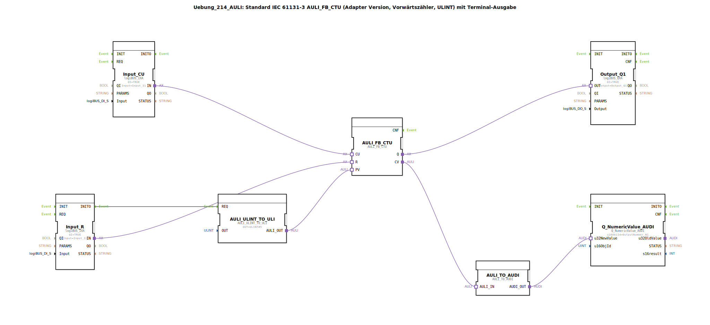

# Uebung_214_AULI: Standard IEC 61131-3 AULI_FB_CTU (Adapter Version, Vorwärtszähler, ULINT) mit Terminal-Ausgabe

* * * * * * * * * *
## Einleitung

Diese Übung implementiert einen Vorwärtszähler gemäß IEC 61131-3 (Typ **AULI_FB_CTU**) als Adapter-Version. Der Zähler arbeitet mit dem Datentyp **ULINT** und gibt seinen aktuellen Zählerstand sowie den Überlauf (Q) an eine Terminal-Ausgabe (Numerische Anzeige) und einen digitalen Ausgang weiter. Zusätzlich wird der Startwert (PV) über einen Konvertierungsbaustein gesetzt. Die Übung demonstriert den Einsatz von Adapter-FBs, I/O-Anbindung und Datenkonvertierung.

## Verwendete Funktionsbausteine (FBs)

Die SubApp besteht aus mehreren Funktionsbausteinen, die im Folgenden beschrieben werden.

### Sub-Baustein: AULI_FB_CTU
- **Typ**: `adapter::iec61131::counters::AULI_FB_CTU`
- **Parameter**: Keine (werden über Adapterverbindungen gesetzt)
- **Funktionsweise**: Vorwärtszähler für ULINT-Werte. Er zählt bei jedem positiven Flanke am Eingang **CU** (Count Up) hoch. Der Eingang **R** setzt den Zähler zurück. Der aktuelle Zählerwert wird am Adapterausgang **CV** ausgegeben, der Überlauf (Zählerstand ≥ PV) am Ausgang **Q**.

### Sub-Baustein: AULI_ULINT_TO_ULI
- **Typ**: `adapter::conversion::unidirectional::AULI_ULINT_TO_ULI`
- **Parameter**:
  - `OUT` = `ULINT#5` (Voreinstellung des Startwerts)
- **Funktionsweise**: Konvertiert einen ULINT-Wert (hier konstant 5) in einen ULI-Ausgangswert, der dem Zähler als **PV** (Preset Value) zugeführt wird. Der Baustein wird beim Start (INITO des Reseteingangs) aktiviert.

### Sub-Baustein: Input_CU
- **Typ**: `logiBUS::io::DI::logiBUS_IXA`
- **Parameter**:
  - `QI` = `TRUE`
  - `Input` = `Input_I1` (physikalischer Eingang 1)
- **Funktionsweise**: Digitaler Eingang, der die Zählimpulse (CU) liefert. Der Baustein stellt den Adapterausgang **IN** zur Verfügung.

### Sub-Baustein: Input_R
- **Typ**: `logiBUS::io::DI::logiBUS_IXA`
- **Parameter**:
  - `QI` = `TRUE`
  - `Input` = `Input_I2` (physikalischer Eingang 2)
- **Funktionsweise**: Digitaler Eingang zum Zurücksetzen des Zählers (R). Sein Ereignisausgang **INITO** wird genutzt, um beim Start die Initialisierung des PV-Wertes auszulösen.

### Sub-Baustein: Output_Q1
- **Typ**: `logiBUS::io::DQ::logiBUS_QXA`
- **Parameter**:
  - `QI` = `TRUE`
  - `Output` = `Output_Q1` (physikalischer Ausgang 1)
- **Funktionsweise**: Digitaler Ausgang, der den Überlauf (Q) des Zählers anzeigt.

### Sub-Baustein: AULI_TO_AUDI
- **Typ**: `adapter::conversion::unidirectional::AULI_TO_AUDI`
- **Parameter**: Keine
- **Funktionsweise**: Konvertiert den Zählerwert vom Typ ULINT (AULI) in einen numerischen Wert (AUDI) für die Terminal-Ausgabe.

### Sub-Baustein: Q_NumericValue_AUDI
- **Typ**: `isobus::UT::Q::Q_NumericValue_AUDI`
- **Parameter**:
  - `u16ObjId` = `OutputNumber_N1` (Objekt-ID der numerischen Anzeige)
- **Funktionsweise**: Gibt den konvertierten Zählerwert auf einem Terminal (numerische Anzeige) aus.

## Programmablauf und Verbindungen

Der Ablauf der Übung ist wie folgt:

1. **Initialisierung**: Beim Start (Ereignis **INITO** des Eingangsbausteins `Input_R`) wird der Baustein `AULI_ULINT_TO_ULI` getriggert, der den konstanten Wert `ULINT#5` in einen ULI-Wert umwandelt und dem Zähler als **PV** (Preset Value) zuweist.
2. **Zählvorgang**: Jeder positive Flanke am physikalischen Eingang `Input_I1` (verbunden mit `Input_CU`) löst am Zähler **CU** einen Zählschritt aus. Der Zähler erhöht seinen internen Wert.
3. **Rücksetzen**: Eine positive Flanke am Eingang `Input_I2` (verbunden mit `Input_R`) setzt den Zähler auf 0 zurück.
4. **Ausgabe**:
   - Der Überlaufausgang **Q** des Zählers wird an den digitalen Ausgang `Output_Q1` weitergegeben.
   - Der aktuelle Zählerwert **CV** wird über die Konvertierungskette (`AULI_TO_AUDI` → `Q_NumericValue_AUDI`) auf einem Terminal (numerische Anzeige mit Objekt-ID `OutputNumber_N1`) dargestellt.

**Hinweis**: Ein Kommentar im Netzwerk schlägt vor, bei Bedarf einen **AX_D_FF** (Flip-Flop) einzufügen, um die Ereignisrate zu reduzieren.

Die Verbindungen im Überblick:
- **Event-Verbindung**: `Input_R.INITO` → `AULI_ULINT_TO_ULI.REQ`
- **Adapterverbindungen**:
  - `Input_CU.IN` → `AULI_FB_CTU.CU`
  - `Input_R.IN` → `AULI_FB_CTU.R`
  - `AULI_FB_CTU.Q` → `Output_Q1.OUT`
  - `AULI_FB_CTU.CV` → `AULI_TO_AUDI.AULI_IN`
  - `AULI_TO_AUDI.AUDI_OUT` → `Q_NumericValue_AUDI.u32NewValue`
  - `AULI_ULINT_TO_ULI.AULI_OUT` → `AULI_FB_CTU.PV`

## Zusammenfassung

Die Übung **Uebung_214_AULI** vermittelt den Umgang mit dem IEC-61131-3-konformen Vorwärtszähler **AULI_FB_CTU** in einer Adapter-basierten Umgebung. Sie zeigt, wie ein Zähler über digitale Eingänge gesteuert, sein Wert über Konvertierungsbausteine aufbereitet und sowohl auf einem digitalen Ausgang als auch auf einem Terminal ausgegeben wird. Die Integration von Initialisierungslogik und die flexible Anbindung über Adapter machen diese Übung zu einer soliden Grundlage für komplexere Automatisierungsaufgaben mit 4diac.