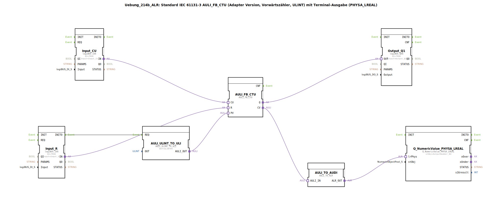

# Uebung_214b_ALR: Standard IEC 61131-3 AULI_FB_CTU (Adapter Version, Vorwärtszähler, ULINT) mit Terminal-Ausgabe (PHYSA_LREAL)

* * * * * * * * * *
## Einleitung
Diese Übung implementiert einen Vorwärtszähler (CTU) nach IEC 61131-3 als Adapter-Version. Der Zähler arbeitet mit dem Datentyp `ULINT`. Der aktuelle Zählwert wird über einen physikalischen Ausgang (`PHYSA_LREAL`) an ein Terminal ausgegeben. Der Preset-Wert wird initial auf 5 gesetzt.

## Verwendete Funktionsbausteine (FBs)

### AULI_FB_CTU
- **Typ**: `adapter::iec61131::counters::AULI_FB_CTU`
- **Parameter**: keine
- **Ereigniseingänge**: (implizit über Adapterverbindungen)
- **Ereignisausgänge**: (implizit)
- **Dateneingänge**:
  - `CU` (Count Up) – Takteingang zum Hochzählen
  - `R` (Reset) – setzt Zähler zurück
  - `PV` (Preset Value) – Vorgabewert, initial `ULINT#5`
- **Datenausgänge**:
  - `Q` (Ausgang) – wird `TRUE`, wenn `CV >= PV`
  - `CV` (aktueller Zählwert) – `ULINT`

### AULI_ULINT_TO_ULI
- **Typ**: `adapter::conversion::unidirectional::AULI_ULINT_TO_ULI`
- **Parameter**: `OUT = ULINT#5` (statischer Wert, der als Preset dient)
- **Ereigniseingänge**:
  - `REQ` (Request) – triggert Umwandlung (verbunden mit `Input_R.INITO`)
- **Datenausgänge**:
  - `AULI_OUT` – liefert den umgewandelten Wert an `AULI_FB_CTU.PV`

### Input_CU
- **Typ**: `logiBUS::io::DI::logiBUS_IXA`
- **Parameter**:
  - `QI = TRUE` (Aktivierung)
  - `Input = Input_I1` (physischer Digitaleingang 1)
- **Datenausgänge**:
  - `IN` – Adapterausgang, verbunden mit `AULI_FB_CTU.CU`

### Input_R
- **Typ**: `logiBUS::io::DI::logiBUS_IXA`
- **Parameter**:
  - `QI = TRUE`
  - `Input = Input_I2` (physischer Digitaleingang 2)
- **Datenausgänge**:
  - `IN` – Adapterausgang, verbunden mit `AULI_FB_CTU.R`
- **Ereignisausgänge**:
  - `INITO` – Initialisierungsereignis, verbunden mit `AULI_ULINT_TO_ULI.REQ`

### Output_Q1
- **Typ**: `logiBUS::io::DQ::logiBUS_QXA`
- **Parameter**:
  - `QI = TRUE`
  - `Output = Output_Q1` (physischer Digitalausgang 1)
- **Dateneingänge**:
  - `OUT` – Adaptereingang, verbunden mit `AULI_FB_CTU.Q`

### AULI_TO_AUDI (Instanzname `AULI_TO_AUDI`)
- **Typ**: `adapter::conversion::unidirectional::AULI_TO_ALR`
- **Parameter**: keine
- **Dateneingänge**:
  - `AULI_IN` – erhält den Zählwert (`AULI_FB_CTU.CV`)
- **Datenausgänge**:
  - `ALR_OUT` – liefert den Zählwert als `LREAL` an `Q_NumericValue_PHYSA_LREAL`

### Q_NumericValue_PHYSA_LREAL
- **Typ**: `isobus::UT::Q::Q_NumericValue_PHYSA_LREAL`
- **Parameter**:
  - `stObj = OutputNumber_N3` (Referenz auf das Terminal-Ausgabeobjekt)
- **Dateneingänge**:
  - `lrPhys` – physikalischer `LREAL`-Wert, verbunden mit `AULI_TO_AUDI.ALR_OUT`

## Programmablauf und Verbindungen

1. **Initialisierung**  
   Beim Hochfahren der Steuerung löst `Input_R.INITO` ein Ereignis aus, das den Konverter `AULI_ULINT_TO_ULI.REQ` triggert. Dieser wandelt den statischen Wert `ULINT#5` um und übergibt ihn als Preset (`PV`) an den Zähler `AULI_FB_CTU`.

2. **Zählvorgang**  
   - Jede steigende Flanke am Digitaleingang `Input_I1` (verbunden mit `Input_CU`) erhöht den Zähler `AULI_FB_CTU` um 1.
   - Der Zähler gibt den aktuellen Zählwert (`CV`) als `ULINT` aus.
   - Wenn `CV >= PV` (hier ≥ 5), wird der Ausgang `Q` auf `TRUE` gesetzt. Dieser schaltet den Digitalausgang `Output_Q1` ein.

3. **Reset**  
   Ein Signal am Digitaleingang `Input_I2` (verbunden mit `Input_R`) setzt den Zähler auf 0 zurück.

4. **Ausgabe auf Terminal**  
   - Der Zählwert (`CV`) wird durch den Konverter `AULI_TO_AUDI` vom Typ `AULI_TO_ALR` in eine Gleitkommazahl (`LREAL`) umgewandelt.
   - Diese wird an den Funktionsbaustein `Q_NumericValue_PHYSA_LREAL` übergeben, der den Wert auf dem Terminal (Objekt `OutputNumber_N3`) anzeigt.

**Hinweise:**  
- Negative Werte sind durch den verwendeten Datentyp `LREAL` möglich (siehe Kommentar im Netzwerk).  
- Zur Reduzierung der Ereignisrate kann bei hohen Zählfrequenzen ein AX_D_FF (Abfrageverzögerung) vorgeschaltet werden (siehe Kommentar).

## Zusammenfassung
Die Übung demonstriert die Anwendung eines IEC 61131-3 Vorwärtszählers als Adapter-FB mit `ULINT`-Datentyp. Der Zähler wird über digitale Eingänge gesteuert, der Ausgang schaltet einen Digitalausgang, und der aktuelle Zählwert wird über eine Typkonvertierung auf einem Terminal als `LREAL` ausgegeben. Der Preset-Wert wird initial auf 5 gesetzt.