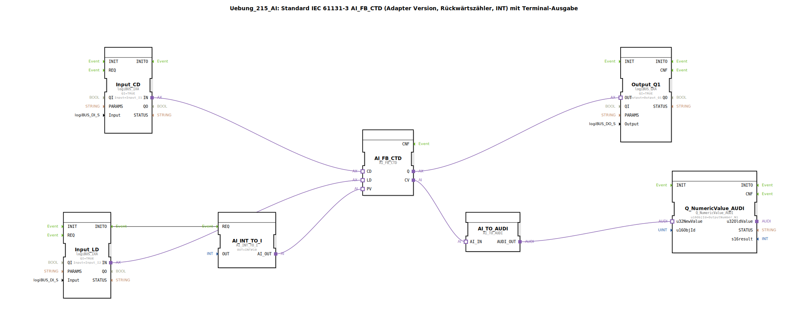

# Uebung_215_AI: Standard IEC 61131-3 AI_FB_CTD (Adapter Version, Rückwärtszähler, INT) mit Terminal-Ausgabe

* * * * * * * * * *
## Einleitung

Diese Übung implementiert einen Rückwärtszähler (Down-Counter) nach IEC 61131-3 mit Adapter-Schnittstelle (AI_FB_CTD) und gibt den aktuellen Zählerwert auf einem Terminal aus. Der Zähler wird über digitale Eingänge dekrementiert und geladen.

## Verwendete Funktionsbausteine (FBs)

### Sub-Bausteine: AI_FB_CTD
- **Typ**: adapter::iec61131::counters::AI_FB_CTD
- **Verwendete interne FBs**: Keine
- **Parameter**: Keine
- **Ereignisausgang/-eingang**: CD (Count Down), LD (Load), R (Reset); Q (Überlaufausgang)
- **Datenausgang/-eingang**: CV (aktueller Zählerwert, INT), PV (Preset Value, INT als Eingang über Adapter)
- **Funktionsweise**: Der Rückwärtszähler zählt bei jedem Ereignis an CD den Wert von PV herunter. Bei einem Ereignis an LD wird der Zähler auf den Wert von PV gesetzt. Der Ausgang Q wird TRUE, wenn der Zählerwert 0 erreicht oder unterschreitet.

### Sub-Bausteine: AI_INT_TO_I
- **Typ**: adapter::conversion::unidirectional::AI_INT_TO_I
- **Verwendete interne FBs**: Keine
- **Parameter**: OUT = INT#10
- **Ereignisausgang/-eingang**: REQ (Eingang), CNF (Ausgang)
- **Datenausgang/-eingang**: AI_OUT (INT)
- **Funktionsweise**: Dieser Baustein stellt einen konstanten Integer-Wert (hier 10) bereit, der als Preset Value (PV) für den Zähler verwendet wird. Er wird durch das INITO-Ereignis des Load-Inputs getriggert.

### Sub-Bausteine: Input_CD (Count Down-Eingang)
- **Typ**: logiBUS::io::DI::logiBUS_IXA
- **Verwendete interne FBs**: Keine
- **Parameter**: QI = TRUE, Input = Input_I1
- **Ereignisausgang/-eingang**: INITO (Initialisierung), IN (Ereignisausgang bei Flanke)
- **Datenausgang/-eingang**: Keine
- **Funktionsweise**: Liest den digitalen Eingang I1 des logiBUS-Systems und gibt bei einer positiven Flanke ein Ereignis auf dem Adapter-Ausgang aus. Dieses Ereignis triggert den CD-Eingang des Zählers.

### Sub-Bausteine: Input_LD (Load-Eingang)
- **Typ**: logiBUS::io::DI::logiBUS_IXA
- **Verwendete interne FBs**: Keine
- **Parameter**: QI = TRUE, Input = Input_I2
- **Ereignisausgang/-eingang**: INITO (Initialisierung), IN (Ereignisausgang bei Flanke)
- **Datenausgang/-eingang**: Keine
- **Funktionsweise**: Liest den digitalen Eingang I2 und gibt bei einer positiven Flanke ein Ereignis aus. Dieses Ereignis triggert das LD-Ereignis am Zähler. Gleichzeitig wird über INITO die Initialisierung des PV-Werts angestoßen.

### Sub-Bausteine: Output_Q1
- **Typ**: logiBUS::io::DQ::logiBUS_QXA
- **Verwendete interne FBs**: Keine
- **Parameter**: QI = TRUE, Output = Output_Q1
- **Ereignisausgang/-eingang**: OUT (Ereigniseingang), CNF (Bestätigung)
- **Datenausgang/-eingang**: Keine
- **Funktionsweise**: Übernimmt den Zählerausgang Q (über Adapter) und gibt ihn als digitalen Ausgang Q1 des logiBUS aus. Sobald der Zähler Null erreicht, wird Q1 aktiv.

### Sub-Bausteine: AI_TO_AUDI
- **Typ**: adapter::conversion::unidirectional::AI_TO_AUDI
- **Verwendete interne FBs**: Keine
- **Parameter**: Keine
- **Ereignisausgang/-eingang**: REQ (Eingang), CNF (Ausgang)
- **Datenausgang/-eingang**: AI_IN (INT), AUDI_OUT (AUDI)
- **Funktionsweise**: Konvertiert den Integer-Zählerwert (CV) in das für das Terminal erforderliche AUDI-Format. Hinweis: Dieser Baustein unterstützt keine negativen Zahlen, was bei einem Rückwärtszähler problematisch sein kann.

### Sub-Bausteine: Q_NumericValue_AUDI
- **Typ**: isobus::UT::Q::Q_NumericValue_AUDI
- **Verwendete interne FBs**: Keine
- **Parameter**: u16ObjId = OutputNumber_N1
- **Ereignisausgang/-eingang**: IN (Eingang für neuen Wert)
- **Datenausgang/-eingang**: u32NewValue (AUDI)
- **Funktionsweise**: Empfängt den konvertierten Wert über die Adapterverbindung und zeigt ihn auf dem Terminal (z.B. Visualisierung) unter der Objekt-ID OutputNumber_N1 an.

## Programmablauf und Verbindungen

Die Verdrahtung der Bausteine erfolgt über Adapterverbindungen. Initial wird der Preset-Wert 10 über AI_INT_TO_I bereitgestellt, sobald der Load-Eingang (Input_LD) ein INITO-Ereignis auslöst. Der Zähler startet mit PV=10.

**Ablauf**:
1. **Zählen**: Eine positive Flanke am Eingang I1 (Input_CD) sendet ein Ereignis über die Adapterverbindung an den CD-Eingang von AI_FB_CTD. Der Zähler dekrementiert um 1.
2. **Laden**: Eine positive Flanke am Eingang I2 (Input_LD) löst das LD-Ereignis aus und setzt den Zähler zurück auf den Wert von PV (10). Gleichzeitig wird über INITO der Konverter AI_INT_TO_I getriggert, um den PV-Wert erneut zu setzen.
3. **Ausgabe**: Der aktuelle Zählerwert (CV) wird über AI_TO_AUDI in ein Terminal-Format gewandelt und auf der Visualisierung (Q_NumericValue_AUDI) ausgegeben. Der Ausgang Q des Zählers wird auf den digitalen Ausgang Q1 geschaltet.

**Hinweise aus dem Quelltext**:
- Der Baustein AI_TO_AUDI kann keine negativen Werte verarbeiten. Da ein Rückwärtszähler unter Null zählen kann, ist dies eine Einschränkung.
- Es wird empfohlen, einen AX_D_FF (Ereignis-Flipflop) einzubauen, um die Anzahl der Ereignisse am Terminal zu reduzieren.

## Zusammenfassung

Diese Übung vermittelt den Umgang mit einem IEC 61131-3 Rückwärtszähler (CTD) in einer Adapter-basierten Implementierung unter 4diac. Sie zeigt die Einbindung digitaler Ein- und Ausgänge über logiBUS sowie die Visualisierung von Zählerwerten auf einem Terminal. Der Lernende versteht das Zusammenspiel von Ereignissen, Datenkonvertierung und die Grenzen der verwendeten Bausteine (keine negativen Zahlen). Die Übung eignet sich für Fortgeschrittene mit Grundkenntnissen in 4diac und logiBUS.