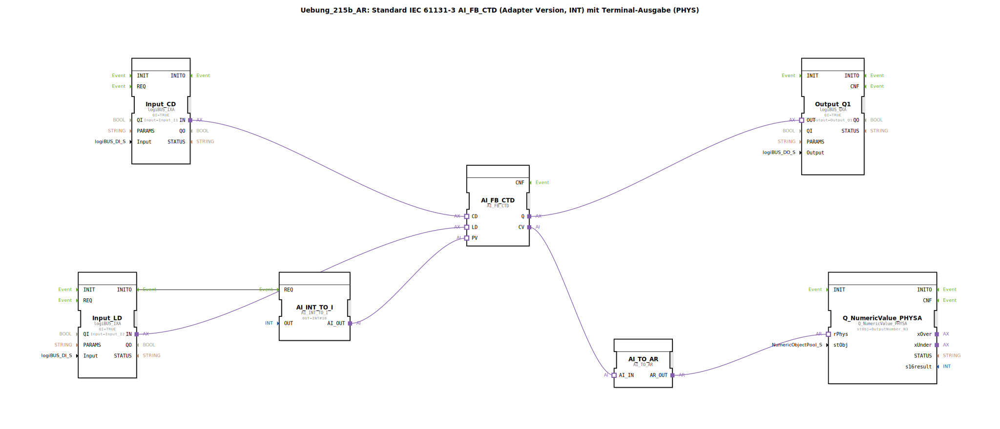

# Uebung_215b_AR: Standard IEC 61131-3 AI_FB_CTD (Adapter Version, INT) mit Terminal-Ausgabe (PHYS)

* * * * * * * * * *
## Einleitung

Diese Übung implementiert einen Abwärtszähler (CTD) nach IEC 61131-3 als Adaptervariante. Der Zähler wird über zwei digitale Eingänge (Count-Down und Load) gesteuert und gibt einen digitalen Ausgang (Q) sowie den aktuellen Zählerwert (CV) aus. Der Zählerwert wird über einen Konverter in eine Textdarstellung umgewandelt und auf einem Terminal (PHYS) ausgegeben. Der Preset-Wert (PV) wird fest auf 10 gesetzt und dem Zähler über einen weiteren Adapter zugeführt.

Lernziele:
- Verständnis des Funktionsbausteins AI_FB_CTD (Abwärtszähler als Adapter)
- Umgang mit Adapter-Schnittstellen zur Daten- und Ereignisübertragung
- Datentypkonvertierung (INT nach Adapter, CV nach Array)
- Steuerung von logiBUS-Ein- und Ausgängen
- Ausgabe numerischer Werte auf einem Terminal

Schwierigkeitsgrad: Fortgeschritten  
Vorkenntnisse: Grundlagen der IEC 61131-3, 4diac-IDE, Adapterkonzept

## Verwendete Funktionsbausteine (FBs)

### AI_FB_CTD
- **Typ**: `adapter::iec61131::counters::AI_FB_CTD`
- **Verwendete interne FBs**: Keine (Basisfunktionsbaustein)
- **Funktionsweise**: Abwärtszähler (Count Down) mit den Adapter-Schnittstellen `CD` (Count-Eingang), `LD` (Preset laden), `PV` (Presetwert), `Q` (Ausgang, wird TRUE wenn CV=0) und `CV` (aktueller Zählerwert).

### AI_INT_TO_I
- **Typ**: `adapter::conversion::unidirectional::AI_INT_TO_I`
- **Parameter**:
  - `OUT` = `INT#10` (Presetwert, fest auf 10 gesetzt)
- **Funktionsweise**: Wandelt einen Integer-Wert (hier 10) in einen Adapterausgang um, der mit dem PV-Eingang des Zählers verbunden wird.

### Input_CD
- **Typ**: `logiBUS::io::DI::logiBUS_IXA`
- **Parameter**:
  - `QI` = `TRUE` (Freigabe)
  - `Input` = `Input_I1` (physischer Eingang 1)
- **Funktionsweise**: Digitaler Eingang für das CD-Signal (Count Down). Bei positiver Flanke wird der Zähler dekrementiert.

### Input_LD
- **Typ**: `logiBUS::io::DI::logiBUS_IXA`
- **Parameter**:
  - `QI` = `TRUE`
  - `Input` = `Input_I2` (physischer Eingang 2)
- **Funktionsweise**: Digitaler Eingang für das LD-Signal (Load). Bei positiver Flanke wird der Presetwert (PV) in den Zähler geladen.

### Output_Q1
- **Typ**: `logiBUS::io::DQ::logiBUS_QXA`
- **Parameter**:
  - `QI` = `TRUE`
  - `Output` = `Output_Q1` (physischer Ausgang 1)
- **Funktionsweise**: Digitaler Ausgang, der den Q-Zustand des Zählers (TRUE=CV=0) an ein logiBUS-Ausgabemodul weiterleitet.

### AI_TO_AR
- **Typ**: `adapter::conversion::unidirectional::AI_TO_AR`
- **Funktionsweise**: Wandelt den analogen Adapterwert (CV) des Zählers in ein Array (AR) um, das vom Terminalbaustein erwartet wird.

### Q_NumericValue_PHYSA
- **Typ**: `isobus::UT::Q::Q_NumericValue_PHYSA`
- **Parameter**:
  - `stObj` = `OutputNumber_N3` (referenziert ein Terminal-Ausgabeobjekt)
- **Funktionsweise**: Zeigt den übergebenen numerischen Wert (aus AI_TO_AR) auf dem Terminal (PHYS) an.

## Programmablauf und Verbindungen

Der Programmablauf besteht aus einem ereignisgesteuerten und einem datenflussgesteuerten Teil.

1. **Initialisierung**: Beim Start wird über den Eventausgang `INITO` von `Input_LD` der Konverter `AI_INT_TO_I` getriggert (`REQ`). Dieser konvertiert den festen Integerwert `10` in einen Adapterwert und übergibt ihn an den `PV`-Eingang von `AI_FB_CTD`.

2. **Zählerbetrieb**:
   - Ein steigendes Signal an `Input_I1` (CD) wird über `Input_CD` an den `CD`-Adaptereingang des Zählers weitergeleitet. Der Zähler dekrementiert den aktuellen Wert.
   - Ein steigendes Signal an `Input_I2` (LD) triggert erneut `AI_INT_TO_I` und lädt den Presetwert in den Zähler.
   - Der Ausgang `Q` des Zählers wird direkt mit `Output_Q1` verbunden: Sobald der Zählerstand 0 erreicht, wird der Ausgang gesetzt.
   - Der aktuelle Zählerwert `CV` wird über `AI_TO_AR` in ein Array umgewandelt und an den Terminalbaustein übergeben, der den Zahlenwert auf dem Bildschirm ausgibt.

3. **Hinweise aus den Kommentaren**:
   - Bei dieser Konfiguration können auch negative Werte auftreten (CD-Signale bei CV=0).
   - Gegebenenfalls sollte ein `AX_D_FF` (Flankenmerker) zwischengeschaltet werden, um die Ereignisse zu reduzieren, falls der Zähler zu schnell zählt.

## Zusammenfassung

Die Übung zeigt die Realisierung eines Abwärtszählers nach IEC 61131-3 unter Verwendung von Adaptern zur Verbindung von logiBUS-Ein-/Ausgängen, Datentypkonvertierung und Terminalausgabe. Der Zähler wird über zwei digitale Eingänge gesteuert und gibt sowohl einen binären Ausgang als auch einen numerischen Wert aus. Die Lösung verdeutlicht den modularen Aufbau mit wiederverwendbaren Adapterbausteinen und die einfache Integration von Hardware-Schnittstellen in die 4diac-IDE.