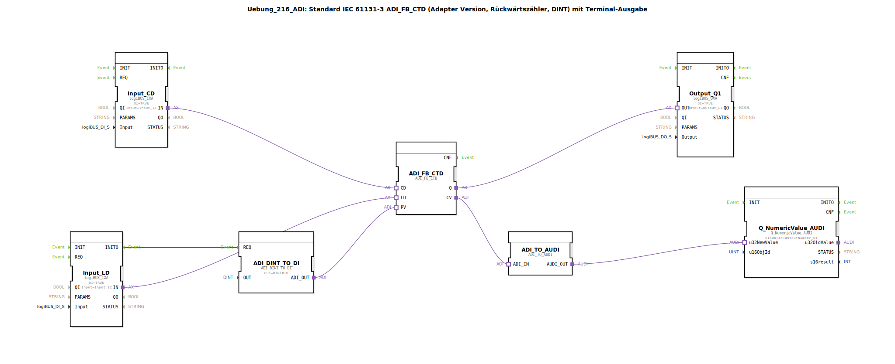

# Uebung_216_ADI: Standard IEC 61131-3 ADI_FB_CTD (Adapter Version, Rückwärtszähler, DINT) mit Terminal-Ausgabe

* * * * * * * * * *

## Einleitung

Diese Übung realisiert einen Rückwärtszähler (Count Down) nach IEC 61131-3 auf Basis des Adapter-Funktionsbausteins `ADI_FB_CTD`. Der Zähler arbeitet mit dem Datentyp `DINT` und gibt den aktuellen Zählerstand sowie das Zählerende-Signal aus. Zur Visualisierung des Zählerstands wird der Wert über einen Terminal-Baustein ausgegeben, wobei eine Adapter-Konvertierung notwendig ist.

Die Übung zeigt den Einsatz von Adapter-Schnittstellen zur Verbindung verschiedener Funktionsbausteine sowie die Grenzen der verwendeten Konvertierung.

## Verwendete Funktionsbausteine (FBs)

### ADI_FB_CTD
- **Typ**: `adapter::iec61131::counters::ADI_FB_CTD`
- **Parameter**: keine
- **Funktion**: IEC 61131-3 Rückwärtszähler (CTD). Zählt bei jedem positiven Flanke am Eingang `CD` den aktuellen Wert (PV) herunter. Bei Erreichen von Null wird der Ausgang `Q` gesetzt. Über den Eingang `LD` wird der Zähler mit dem Wert von `PV` geladen.
- **Adapter-Eingänge**: `CD` (Zählimpuls), `LD` (Laden), `PV` (Vorgabewert)
- **Adapter-Ausgänge**: `Q` (Zählerende), `CV` (aktueller Zählerstand)

### ADI_DINT_TO_DI
- **Typ**: `adapter::conversion::unidirectional::ADI_DINT_TO_DI`
- **Parameter**: `OUT = DINT#10`
- **Funktion**: Wandelt eine konstante DINT-Zahl (hier 10) in ein DI-Adapter-Interface um, das als Vorgabewert (`PV`) für den Zähler dient.

### Input_CD
- **Typ**: `logiBUS::io::DI::logiBUS_IXA`
- **Parameter**: `QI = TRUE`, `Input = Input_I1`
- **Funktion**: Digitaler Eingang für das Zählsignal (CD). Aktiviert über den physischen Eingang I1.

### Input_LD
- **Typ**: `logiBUS::io::DI::logiBUS_IXA`
- **Parameter**: `QI = TRUE`, `Input = Input_I2`
- **Funktion**: Digitaler Eingang für das Ladesignal (LD). Aktiviert über den physischen Eingang I2. Der Ereignisausgang `INITO` dieses Bausteins startet die Initialisierung des Vorgabewerts.

### Output_Q1
- **Typ**: `logiBUS::io::DQ::logiBUS_QXA`
- **Parameter**: `QI = TRUE`, `Output = Output_Q1`
- **Funktion**: Digitaler Ausgang für das Zählerende-Signal (`Q`). Schaltet den physischen Ausgang Q1.

### ADI_TO_AUDI
- **Typ**: `adapter::conversion::unidirectional::ADI_TO_AUDI`
- **Parameter**: keine
- **Funktion**: Konvertiert das ADI-Interface (DINT) in ein AUDI-Interface (Analog Universal Data Interface). **Wichtig:** Diese Konvertierung unterstützt keine negativen Zahlen – der Zählerstand kann nur als positive Zahl oder Null dargestellt werden.

### Q_NumericValue_AUDI
- **Typ**: `isobus::UT::Q::Q_NumericValue_AUDI`
- **Parameter**: `u16ObjId = OutputNumber_N1`
- **Funktion**: Gibt den übergebenen numerischen Wert (vom AUDI-Interface) auf einem Terminal aus. Die Objekt-ID verweist auf eine vordefinierte Ausgabeadresse.

## Programmablauf und Verbindungen

Die Steuerung erfolgt über Ereignis- und Adapterverbindungen:

1. **Initialisierung des Vorgabewerts**:  
   Der Ereignisausgang `INITO` des Bausteins `Input_LD` triggert den Baustein `ADI_DINT_TO_DI`. Dadurch wird die Konstante `DINT#10` einmalig in den `ADI_FB_CTD` geladen (über die Adapterverbindung `ADI_DINT_TO_DI.ADI_OUT` → `ADI_FB_CTD.PV`).

2. **Zählimpulse (CD)**:  
   Der Adapterausgang `Input_CD.IN` ist mit dem Adaptereingang `ADI_FB_CTD.CD` verbunden. Jede positive Flanke am Eingang I1 zählt den Zählerstand um eins herunter.

3. **Ladesignal (LD)**:  
   Der Adapterausgang `Input_LD.IN` ist mit dem Adaptereingang `ADI_FB_CTD.LD` verbunden. Ein Signal an I2 lädt den Zähler mit dem aktuellen Vorgabewert (10).

4. **Zählerende (Q)**:  
   Der Adapterausgang `ADI_FB_CTD.Q` führt zum Adaptereingang `Output_Q1.OUT`. Bei Erreichen von Null wird der Ausgang Q1 aktiviert.

5. **Ausgabe des Zählerstands**:  
   Der Adapterausgang `ADI_FB_CTD.CV` (aktueller Zählerstand) wird über `ADI_TO_AUDI` konvertiert und an den Terminal-Baustein `Q_NumericValue_AUDI` weitergeleitet. Der Zählerstand erscheint auf dem Terminal.

**Hinweis**: Der Kommentar im Netzwerk weist darauf hin, dass der Baustein `ADI_TO_AUDI` keine negativen Zahlen verarbeiten kann. Da der Rückwärtszähler nur bis Null zählt, tritt dieser Fall in der Übung nicht auf. Für erweiterte Anwendungen müsste eine geeignetere Konvertierung gewählt werden.

## Zusammenfassung

Die Übung vermittelt den Umgang mit dem IEC 61131-3-Rückwärtszähler als Adapter-Baustein. Sie zeigt:

- die Verwendung von Adapter-Schnittstellen zur Verbindung von Digital-Eingängen, Zähler und Ausgängen,
- die Initialisierung eines Vorgabewerts über eine Konvertierung,
- die Terminal-Ausgabe eines Zählerstands mit Hilfe eines AUDI-Interfaces,
- die Einschränkungen der verwendeten Konvertierung (`ADI_TO_AUDI`) bei negativen Werten.

Der Aufbau ist als Subapplikation realisiert und kann direkt in eine 4diac-IDE-Umgebung geladen und getestet werden.