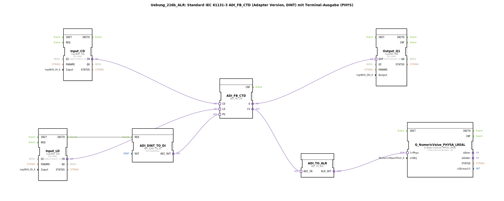

# Uebung_216b_ALR: Standard IEC 61131-3 ADI_FB_CTD (Adapter Version, DINT) mit Terminal-Ausgabe (PHYS)

* * * * * * * * * *
## Einleitung
Die Übung **Uebung_216b_ALR** realisiert einen Abwärtszähler (Counter Down) gemäß IEC 61131-3 unter Verwendung eines Adapter-basierten Funktionsbausteins `ADI_FB_CTD`. Der Zählerwert wird über eine Adapter-Wandlungskette auf ein alphanumerisches Terminal (PHYS) ausgegeben. Zusätzlich wird ein digitaler Ausgang gesetzt, wenn der Zählerstand Null erreicht. Die Übung veranschaulicht die Integration von logiBUS‑Eingängen, Adapter-Konvertierungen und Terminal-Ausgabe in einer kompakten Subapplikation.

## Verwendete Funktionsbausteine (FBs)

### Interne Funktionsbausteine

- **ADI_FB_CTD** (Typ: `adapter::iec61131::counters::ADI_FB_CTD`)
    - **Beschreibung**: Adapter-Version eines IEC 61131‑3 Abwärtszählers (CTD). Der Baustein zählt bei jedem fallenden Flanke am Ereigniseingang `CD` den aktuellen Wert (`CV`) um 1 herunter. Der Preset-Wert wird über den Adapter-Eingang `PV` geladen, sobald der Eingang `LD` aktiviert wird. Der Ausgang `Q` wird gesetzt, sobald `CV` den Wert 0 erreicht.  
    - **Parameter**: (keine expliziten Parameter gesetzt – verwendet Standardwerte)
    - **Ereignis-/Datenschnittstellen**:  
        - Ereigniseingang: `CD` (Count Down), `LD` (Load)  
        - Adapter-Dateneingang: `PV` (Preset Value, DINT)  
        - Adapter-Datenausgang: `CV` (Current Value, DINT), `Q` (BOOL)

- **ADI_DINT_TO_DI** (Typ: `adapter::conversion::unidirectional::ADI_DINT_TO_DI`)
    - **Beschreibung**: Wandelt einen DINT-Wert in einen Adapter-Dateneingang (DI) um. Hier wird ein fester Preset-Wert von DINT#10 bereitgestellt.  
    - **Parameter**: `OUT` = DINT#10
    - **Ereignis-/Datenschnittstellen**:  
        - Ereigniseingang: `REQ` (Trigger zur Ausgabe)  
        - Adapter-Datenausgang: `ADI_OUT` (DINT)

- **Input_CD** (Typ: `logiBUS::io::DI::logiBUS_IXA`)
    - **Beschreibung**: Digitaler Eingangsbaustein für logiBUS, der das Signal des physischen Eingangs `Input_I1` bereitstellt.  
    - **Parameter**: `QI` = TRUE (Qualifier), `Input` = Input_I1
    - **Adapter-Ausgang**: `IN` (digitale Information)

- **Input_LD** (Typ: `logiBUS::io::DI::logiBUS_IXA`)
    - **Beschreibung**: Digitaler Eingangsbaustein für logiBUS, der das Signal des physischen Eingangs `Input_I2` bereitstellt.  
    - **Parameter**: `QI` = TRUE, `Input` = Input_I2
    - **Adapter-Ausgang**: `IN`  
    - **Ereignisausgang**: `INITO` (wird bei Initialisierung ausgelöst)

- **Output_Q1** (Typ: `logiBUS::io::DQ::logiBUS_QXA`)
    - **Beschreibung**: Digitaler Ausgangsbaustein für logiBUS, der den physischen Ausgang `Output_Q1` ansteuert.  
    - **Parameter**: `QI` = TRUE, `Output` = Output_Q1
    - **Adapter-Eingang**: `OUT` (digitale Information)

- **ADI_TO_ALR** (Typ: `adapter::conversion::unidirectional::ADI_TO_ALR`)
    - **Beschreibung**: Wandelt einen Adapter-Datenwert (DINT) in ein alphanumerisches Format (ALR) um, das für die Terminalausgabe geeignet ist.  
    - **Keine Parameter** gesetzt.
    - **Schnittstellen**:  
        - Adapter-Eingang: `ADI_IN` (DINT)  
        - Adapter-Ausgang: `ALR_OUT` (ALR)

- **Q_NumericValue_PHYSA_LREAL** (Typ: `isobus::UT::Q::Q_NumericValue_PHYSA_LREAL`)
    - **Beschreibung**: Gibt einen numerischen Wert (als LREAL interpretiert) auf einem physischen Terminal aus. Der Wert wird vom angeschlossenen `stObj` (hier `OutputNumber_N3`) dargestellt.  
    - **Parameter**: `stObj` = OutputNumber_N3 (Referenz auf ein Terminal-Objekt)
    - **Adapter-Eingang**: `lrPhys` (physikalischer Wert als LREAL)

## Programmablauf und Verbindungen

1. **Initialisierung**: Beim Start der Subapplikation wird der Baustein `Input_LD` aktiv und löst das Ereignis `INITO` aus. Dieses Ereignis triggert `ADI_DINT_TO_DI.REQ`, sodass der Preset-Wert (DINT#10) am Adapterausgang `ADI_OUT` anliegt.
2. **Preset laden**: Der Preset-Wert wird über die Adapterverbindung an den Eingang `PV` des Zählers `ADI_FB_CTD` übergeben. Gleichzeitig wird durch das Ereignis `INITO` der Lade-Eingang `LD` des Zählers aktiviert? (Die Ereignisverbindung `Input_LD.INITO` geht nur an `ADI_DINT_TO_DI.REQ`, nicht direkt an den Zähler. Allerdings ist `Input_LD.IN` mit `ADI_FB_CTD.LD` verbunden – diese Verbindung ist als Adapterverbindung ausgeführt und überträgt das digitale Signal. Die Initialisierung von `Input_LD` setzt vermutlich den Eingang `LD` auf TRUE, sodass der Zähler den Preset lädt.)
3. **Zählbetrieb**: Der digitale Eingang `Input_CD` (Pin I1) führt dem Zähler über den Adaptereingang `CD` die Zählimpulse zu. Bei jeder fallenden Flanke (bzw. gemäß Definition des Adapters) verringert der Zähler den aktuellen Wert `CV` um 1.
4. **Ausgangsstatus**: Sobald `CV` auf 0 gefallen ist, setzt der Zähler den Ausgang `Q` auf TRUE. Dieser wird über `Output_Q1` an den physischen Ausgang Q1 weitergegeben.
5. **Terminalausgabe**: Der aktuelle Zählerstand (`CV`) wird über den Adapter `ADI_TO_ALR` in ein alphanumerisches Format gewandelt und an den Terminalbaustein `Q_NumericValue_PHYSA_LREAL` übergeben. Dieser gibt den Wert auf dem konfigurierten Terminal `OutputNumber_N3` aus. Beachte den Kommentar: Hier sind auch negative Werte möglich (durch Überlauf des Zählers unter 0).
6. **Hinweise**: Der Kommentar schlägt vor, ggf. einen `AX_D_FF` (FlipFlop) einzubauen, um die Ereignisrate zu reduzieren. Dies wäre bei sehr schnellen Zählimpulsen sinnvoll, um die Terminalausgabe zu entlasten.

### Verbindungsübersicht (Adapterverbindungen)

| Von (Quelle) | Nach (Ziel) | Bemerkung |
|--------------|-------------|-----------|
| `Input_CD.IN` | `ADI_FB_CTD.CD` | Zählimpulse |
| `Input_LD.IN` | `ADI_FB_CTD.LD` | Ladesignal |
| `ADI_FB_CTD.Q` | `Output_Q1.OUT` | Ausgangsstatus (CV=0) |
| `ADI_FB_CTD.CV` | `ADI_TO_ALR.ADI_IN` | aktueller Zählerstand |
| `ADI_TO_ALR.ALR_OUT` | `Q_NumericValue_PHYSA_LREAL.lrPhys` | Terminalausgabe |
| `ADI_DINT_TO_DI.ADI_OUT` | `ADI_FB_CTD.PV` | Preset-Wert |

**Ereignisverbindung**:
- `Input_LD.INITO` → `ADI_DINT_TO_DI.REQ`

## Zusammenfassung
Die Übung demonstriert den Einsatz eines IEC-61131-3‑Abwärtszählers in einer Adapter-basierten Umgebung. Durch die Kombination von logiBUS-Ein-/Ausgängen, einer DINT-Konvertierung und einer alphanumerischen Terminalausgabe wird ein vollständiger, praxisnaher Zählerkreislauf abgebildet. Der Benutzer lernt, Adapterverbindungen zu verschalten und Ereignissteuerungen zu nutzen. Ein besonderer Fokus liegt auf der korrekten Initialisierung des Preset-Werts und der Ausgabe des Zählerstands (auch negativer Werte) auf einem Terminal.