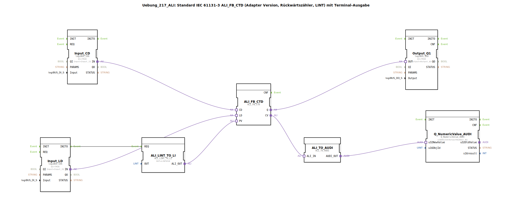

# Uebung_217_ALI: Standard IEC 61131-3 ALI_FB_CTD (Adapter Version, Rückwärtszähler, LINT) mit Terminal-Ausgabe

* * * * * * * * * *

## Einleitung

Diese Übung realisiert einen **IEC 61131-3 konformen Rückwärtszähler (CTD) in Adapterversion** für den Datentyp LINT (Long Integer). Der aktuelle Zählerstand wird auf einem Terminal ausgegeben. Der Zähler wird über ein digitales Eingangssignal **CD** (Count Down) dekrementiert. Ein weiteres digitales Signal **LD** (Load) lädt den Zähler mit einem vorgegebenen Preset-Wert. Sobald der Zählerstand den Wert 0 erreicht, wird der Ausgang **Q** gesetzt.

Der Preset-Wert wird bei der Initialisierung aus einem Konstanten-Baustein (LINT#10) bezogen und über einen ALI-LINT-to-LI-Konverter an den Zähler übergeben. Der Zählerstand wird über einen ALI-to-AUDI-Konverter an einen numerischen Anzeigebaustein (Q_NumericValue_AUDI) weitergeleitet und auf dem Terminal ausgegeben.

> **Hinweis:** Der Konverter ALI_TO_AUDI unterstützt keine negativen Zahlen – dies ist bei der Wahl der Preset-Werte zu beachten.

## Verwendete Funktionsbausteine (FBs)

### ALI_FB_CTD
- **Typ:** `adapter::iec61131::counters::ALI_FB_CTD`
- **Verwendete interne FBs:** keine (eigenständiger Zählerbaustein)
- **Parameter:**
  - Ereigniseingänge: CD, LD, R (nicht genutzt)
  - Ereignisausgänge: Q
  - Dateneingänge:
    - CD (Adapter) – Zählimpuls (Count Down)
    - LD (Adapter) – Ladesignal (Load)
    - PV (Adapter: LINT) – Preset-Wert (Vorgabewert)
  - Datenausgänge:
    - CV (Adapter: LINT) – aktueller Zählerstand
    - Q (Adapter: BOOL) – Ausgang wird TRUE, wenn CV = 0
- **Funktionsweise:** Ein Impuls am Ereigniseingang CD dekrementiert den aktuellen Zählerstand CV um 1. Ein Impuls am LD lädt den Wert von PV in CV. Wenn CV = 0 wird der Ausgang Q gesetzt.

### ALI_LINT_TO_LI
- **Typ:** `adapter::conversion::unidirectional::ALI_LINT_TO_LI`
- **Verwendete interne FBs:** keine
- **Parameter:**
  - Parameter: `OUT` = `LINT#10` (Ausgangswert wird als Konstante bereitgestellt)
  - Ereigniseingang: REQ
  - Ereignisausgang: CNF
  - Dateneingang: IN (LINT) – nicht verbunden, da über Parameter konstant
  - Datenausgang: ALI_OUT (Adapter) – liefert den LINT-Wert
- **Funktionsweise:** Stellt bei einer Anforderung (REQ) den parametrierten LINT-Wert (hier 10) am Ausgang ALI_OUT bereit. Dient als Quelle für den Preset-Wert PV.

### Input_CD
- **Typ:** `logiBUS::io::DI::logiBUS_IXA`
- **Verwendete interne FBs:** keine
- **Parameter:**
  - `QI` = `TRUE` (Eingang aktiviert)
  - `Input` = `Input_I1` (Benennung des physikalischen Eingangs)
- **Funktionsweise:** Wandelt ein digitales Signal vom Feldbus (Input_I1) in einen Adapter-Ereignisausgang IN. Wird verwendet, um das CD-Signal (Count Down) an den Zähler zu liefern.

### Input_LD
- **Typ:** `logiBUS::io::DI::logiBUS_IXA`
- **Parameter:**
  - `QI` = `TRUE`
  - `Input` = `Input_I2`
- **Funktionsweise:** Analog zu Input_CD, liefert das Ladesignal (LD) für den Zähler.

### Output_Q1
- **Typ:** `logiBUS::io::DQ::logiBUS_QXA`
- **Parameter:**
  - `QI` = `TRUE`
  - `Output` = `Output_Q1`
- **Funktionsweise:** Nimmt den digitalen Ausgang Q des Zählers entgegen und stellt ihn als Feldbus-Ausgang (Output_Q1) bereit.

### ALI_TO_AUDI
- **Typ:** `adapter::conversion::unidirectional::ALI_TO_AUDI`
- **Verwendete interne FBs:** keine
- **Parameter:** keine
- **Funktionsweise:** Wandelt den ALI-Adatper (LINT) in einen AUDI-Adapter (UINT?) um. Der konvertierte Wert wird an den numerischen Anzeigebaustein weitergegeben. Da der Konverter nur positive Werte verarbeitet, können negative Zählerstände nicht angezeigt werden.

### Q_NumericValue_AUDI
- **Typ:** `isobus::UT::Q::Q_NumericValue_AUDI`
- **Parameter:**
  - `u16ObjId` = `OutputNumber_N1` (Kennung des Terminal-Ausgabeelements)
- **Funktionsweise:** Nimmt einen AUDI-Adapter mit einem numerischen Wert entgegen und zeigt diesen auf dem angeschlossenen Terminal unter der Objekt-ID OutputNumber_N1 an.

## Programmablauf und Verbindungen

Die folgende Abbildung zeigt den logischen Daten- und Ereignisfluss:

- **Initialisierung:** Beim Start (Ereignis INITO von Input_LD) wird der Baustein ALI_LINT_TO_LI über den Ereigniseingang REQ getriggert. Dieser liefert am Ausgang ALI_OUT den konstanten Wert LINT#10. Dieser ist mit dem PV-Eingang des Zählers verbunden.  
- **Laden des Preset-Werts:** Ein Impuls an Input_LD (Eingang Input_I2) löst den Ereignisausgang INITO und gleichzeitig über den Adapter IN das Ladesignal LD des Zählers aus. Der Zähler übernimmt den Wert von PV und setzt CV = 10.  
- **Count Down:** Ein Impuls an Input_CD (Eingang Input_I1) wirkt auf den Adapter CD des Zählers. Jeder Impuls verringert CV um 1.  
- **Ausgabe Zählerstand:** Der aktuelle Zählerstand CV wird über den Adapter CV an ALI_TO_AUDI weitergeleitet. Dieser wandelt den Wert in den AUDI-Adapter um und übergibt ihn an Q_NumericValue_AUDI, der ihn auf dem Terminal anzeigt.  
- **Ausgang Q:** Wenn CV = 0 erreicht, setzt der Zähler den Ausgang Q. Dieser wird über Output_Q1 als Feldbus-Signal (Output_Q1) ausgegeben.

### Verbindungsliste (Adapter- und Ereignisverbindungen)

- **Ereignisverbindung:** `Input_LD.INITO` → `ALI_LINT_TO_LI.REQ`
- **Adapterverbindungen:**
  - `Input_CD.IN` → `ALI_FB_CTD.CD`
  - `Input_LD.IN` → `ALI_FB_CTD.LD`
  - `ALI_FB_CTD.Q` → `Output_Q1.OUT`
  - `ALI_FB_CTD.CV` → `ALI_TO_AUDI.ALI_IN`
  - `ALI_TO_AUDI.AUDI_OUT` → `Q_NumericValue_AUDI.u32NewValue`
  - `ALI_LINT_TO_LI.ALI_OUT` → `ALI_FB_CTD.PV`

## Zusammenfassung

In dieser Übung wird ein klassischer Rückwärtszähler (CTD) nach IEC 61131-3 in Adapterbauweise umgesetzt. Die Teilnehmer lernen:

- Die Verwendung eines Zähler-FB mit den Ereignissen CD und LD.
- Das Initialisieren eines Preset-Wertes über einen separaten Konvertierungsbaustein (ALI_LINT_TO_LI).
- Die Weiterleitung von Zählerständen an eine Terminalausgabe (Q_NumericValue_AUDI) unter Berücksichtigung der Einschränkungen des ALI_TO_AUDI-Konverters (keine negativen Zahlen).
- Die Verschaltung von Adaptern und Ereignissen in einem SubApp-Netzwerk.

Der Schwierigkeitsgrad ist **mittel**. Vorkenntnisse in der 4diac-IDE und grundlegendes Verständnis von Ereignis-/Datenflüssen sowie Adaptern werden empfohlen. Die Übung kann direkt nach dem Import der Bibliothek und dem Anlegen eines passenden Systems gestartet werden.