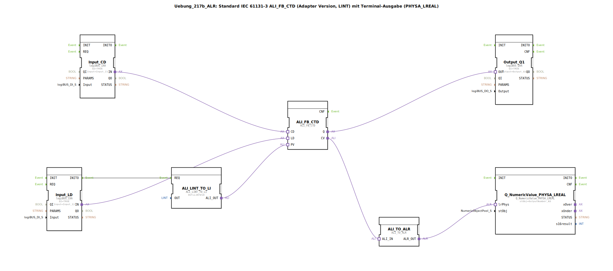

# Uebung_217b_ALR: Standard IEC 61131-3 ALI_FB_CTD (Adapter Version, LINT) mit Terminal-Ausgabe (PHYSA_LREAL)

* * * * * * * * * *

## Einleitung

Diese Übung demonstriert die Verwendung eines IEC 61131-3 konformen Abwärtszählers (CTD) im Adapter‑Format (ALI) mit dem Datentyp LINT. Der Zählerwert wird über einen Eingangstaster dekrementiert, ein weiterer Taster lädt einen vorgegebenen Preset‑Wert. Der aktuelle Zählerstand wird über eine Umwandlungskette (LINT → LREAL) auf einem Terminal ausgegeben. Der Ausgang des Zählers (Q) schaltet einen digitalen Ausgang.

Die Übung veranschaulicht den Umgang mit Adapter‑Schnittstellen, die Signalumwandlung zwischen unterschiedlichen Datentypen sowie die Anbindung einer numerischen Terminalausgabe.

## Verwendete Funktionsbausteine (FBs)

### ALI_FB_CTD
- **Typ**: `adapter::iec61131::counters::ALI_FB_CTD`
- **Beschreibung**: IEC 61131-3 Abwärtszähler (CTD) für den Datentyp LINT. Er besitzt zwei Ereigniseingänge (`CD`, `LD`), einen Dateneingang für den Preset-Wert (`PV`) und einen Ereignisausgang (`Q`) für das Zählergebnis. Der Zählerstand wird am Adapterausgang `CV` bereitgestellt.

### ALI_LINT_TO_LI
- **Typ**: `adapter::conversion::unidirectional::ALI_LINT_TO_LI`
- **Beschreibung**: Konvertiert einen LINT‑Wert in einen LINT‑Adapterwert (LI). Wird verwendet, um den Preset-Wert (LINT#10) an den Zähler zu übergeben.
- **Parameter**: `OUT` = `LINT#10` (voreingestellter Zählerendwert)

### Input_CD (logiBUS_IXA)
- **Typ**: `logiBUS::io::DI::logiBUS_IXA`
- **Beschreibung**: Digitaler Eingangsbaustein für den logiBUS. Erfasst den Zustand des Tasters `Input_I1`, der das Dekrementieren (`CD`) auslöst.
- **Parameter**: `QI` = `TRUE`, `Input` = `Input_I1`

### Input_LD (logiBUS_IXA)
- **Typ**: `logiBUS::io::DI::logiBUS_IXA`
- **Beschreibung**: Zweiter digitaler Eingang für den Taster `Input_I2`, der das Laden des Preset-Wertes (`LD`) auslöst.
- **Parameter**: `QI` = `TRUE`, `Input` = `Input_I2`

### Output_Q1 (logiBUS_QXA)
- **Typ**: `logiBUS::io::DQ::logiBUS_QXA`
- **Beschreibung**: Digitaler Ausgangsbaustein für den logiBUS. Gibt den Zustand von `Q` (Zählerstand ≤ 0) auf `Output_Q1` aus.
- **Parameter**: `QI` = `TRUE`, `Output` = `Output_Q1`

### ALI_TO_ALR
- **Typ**: `adapter::conversion::unidirectional::ALI_TO_ALR`
- **Beschreibung**: Wandelt einen ALI‑Adapter (ganzzahlig) in einen ALR‑Adapter (reell) um. Ermöglicht die Übergabe des LINT‑Zählerwerts an eine Terminalausgabe, die einen LREAL‑Wert erwartet.

### Q_NumericValue_PHYSA_LREAL
- **Typ**: `isobus::UT::Q::Q_NumericValue_PHYSA_LREAL`
- **Beschreibung**: Terminalausgabe‑Baustein für numerische Werte vom Typ `PHYSA_LREAL`. Zeigt den umgewandelten Zählerwert auf dem zugeordneten Terminalobjekt `OutputNumber_N3` an.
- **Parameter**: `stObj` = `OutputNumber_N3`

## Programmablauf und Verbindungen

1. **Initialisierung**: Beim Start (z. B. nach einem Reset) sendet `Input_LD` das Ereignis `INITO` an `ALI_LINT_TO_LI`, welches den Preset-Wert `LINT#10` bereitstellt.
2. **Preset laden**: Drücken des Tasters `Input_I2` erzeugt ein Ereignis auf dem Adapter `Input_LD.IN`. Dieses wird mit dem Ladeeingang `LD` des Zählers `ALI_FB_CTD` verbunden. Gleichzeitig wird der von `ALI_LINT_TO_LI` gelieferte Preset-Wert über den Adapter `ALI_OUT` an den Eingang `PV` des Zählers übergeben. Der Zähler übernimmt den Wert `10`.
3. **Dekrementieren**: Jeder Tastendruck auf `Input_I1` (Eingang `Input_CD`) erzeugt ein Ereignis, das über den Adapter `IN` an den Dekrementierungseingang `CD` des Zählers geleitet wird. Der Zählerstand verringert sich um 1.
4. **Ausgang Q**: Wenn der Zählerstand ≤ 0 ist, wird der Adapterausgang `Q` des Zählers aktiv. Dieses Signal wird an den digitalen Ausgang `Output_Q1` weitergegeben (Schalten einer Last oder Anzeige).
5. **Anzeige des Zählerstands**: Der aktuelle Zählerwert `CV` (Typ LINT) wird über die Umwandlungskette `ALI_TO_ALR` und `Q_NumericValue_PHYSA_LREAL` auf dem Terminal als Gleitkommazahl ausgegeben. Die Kommentare weisen darauf hin, dass hier auch negative Werte auftreten können und dass bei schnellen Ereignisfolgen ein AX_D_FF zur Reduzierung der Terminal‑Aktualisierungen sinnvoll sein kann.

**Verbindungsübersicht** (Adapter‑ und Ereignisverbindungen):

| Quelle                        | Ziel                           | Typ             |
|-------------------------------|--------------------------------|-----------------|
| `Input_CD.IN`                 | `ALI_FB_CTD.CD`                | Adapter (IN)    |
| `Input_LD.IN`                 | `ALI_FB_CTD.LD`                | Adapter (IN)    |
| `ALI_FB_CTD.Q`                | `Output_Q1.OUT`                | Adapter (OUT)   |
| `ALI_FB_CTD.CV`               | `ALI_TO_ALR.ALI_IN`            | Adapter         |
| `ALI_TO_ALR.ALR_OUT`          | `Q_NumericValue_PHYSA_LREAL.lrPhys` | Adapter    |
| `ALI_LINT_TO_LI.ALI_OUT`      | `ALI_FB_CTD.PV`                | Adapter         |
| `Input_LD.INITO` (Ereignis)   | `ALI_LINT_TO_LI.REQ`           | Ereignis        |

## Zusammenfassung

Die Übung **217b_ALR** vermittelt den sicheren Umgang mit einem IEC 61131-3 Abwärtszähler im Adapter‑Format, der Signalumwandlung zwischen Ganzzahl‑ und Gleitkommatypen sowie der Anbindung einer Terminalausgabe. Sie zeigt die typische Verschaltung von logiBUS‑Ein‑/Ausgängen mit Funktionsbausteinen und bereitet auf die Realisierung zählerbasierter Steuerungsaufgaben vor.

**Lernziele:**
- Verständnis des IEC 61131-3 Zählers CTD (Abwärtszähler) mit LINT‑Datentyp
- Umgang mit Adapter‑Schnittstellen (ALI, LI, ALR)
- Konvertierung zwischen Datentypen (LINT → LREAL)
- Einbindung einer numerischen Terminalausgabe
- Erkennung von Ereignis‑ und Datenflüssen in einem ST‑Netzwerk

**Schwierigkeitsgrad:** Fortgeschritten  
**Vorkenntnisse:** Grundlagen der 4diac‑IDE, Umgang mit logiBUS‑Bausteinen, Ereignisverkettung.