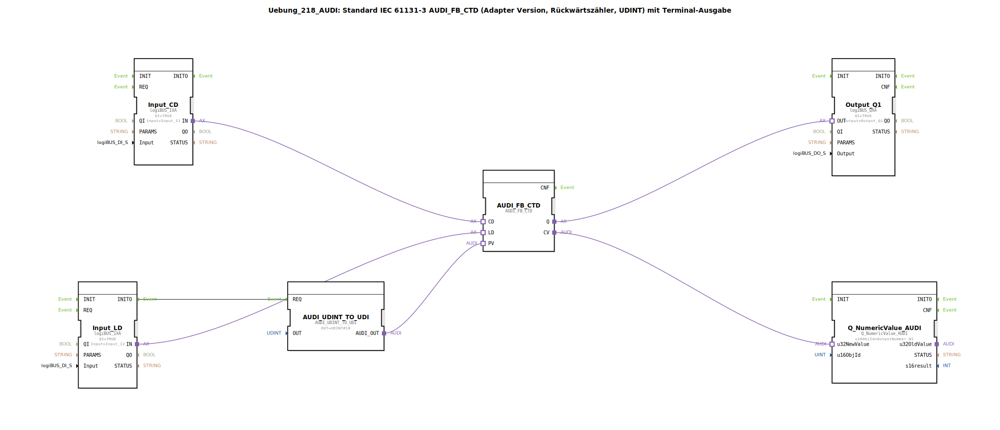

# Uebung_218_AUDI: Standard IEC 61131-3 AUDI_FB_CTD (Adapter Version, Rückwärtszähler, UDINT) mit Terminal-Ausgabe

* * * * * * * * * *

## Einleitung

Diese Übung realisiert einen IEC 61131-3 konformen Rückwärtszähler (AUDI_FB_CTD) mit UDINT-Datentyp. Der Zählerwert wird über einen Terminal-Baustein ausgegeben. Ein separater Konvertierungsbaustein setzt den Anfangswert (Preset Value) auf 10. Die Übung demonstriert die Verwendung von Adapter-basierten Funktionsbausteinen und die Zusammenarbeit mit Ein-/Ausgangsmodulen sowie einer numerischen Terminalanzeige.

## Verwendete Funktionsbausteine (FBs)

- **AUDI_FB_CTD** – Typ: `adapter::iec61131::counters::AUDI_FB_CTD`
    - IEC 61131-3 kompatibler Abwärtszähler (CTD). Jedes Ereignis am Eingang `CD` (Count Down) dekrementiert den internen Zähler. Wenn der Zählerstand null erreicht, wird der Ausgang `Q` gesetzt. Der Eingang `LD` lädt den aktuellen Zählerstand mit dem Wert von `PV`.
- **AUDI_UDINT_TO_UDI** – Typ: `adapter::conversion::unidirectional::AUDI_UDINT_TO_UDI`
    - Konvertiert einen UDINT-Wert (hier fest auf `UDINT#10` gesetzt) und gibt ihn an seinem Ausgang `AUDI_OUT` aus. Dieser Wert wird als Preset-Wert (`PV`) des Zählers verwendet.
- **Input_CD** – Typ: `logiBUS::io::DI::logiBUS_IXA`
    - Digitaler Eingang, verbunden mit `Input_I1`. Bei TRUE wird ein Ereignis am Ausgang `IN` erzeugt, das den Zähler dekrementiert.
- **Input_LD** – Typ: `logiBUS::io::DI::logiBUS_IXA`
    - Digitaler Eingang, verbunden mit `Input_I2`. Bei TRUE löst er über seinen Ereignisausgang `INITO` die Initialisierung des Preset-Wertes aus und lädt anschließend den Zähler über den Adaptereingang `LD`.
- **Output_Q1** – Typ: `logiBUS::io::DQ::logiBUS_QXA`
    - Digitaler Ausgang, verbunden mit `Output_Q1`. Erhält den Wert von `AUDI_FB_CTD.Q` und gibt ihn als binäres Signal aus.
- **Q_NumericValue_AUDI** – Typ: `isobus::UT::Q::Q_NumericValue_AUDI`
    - Terminal-Ausgabebaustein für numerische Werte. Empfängt den aktuellen Zählerstand (`CV`) und zeigt ihn auf dem zugeordneten Objekt `OutputNumber_N1` an.

## Programmablauf und Verbindungen

**Ereignis- und Datenverbindungen:**

1. Der Eingang `Input_LD` (Pin `Input_I2`) erzeugt bei einem positiven Flanke am Ausgang `IN` ein Ereignis. Dieses Ereignis wird über die Eventverbindung `Input_LD.INITO` an den Konvertierungsbaustein `AUDI_UDINT_TO_UDI.REQ` weitergeleitet.
2. Daraufhin gibt `AUDI_UDINT_TO_UDI` den vorberechneten UDINT-Wert (10) an seinem Ausgang `AUDI_OUT` aus. Dieser wird über eine Adapterverbindung zum Eingang `PV` von `AUDI_FB_CTD` geführt.
3. Gleichzeitig wird der Adaptereingang `Input_LD.IN` direkt mit dem `LD`-Eingang des Zählers verbunden (Adapterverbindung). Somit wird der Preset-Wert (10) in den Zähler geladen.
4. Der Eingang `Input_CD` (Pin `Input_I1`) liefert an seinem Ausgang `IN` ein Signal, das über eine Adapterverbindung an den `CD`-Eingang des Zählers angeschlossen ist. Jedes Ereignis verringert den Zählerstand um 1.
5. Der Zählerausgang `Q` wird über eine Adapterverbindung an den digitalen Ausgang `Output_Q1.OUT` weitergegeben. `Q` wird TRUE, sobald der Zählerstand 0 erreicht hat.
6. Der aktuelle Zählerstand (`CV`) wird über eine Adapterverbindung an den numerischen Terminalausgang `Q_NumericValue_AUDI.u32NewValue` gesendet und auf dem Terminal angezeigt.

**Lernziele:**
- Verständnis des IEC 61131-3 Abwärtszählers (CTD) als Adapterbaustein.
- Umgang mit Ereignis- und Adapterverbindungen in 4diac.
- Initialisierung von Zählerwerten über Konvertierungsbausteine.
- Visualisierung von Werten auf einem Terminal.

**Schwierigkeitsgrad:** Mittel

**Benötigte Vorkenntnisse:** Grundlagen der SPS-Programmierung, Umgang mit 4diac-IDE, Verständnis von Ereignis- und Datenflüssen.

**Durchführung:**
- Importieren Sie die Übung in die 4diac-IDE.
- Weisen Sie die Ein-/Ausgänge den entsprechenden realen oder simulierten Hardware-Pins zu.
- Starten Sie die Anwendung und beobachten Sie das Verhalten: Drücken von `I2` setzt den Zähler auf 10 zurück. Drücken von `I1` zählt herunter, bis 0 erreicht ist – dann leuchtet `Q1`. Der aktuelle Zählerstand wird im Terminal angezeigt.

## Zusammenfassung

Die Übung 218 demonstriert einen vollständigen IEC 61131-3 Abwärtszähler mit UDINT-Datentyp, der über Adapterverbindungen mit digitalen Ein- und Ausgängen sowie einer Terminalausgabe kommuniziert. Der Preset-Wert wird durch einen separaten Konvertierungsbaustein bereitgestellt. Die Implementierung zeigt typische Muster für die Verwendung von Zählern in der Automatisierungstechnik mit der 4diac-IDE.