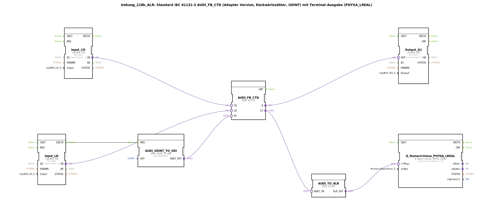

# Uebung_218b_ALR: Standard IEC 61131-3 AUDI_FB_CTD (Adapter Version, Rückwärtszähler, UDINT) mit Terminal-Ausgabe (PHYSA_LREAL)

* * * * * * * * * *
## Einleitung
Diese Übung realisiert einen **Rückwärtszähler (CTD)** nach IEC 61131‑3 mit einem **AUDI_FB_CTD** (Adapter‑Version, Datentyp **UDINT**). Der aktuelle Zählerstand wird über ein Terminal in **PHYSA_LREAL** ausgegeben. Zusätzlich ist ein digitaler Ausgang (**Output_Q1**) vorhanden, der den Zustand des Zählers (Q) anzeigt.

Die Implementierung erlaubt auch **negative Zählwerte** – ein entsprechender Hinweis im Netzwerk macht darauf aufmerksam. Um die Ereignisrate bei schnellen Zählimpulsen zu reduzieren, könnte optional ein **AX_D_FF** (Flip‑Flop) eingebaut werden.

---

## Verwendete Funktionsbausteine (FBs)

### Sub‑Baustein: `AUDI_FB_CTD`
- **Typ**: `adapter::iec61131::counters::AUDI_FB_CTD`
- **Verwendete interne FBs** (keine weiteren internen FBs)
- **Parameter**: Keine eigenen Parameter (alle Daten werden über Adapter verbunden)
- **Ereigniseingänge/-ausgänge**:
    - *Eingänge*: CD (Count Down), LD (Load)
    - *Ausgänge*: Q (Zählerstatus)
- **Dateneingänge/-ausgänge**:
    - *Eingänge*: PV (Preset Value, UDINT)
    - *Ausgänge*: CV (Current Value, UDINT)
- **Funktionsweise**:
    Der Baustein zählt bei jedem positiven Flanken‑Ereignis am Eingang **CD** den internen Zähler um eins herunter. Bei einem Ereignis am Eingang **LD** wird der Zähler auf den Wert von **PV** geladen. Der Ausgang **Q** wird aktiv, sobald der Zählerstand auf Null oder kleiner ist. Der aktuelle Zählerstand steht an **CV** zur Verfügung.

---

### Sub‑Baustein: `AUDI_UDINT_TO_UDI`
- **Typ**: `adapter::conversion::unidirectional::AUDI_UDINT_TO_UDI`
- **Verwendete interne FBs**: Keine
- **Parameter**:
    - `OUT = UDINT#10` (fester Preset‑Wert 10)
- **Ereigniseingänge/-ausgänge**:
    - *Eingang*: REQ (Anforderung)
    - *Ausgang*: CNF (Bestätigung)
- **Dateneingänge/-ausgänge**:
    - *Ausgang*: AUDI_OUT (Ausgangswert, UDINT)
- **Funktionsweise**:
    Bei einem Ereignis am Eingang **REQ** wird der parametrierte UDINT‑Wert (hier 10) zum Ausgang `AUDI_OUT` weitergeleitet. Dieser Wert dient als anfänglicher Preset‑Wert für den Rückwärtszähler.

---

### Sub‑Baustein: `Input_CD`
- **Typ**: `logiBUS::io::DI::logiBUS_IXA`
- **Verwendete interne FBs**: Keine
- **Parameter**:
    - `QI = TRUE` (Qualifier – Eingang aktiv)
    - `Input = Input_I1` (physischer Eingangskanal)
- **Ereigniseingänge/-ausgänge**:
    - *Ausgang*: INITO (Initialisierung abgeschlossen)
- **Dateneingänge/-ausgänge**:
    - *Ausgang*: IN (Adapterausgang für den Zählimpuls)
- **Funktionsweise**:
    Dieser Baustein stellt den digitalen Eingang **Input_I1** (z. B. Taster oder Sensor) als Adapter‑Schnittstelle bereit. Bei Betätigung wird das Signal am Ausgang `IN` weitergeleitet und löst am angeschlossenen Zähler ein **CD**‑Ereignis aus.

---

### Sub‑Baustein: `Input_LD`
- **Typ**: `logiBUS::io::DI::logiBUS_IXA`
- **Verwendete interne FBs**: Keine
- **Parameter**:
    - `QI = TRUE`
    - `Input = Input_I2` (physischer Eingangskanal)
- **Ereigniseingänge/-ausgänge**:
    - *Ausgang*: INITO (Initialisierung abgeschlossen)
- **Dateneingänge/-ausgänge**:
    - *Ausgang*: IN (Adapterausgang für den Ladevorgang)
- **Funktionsweise**:
    Identisch zu `Input_CD`, jedoch auf **Input_I2** geschaltet. Ein Signal an diesem Eingang bewirkt das Laden des Zähler‑Preset‑Wertes.

---

### Sub‑Baustein: `Output_Q1`
- **Typ**: `logiBUS::io::DQ::logiBUS_QXA`
- **Verwendete interne FBs**: Keine
- **Parameter**:
    - `QI = TRUE`
    - `Output = Output_Q1` (physischer Ausgangskanal)
- **Ereigniseingänge/-ausgänge**:
    - *Eingang*: OUT (Adaptereingang für das Ausgangssignal)
- **Dateneingänge/-ausgänge**:
    - *Eingang*: (über Adapter)
- **Funktionsweise**:
    Der Baustein setzt den digitalen Ausgang **Output_Q1** auf den Wert, der am Adaptereingang `OUT` anliegt. Er dient zur Anzeige des Zähler‑Status (Q).

---

### Sub‑Baustein: `AUDI_TO_ALR`
- **Typ**: `adapter::conversion::unidirectional::AUDI_TO_ALR`
- **Verwendete interne FBs**: Keine
- **Parameter**: Keine eigenen Parameter
- **Ereigniseingänge/-ausgänge**: (keine Ereignisse; reine Datenkonvertierung)
- **Dateneingänge/-ausgänge**:
    - *Eingang*: AUDI_IN (UDINT‑Wert)
    - *Ausgang*: ALR_OUT (physikalischer LREAL‑Wert)
- **Funktionsweise**:
    Dieser Baustein wandelt den aktuellen Zählerstand (**UDINT**) in einen physikalischen **LREAL**‑Wert um, der für die Terminalausgabe geeignet ist. Er ermöglicht die Darstellung des Zählwertes als reelle Zahl, auch negativer Werte.

---

### Sub‑Baustein: `Q_NumericValue_PHYSA_LREAL`
- **Typ**: `isobus::UT::Q::Q_NumericValue_PHYSA_LREAL`
- **Verwendete interne FBs**: Keine
- **Parameter**:
    - `stObj = OutputNumber_N3` (Verweis auf das Terminal‑Ausgabeobjekt)
- **Ereigniseingänge/-ausgänge**: (keine Ereignisse)
- **Dateneingänge/-ausgänge**:
    - *Eingang*: lrPhys (physikalischer LREAL‑Wert)
- **Funktionsweise**:
    Der Baustein nimmt den umgewandelten LREAL‑Wert entgegen und gibt ihn auf dem Terminal (OutputNumber_N3) aus. Er ist das Bindeglied zur grafischen/ numerischen Anzeige der Übung.

---

## Programmablauf und Verbindungen

1. **Initialisierung**  
   Nach dem Start des Systems wird der Baustein `Input_LD` initialisiert. Dabei erzeugt er ein `INITO`‑Ereignis, das den Baustein `AUDI_UDINT_TO_UDI` anstößt (`REQ`). Dieser gibt den festen Wert **UDINT#10** an den Preset‑Eingang des Zählers weiter.

2. **Zählbetrieb**  
   - Jedes positive Signal an **Input_I1** (→ `Input_CD`) erzeugt ein **CD**‑Ereignis am Zähler → Zählerstand wird um 1 dekrementiert.  
   - Ein Signal an **Input_I2** (→ `Input_LD`) erzeugt ein **LD**‑Ereignis → Zähler wird auf den zuletzt geladenen Preset‑Wert (initial 10) zurückgesetzt.  

3. **Ausgaben**  
   - Der Zähler‑Ausgang **Q** wird über einen Adapter mit dem digitalen Ausgang **Output_Q1** verbunden. Somit leuchtet die Ausgangslampe, wenn der Zähler ≤ 0 ist.  
   - Der aktuelle Zählerstand **CV** wird über `AUDI_TO_ALR` in einen LREAL‑Wert gewandelt und von `Q_NumericValue_PHYSA_LREAL` auf dem Terminal (OutputNumber_N3) ausgegeben.

4. **Hinweise aus den Kommentaren**  
   - *„Hier sind negative Werte möglich!“* – Der Zähler kann bei fortgesetzten CD‑Ereignissen unter Null gehen. Die Terminalausgabe stellt auch negative LREAL‑Werte dar.  
   - *„Hier gegebenenfalls einen AX_D_FF einbauen, damit die Events reduziert werden.“* – Bei sehr schnellen Impulsen kann ein vorgeschalteter Flip‑Flop‑Baustein die Ereignisrate dämpfen und unerwünschte Zählungen verhindern.

**Verbindungsübersicht (Auszug aus dem Netzwerk):**
- `Input_CD.IN` → `AUDI_FB_CTD.CD`
- `Input_LD.IN` → `AUDI_FB_CTD.LD`
- `AUDI_FB_CTD.Q` → `Output_Q1.OUT`
- `AUDI_FB_CTD.CV` → `AUDI_TO_ALR.AUDI_IN`
- `AUDI_TO_ALR.ALR_OUT` → `Q_NumericValue_PHYSA_LREAL.lrPhys`
- Ereignis: `Input_LD.INITO` → `AUDI_UDINT_TO_UDI.REQ`

---

## Zusammenfassung
Die **Uebung_218b_ALR** vermittelt den Umgang mit einem **IEC‑61131‑3 Rückwärtszähler** in der **4diac‑IDE**. Der Zähler wird über zwei digitale Eingänge gesteuert (Zählen und Laden) und gibt seinen Status sowie den aktuellen Wert aus. Die Besonderheit liegt in der Umwandlung des UDINT‑Zählwertes in eine LREAL‑Terminalausgabe, sodass auch negative Zahlen dargestellt werden können.

**Lernziele:**
- Aufbau und Parametrierung eines Adapter‑basierten CTD‑Funktionsbausteins
- Einbindung digitaler Ein‑/Ausgänge über logiBUS‑Adapter
- Datenkonvertierung (UDINT → LREAL) für Ausgabezwecke
- Erkennung von Problemen bei hohen Ereignisraten und Lösungsansätze (AX_D_FF)

**Schwierigkeitsgrad:** Mittel  
**Vorkenntnisse:** Grundlagen der 4diac‑IDE, Umgang mit IEC‑Bausteinen und Adapterverbindungen.